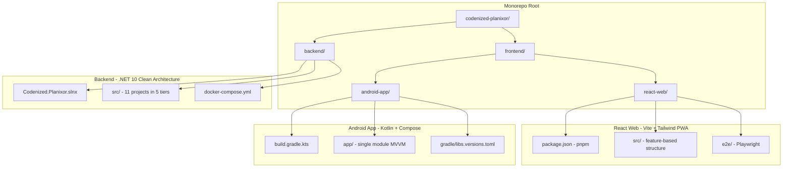

# Design Document: Bootstrap Projects

## Overview

This design describes the scaffolding of the three sub-projects in the Codenized Planixor monorepo: a .NET 10 backend solution with Clean Architecture, a React TypeScript PWA with Vite/Tailwind, and an Android Kotlin native app with Jetpack Compose/Hilt/Retrofit. The scaffolding produces a fully buildable, self-contained project in each of the three directories (`backend/`, `frontend/react-web/`, `frontend/android-app/`) plus a root-level monorepo configuration.

The goal is to generate all initial project structure, configuration files, and boilerplate code so that each sub-project compiles and runs successfully out of the box — enabling developers to immediately begin implementing business features.

### Design Decisions

1. **No shared build tooling**: Each sub-project is entirely self-contained. No root-level build orchestrator (e.g., Nx, Turborepo) is used — each project builds independently from its own directory.
2. **Steering-file-driven versions**: All dependency versions, SDK targets, and tool configurations are sourced from the existing steering files to ensure consistency.
3. **Minimal viable boilerplate**: Only the code necessary to satisfy a successful build and health check is generated. No business entities, use cases, or feature screens are scaffolded beyond what's needed to prove the architecture works.
4. **i18n from day one**: Both frontend projects include internationalization infrastructure with Spanish as default and English as fallback.

## Architecture

The monorepo follows a flat structure with three independent sub-projects:



### Sub-Project Independence

Each sub-project:
- Has its own `.gitignore` tailored to its ecosystem
- Has its own build system (MSBuild/dotnet, pnpm/Vite, Gradle)
- Contains no imports, references, or paths pointing to sibling sub-projects
- Can be cloned and built in isolation (given its own dependencies are installed)

## Components and Interfaces

### Component 1: Backend .NET 10 Solution

**Structure**: 11 projects organized into 5 Clean Architecture tiers within `backend/src/`, with Docker Compose and configuration files at `backend/` root.

```
backend/
├── src/
│   ├── Codenized.Planixor.Core/                    # Tier 1 - Enterprise Business Rules
│   ├── Codenized.Planixor.Dtos/                    # Tier 2 - Application Business Rules
│   ├── Codenized.Planixor.Events/                  # Tier 2
│   ├── Codenized.Planixor.UseCases/                # Tier 2
│   ├── Codenized.Planixor.Services/                # Tier 3 - Interface Adapters
│   ├── Codenized.Planixor.Persistence.MySql.Efc.DataContext/   # Tier 3
│   ├── Codenized.Planixor.Persistence.MySql.Efc.Repositories/  # Tier 3
│   ├── Codenized.Planixor.Persistence.IoC/         # Tier 3
│   ├── Codenized.Planixor.IoC/                     # Tier 4 - Frameworks and Drivers
│   ├── Codenized.Planixor.Api/                     # Tier 4
│   └── UnitTest.Codenized.Planixor/                # Tier 5 - Tests
├── docker-compose.yml
├── docker-compose.override.yml
├── docker-compose.dcproj
├── .editorconfig
├── stylecop.json
├── .gitignore
└── Codenized.Planixor.slnx
```

**Key interfaces**:
- `IApplicationContext` — EF Core context contract (DbSets)
- `ApplicationReadContext` / `ApplicationWriteContext` — read/write split contexts
- `DependencyContainer.cs` (Persistence.IoC) — `AddCleanArchitecturePersistence()` extension
- `DependencyContainer.cs` (IoC) — `AddCleanArchitecture()` extension
- `Program.cs` — application entry point with middleware pipeline
- `RegisterEndpoints.cs` — endpoint mapping (health check only at scaffold time)

**Dependency direction** (enforced via project references):
```
Tier 1 (Core)           → no references
Tier 2 (Dtos, Events, UseCases) → Core only
Tier 3 (Services, DataContext, Repositories, Persistence.IoC) → Tiers 1-2
Tier 4 (IoC, Api)       → Tiers 1-3
Tier 5 (UnitTest)       → any tier
```

### Component 2: React TypeScript PWA

**Structure**: Feature-based architecture with Vite build tooling, located at `frontend/react-web/`.

```
frontend/react-web/
├── src/
│   ├── features/           # Business feature modules
│   ├── shared/             # Cross-feature reusable code
│   ├── context/            # Global state (React Context)
│   ├── infrastructure/     # Cross-cutting (API client, auth, monitoring)
│   ├── pages/              # Route-level components
│   ├── assets/             # Static assets
│   ├── test/
│   │   └── setup.ts        # Testing Library setup
│   ├── App.tsx             # Root component
│   ├── main.tsx            # Entry point
│   └── index.css           # Tailwind CSS import
├── e2e/
│   ├── pages/              # Page Object Models
│   └── playwright.config.ts
├── vite.config.ts
├── vitest.config.ts
├── tsconfig.json / tsconfig.app.json / tsconfig.node.json
├── eslint.config.js
├── .prettierrc
├── .env.example
├── .gitignore
└── package.json
```

**Key interfaces**:
- `vite.config.ts` — path aliases (`@/`, `@features/`, `@shared/`, `@context/`), plugins
- `eslint.config.js` — flat config with SonarJS, jsx-a11y, prettier
- `vitest.config.ts` — test configuration with React Testing Library
- i18n configuration — Spanish default, English fallback
- Husky hooks — pre-commit (lint + typecheck), pre-push (test + build)

### Component 3: Android Kotlin Native App

**Structure**: Single-module MVVM with layer separation by package, located at `frontend/android-app/`.

```
frontend/android-app/
├── app/
│   ├── src/
│   │   ├── main/
│   │   │   ├── java/com/codenized/planixor/
│   │   │   │   ├── domain/        # Pure business logic
│   │   │   │   ├── data/          # Networking, persistence
│   │   │   │   │   └── connectivity/ConnectivityChecker.kt
│   │   │   │   ├── ui/            # Jetpack Compose screens
│   │   │   │   │   ├── navigation/AppNavigation.kt
│   │   │   │   │   └── theme/ (Color.kt, Theme.kt, Type.kt)
│   │   │   │   ├── di/            # Hilt modules
│   │   │   │   └── MainActivity.kt
│   │   │   ├── res/
│   │   │   │   ├── values/strings.xml
│   │   │   │   └── values-es/strings.xml
│   │   │   └── AndroidManifest.xml
│   │   └── test/                   # JVM unit tests
│   ├── build.gradle.kts
│   └── proguard-rules.pro
├── gradle/
│   ├── libs.versions.toml          # Version catalog
│   └── wrapper/
├── build.gradle.kts                # Root (plugins only)
├── settings.gradle.kts
├── gradle.properties
├── gradlew / gradlew.bat
└── .gitignore
```

**Key interfaces**:
- `PlanixorApplication.kt` — `@HiltAndroidApp` annotated Application class
- `MainActivity.kt` — `@AndroidEntryPoint`, single activity with Compose `setContent`
- `AppNavigation.kt` — `NavHost` with start destination
- `NetworkModule.kt` (di/) — Hilt `@Module` providing Retrofit + OkHttpClient
- `ConnectivityChecker.kt` — network availability utility
- `PlanixorTheme` composable — Material 3 theme wrapper

### Component 4: Monorepo Root Configuration

```
codenized-planixor/
├── backend/
├── frontend/
│   ├── react-web/
│   └── android-app/
├── .gitignore              # OS/IDE patterns (not sub-project-specific)
└── README.md               # Sub-project listing with build commands
```

## Data Models

This feature does not introduce runtime data models. The scaffolded code includes placeholder/empty structures:

### Backend Data Models (scaffolded as empty shells)

| Model | Location | Purpose |
|---|---|---|
| `AppSettings` | `Core/Settings/AppSettings.cs` | Configuration POCO bound from `appsettings.json` |

```csharp
public sealed class AppSettings
{
    public string ProductName { get; set; } = string.Empty;       // max 50
    public string ServiceName { get; set; } = string.Empty;       // max 50
    public string Version { get; set; } = string.Empty;
    public string Environment { get; set; } = string.Empty;
    public bool SwaggerEnabled { get; set; }
    public string ApiBasePath { get; set; } = string.Empty;
    public int HttpClientTimeoutInSeconds { get; set; } = 100;
}
```

### React Web Data Models

No domain models at scaffold time. The project includes only the structural directories and a minimal `App.tsx` rendering a placeholder.

### Android App Data Models

No domain models at scaffold time. The project includes only the MVVM package structure and a minimal composable screen.

## Error Handling

### Backend

- **Global exception strategy**: `UseApiGlobalExceptionStrategy()` middleware catches all unhandled exceptions and returns structured error responses.
- **Health check endpoint**: Returns HTTP 200 when the application is healthy; the health check infrastructure handles degraded/unhealthy states.
- **Build errors**: The scaffolded code must produce zero warnings and zero errors — any build failure indicates a scaffolding defect.

### React Web

- **Build errors**: TypeScript strict mode and ESLint catch issues at build time. Zero errors required.
- **Runtime**: Sentry integration is configured (DSN placeholder) for error monitoring. Error boundaries will be added with feature implementation.

### Android App

- **Build errors**: Kotlin compiler with compose plugin catches issues at build time. Zero errors required.
- **Runtime**: `ConnectivityChecker` provides network availability checks. The sealed result type pattern (`Success`/`Error`/`NoInternet`) is established for future repository implementations.

## Testing Strategy

### Why Property-Based Testing Does NOT Apply

This feature is a **project scaffolding/generation** task. The acceptance criteria verify:
- File and directory existence
- Build command success (zero errors/warnings)
- Correct configuration values in generated files
- Correct dependency versions

These are **configuration validation and smoke tests** — they don't involve pure functions with varying inputs, universal properties, or meaningful input spaces. Running 100 iterations of "does the project build?" adds no value over running it once.

### Appropriate Testing Approach

| Test Type | Scope | Tool |
|---|---|---|
| **Smoke tests** | Each sub-project builds successfully | `dotnet build`, `pnpm run build`, `./gradlew assembleDebug` |
| **Integration tests** | Health endpoint returns 200 | HTTP request to running API |
| **Lint/quality gates** | Zero warnings, zero lint errors | `dotnet build` (warnings as errors), `pnpm run lint`, `./gradlew lint` |
| **Unit test scaffold** | Test infrastructure works | `dotnet test`, `pnpm vitest --run`, `./gradlew test` |

### Verification Checklist

For the **backend**:
1. `dotnet build` in `backend/` — zero errors, zero warnings
2. `dotnet test` in `backend/` — test project compiles and placeholder test passes
3. API starts and `GET /health` returns 200

For **react-web**:
1. `pnpm install` succeeds
2. `pnpm run build` — zero TypeScript errors
3. `pnpm run lint` — zero ESLint errors
4. `pnpm vitest --run` — test suite passes
5. `pnpm run quality` — lint + typecheck + tests pass

For **android-app**:
1. `./gradlew assembleDebug` — zero errors, produces APK
2. `./gradlew test` — unit test suite passes

### Unit Test Scaffolding

Each sub-project includes a minimal passing test to prove the test infrastructure works:

- **Backend**: `UnitTest.Codenized.Planixor` project with one NUnit test
- **React Web**: `src/test/setup.ts` with Testing Library matchers; one sample test file
- **Android App**: One JUnit test in `app/src/test/`
