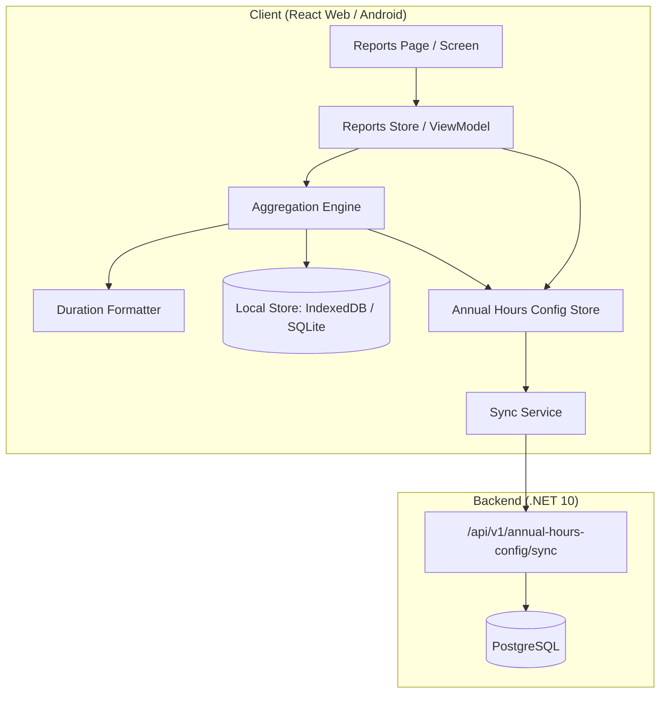

# Design Document — Reports Feature (gh10-reports)

## Overview

The Reports feature provides users with visual summaries of hours invested in calendar events, grouped by shift types and reminder types. It operates in two modes — monthly and annual — computing all aggregations against local data (offline-first). The annual mode supports an optional configured target (Annual_Hours_Config) to show surplus/deficit against planned working hours.

The feature spans three platforms:
- **React Web PWA** (TypeScript, IndexedDB/Dexie, Zustand)
- **Android App** (Kotlin, Room/SQLite, Jetpack Compose, ViewModel)
- **Backend API** (.NET 10, PostgreSQL) — sync endpoints only

All report computation is client-side. The backend only participates in synchronizing the `Annual_Hours_Config` entity for subscribed users.

---

## Architecture



### Key architectural decisions

1. **Pure client-side aggregation**: Report calculations run against local IndexedDB/SQLite. No API calls for report data — only sync for Annual_Hours_Config.
2. **Shared aggregation logic**: The aggregation engine is a pure function (inputs: events array, period, config) → (output: chart data). This keeps it testable and portable.
3. **Dedicated formatter utility**: A single `formatDuration(totalMinutes: number): string` function used consistently across all display contexts.
4. **Reactive state**: Zustand store (Web) and StateFlow (Android) trigger re-computation when the selected period or Annual_Hours_Config changes.
5. **Existing sync infrastructure reuse**: Annual_Hours_Config push/pull follows the same patterns as CalendarEvent sync (batched, LWW, cursor-paginated).

---

## Components and Interfaces

### React Web — Component Hierarchy

```
pages/ReportsPage.tsx                     (route-level, composes feature)
└── features/reports/reports.tsx           (container: state, mode, date selection)
    ├── components/TimeRangeSelector.tsx   (Month|Year segmented control)
    ├── components/DateNavigator.tsx       (arrows + label + Today button)
    ├── components/ShiftsSection.tsx       (bar chart + donut + table)
    │   ├── components/HorizontalBarChart.tsx
    │   ├── components/DonutChart.tsx
    │   └── components/ReportTable.tsx
    ├── components/RemindersSection.tsx    (bar chart + donut + table)
    │   ├── components/HorizontalBarChart.tsx (reused)
    │   ├── components/DonutChart.tsx      (reused)
    │   └── components/ReportTable.tsx     (reused)
    ├── components/EmptyState.tsx
    └── components/AnnualConfigModal.tsx
```

### React Web — Module Structure

```
src/features/reports/
├── reports.tsx                    (container component)
├── models.ts                     (AnnualHoursConfig, ReportData types)
├── components/
│   ├── TimeRangeSelector.tsx
│   ├── DateNavigator.tsx
│   ├── ShiftsSection.tsx
│   ├── RemindersSection.tsx
│   ├── HorizontalBarChart.tsx
│   ├── DonutChart.tsx
│   ├── ReportTable.tsx
│   ├── EmptyState.tsx
│   └── AnnualConfigModal.tsx
├── hooks/
│   ├── useReportData.ts          (aggregation hook, queries IndexedDB)
│   └── useAnnualConfig.ts        (CRUD for Annual_Hours_Config)
└── services/
    └── reportAggregator.ts       (pure aggregation functions)
```

### Android — Component Hierarchy

```
ui/reports/
├── ReportsScreen.kt              (stateless composable, observes ViewModel)
├── ReportsViewModel.kt           (state management, aggregation orchestration)
├── ReportsUiState.kt             (immutable data class)
├── components/ (inside ui/components/ for reuse)
│   ├── TimeRangeSelector.kt
│   ├── DateNavigator.kt
│   ├── HorizontalBarChart.kt    (already exists: BarChart.kt)
│   ├── DonutChart.kt            (already exists)
│   └── ReportTable.kt
└── AnnualConfigDialog.kt
```

### Reports State Shape

The reports feature maintains the following UI state (React Web: Zustand store, Android: `data class ReportsUiState` in ViewModel):

```typescript
interface ReportsState {
  mode: 'month' | 'year';
  selectedMonth: number;      // 0-11
  selectedYear: number;       // e.g. 2026
  previousMonth: number;      // saved when switching to Year mode
  previousYear: number;       // saved when switching to Year mode
  isConfigModalOpen: boolean;
  reportData: ReportData | null;
  isLoading: boolean;
}
```

**State behavior:**
- `previousMonth` / `previousYear` are saved when switching to Year mode.
- When switching back to Month mode, `selectedMonth` and `selectedYear` are restored from those fields.
- State resets when leaving the page (not persisted between navigations).
- Android equivalent: `data class ReportsUiState(...)` in the ViewModel with identical fields.

### Charting Libraries

| Platform | Library | Notes |
|---|---|---|
| **React Web** | [Recharts](https://recharts.org/) | Declarative React/SVG charting. `<Bar>` for horizontal bars, `<Pie>` for donut with `innerRadius`/`outerRadius` and `minAngle={3.6}` for the 1% minimum arc. |
| **Android** | Custom Compose Canvas | Existing `BarChart.kt` and `DonutChart.kt` components. Minimum arc: clamp angle to `3.6f` degrees (1% of 360°) in `drawArc`. |

### Shared Utility (cross-platform logic, implemented identically)

| Function | Signature | Purpose |
|---|---|---|
| `formatDuration` | `(totalMinutes: Int) → String` | Converts minutes to `"{X}h {Y}m"` |
| `formatHoursComparison` | `(actualMinutes: Int, configuredHours: Int) → String` | Produces `"{A}h / {C}h"` where A = floor(actualMinutes/60), C = configuredHours. Used ONLY in Shift_Donut_Chart center text when Year mode + Annual_Hours_Config exists. |
| `aggregateByType` | `(events[], period) → Map<typeId, totalMinutes>` | Groups events by eventTypeId, sums totalHours |
| `computePercentages` | `(totalsMap, configuredHours?) → Map<typeId, percentage>` | Calculates % for donut chart |
| `filterEventsForPeriod` | `(events[], startDate, endDate) → events[]` | Filters by startDay within range, isDeleted=false |

### Component Ordering Reference

| Component | Monthly Mode | Annual Mode |
|---|---|---|
| Bar chart | Descending by hours | Descending by hours |
| Table | Alphabetical by name | Descending by hours |
| Donut | By percentage (visual, clockwise from top) | By percentage (visual, clockwise from top) |

### Backend — Sync Endpoint Structure

```
backend/src/Codenized.Planixor.Api/Endpoints/AnnualHoursConfig/
├── AnnualHoursConfigRegisterEndpoints.cs
├── AnnualHoursConfigSyncPushEndpoints.cs
└── AnnualHoursConfigSyncPullEndpoints.cs
```

Following the same pattern as `CalendarEvent` sync:
- `POST /api/v1/annual-hours-config/sync/push` — accepts batch of up to 100 records
- `GET /api/v1/annual-hours-config/sync/pull?lastSyncedAt={datetime}&cursor={cursor}` — returns paginated records (userId extracted from JWT)

### Backend Logic

**Push flow:**
1. Extract `userId` from JWT claims (not from request body)
2. Validate active subscription (reject with 403 if inactive)
3. Upsert each record by `id` (`INSERT ON CONFLICT UPDATE`)
4. Return `ProcessedCount`

**Pull flow:**
1. Filter by `userId` (from JWT) + `modifiedAt > lastSyncedAt`
2. Paginate with cursor (max 100 per page)

**Design decisions:**
- The backend does NOT enforce year-level uniqueness — that is a client responsibility. The backend is a sync hub, not business logic.
- LWW conflict resolution happens on the client during pull.
- Migration: New table `AnnualHoursConfigs` created via EF Core migration.

### Navigation Year Range

The date picker allows navigation to **future years** as well (not limited to the current year).
- Navigable range: `currentYear - 10` to `currentYear + 10`.
- The `Annual_Hours_Config` model range (2000–2100) is broader than the navigable range, which is acceptable.
- Users CAN navigate to future years and configure annual hours targets for them.

---

## Data Models

### Annual_Hours_Config Entity

| Field | Type | Constraints | Description |
|---|---|---|---|
| `id` | UUID | PK, client-generated | Globally unique identifier |
| `year` | Integer | Required, range 2000–2100 | Calendar year this config applies to |
| `configuredHours` | Integer | Required, range 1–8784 | Required annual working hours (whole hours) |
| `modifiedAt` | DateTime (UTC) | Required | Last local modification timestamp |
| `syncedAt` | DateTime (UTC) | Nullable | Last successful sync timestamp |
| `isDeleted` | Boolean | Required, default false | Soft-delete flag |

**Uniqueness constraint**: Only one non-deleted record per `year` value.

### Platform Storage Schemas

#### IndexedDB (React Web — Dexie v6)

```typescript
// db.ts — add to PlanixorDatabase
this.version(6).stores({
  calendarEvents: 'id, startDay, endDay, [startDay+eventType+isDeleted], eventType, isDeleted, modifiedAt',
  shifts: 'id, createdAt, isDeleted, isActive',
  reminders: 'id, createdAt, isDeleted, isActive',
  annualHoursConfig: 'id, year, isDeleted, modifiedAt',
});
```

TypeScript interface:

```typescript
export interface AnnualHoursConfig {
  id: string;
  year: number;
  configuredHours: number;
  modifiedAt: Date;
  syncedAt: Date | null;
  isDeleted: boolean;
}
```

#### SQLite (Android — Room)

```kotlin
@Entity(
    tableName = "annual_hours_config",
    indices = [
        Index(value = ["year", "isDeleted"]),
        Index(value = ["modifiedAt"]),
    ],
)
data class AnnualHoursConfigEntity(
    @PrimaryKey val id: String,
    val year: Int,
    val configuredHours: Int,
    val modifiedAt: Long,
    val syncedAt: Long?,
    val isDeleted: Boolean,
)
```

#### Android DAO + Repository

```kotlin
@Dao
interface AnnualHoursConfigDao {
    @Query("SELECT * FROM annual_hours_config WHERE year = :year AND isDeleted = 0 LIMIT 1")
    fun getByYear(year: Int): Flow<AnnualHoursConfigEntity?>

    @Query("SELECT * FROM annual_hours_config WHERE isDeleted = 0")
    fun getAll(): Flow<List<AnnualHoursConfigEntity>>

    @Query("SELECT * FROM annual_hours_config WHERE syncedAt IS NULL OR modifiedAt > syncedAt")
    suspend fun getPendingSync(): List<AnnualHoursConfigEntity>

    @Upsert
    suspend fun upsert(entity: AnnualHoursConfigEntity)
}
```

```kotlin
class AnnualHoursConfigRepository(private val dao: AnnualHoursConfigDao) {
    fun getByYear(year: Int): Flow<AnnualHoursConfig?>
    suspend fun save(year: Int, configuredHours: Int): Result<Unit>
    suspend fun softDelete(year: Int): Result<Unit>
    suspend fun getPendingSync(): List<AnnualHoursConfig>
    suspend fun upsertFromSync(records: List<AnnualHoursConfig>)
}
```

This follows the existing pattern for Shifts and Reminders repositories in the project.

#### PostgreSQL (Backend — EF Core)

```csharp
public class AnnualHoursConfig
{
    public Guid Id { get; private set; }
    public int Year { get; private set; }
    public int ConfiguredHours { get; private set; }
    public DateTime ModifiedAt { get; private set; }
    public DateTime? SyncedAt { get; private set; }
    public bool IsDeleted { get; private set; }
}
```

EF Core configuration:
- Table: `AnnualHoursConfigs`
- Unique filtered index on `Year` WHERE `IsDeleted = false`
- `Id` as primary key (no auto-generation)

### Report Aggregation Data Structures

```typescript
/** Output of the aggregation engine */
interface ReportData {
  shifts: TypeAggregate[];
  reminders: TypeAggregate[];
  totalShiftMinutes: number;
  totalReminderMinutes: number;
  annualConfig: AnnualHoursConfig | null; // only in year mode
}

interface TypeAggregate {
  typeId: string;
  name: string;
  icon: string;
  backgroundColor: string;
  totalMinutes: number;
  percentage: number;
}
```

### Sync DTOs (Backend)

```csharp
// Push (userId extracted from JWT — not included in request body)
public record AnnualHoursConfigSyncPushRequest(
    List<AnnualHoursConfigSyncRecord> Records);

public record AnnualHoursConfigSyncRecord(
    Guid Id,
    int Year,
    int ConfiguredHours,
    DateTime ModifiedAt,
    DateTime? SyncedAt,
    bool IsDeleted);

public record AnnualHoursConfigSyncPushResponse(int ProcessedCount);

// Pull (userId extracted from JWT — query params only)
public record AnnualHoursConfigSyncPullResponse(
    List<AnnualHoursConfigSyncRecord> Records,
    string? NextCursor);
```

---

## Correctness Properties

*A property is a characteristic or behavior that should hold true across all valid executions of a system — essentially, a formal statement about what the system should do. Properties serve as the bridge between human-readable specifications and machine-verifiable correctness guarantees.*

### Property 1: Duration formatter decomposition is correct

*For any* non-negative integer `totalMinutes`, `formatDuration(totalMinutes)` SHALL produce a string `"{X}h {Y}m"` where `X == floor(totalMinutes / 60)` and `Y == totalMinutes mod 60`, such that `X * 60 + Y == totalMinutes` always holds.

**Validates: Requirements 2.11, 3.11, 5.10, 6.9, 13.1**

### Property 2: Non-positive minutes normalize to "0h 0m"

*For any* integer `totalMinutes` where `totalMinutes <= 0`, the normalized value used for formatting and aggregation SHALL be 0, producing the display string `"0h 0m"`.

**Validates: Requirements 13.2, 13.5**

### Property 3: Aggregation includes only non-deleted events of correct type within period

*For any* list of calendar events, a target event type ("shift" or "reminder"), and a date range [periodStart, periodEnd], the aggregation function SHALL include an event if and only if `event.isDeleted == false` AND `event.eventType == targetType` AND `event.startDay >= periodStart` AND `event.startDay <= periodEnd`. The `endDay` field SHALL NOT affect inclusion.

**Validates: Requirements 2.9, 2.10, 3.8, 3.9, 5.8, 5.9, 6.7, 6.8**

### Property 4: Grand total equals sum of per-type totals

*For any* set of filtered calendar events grouped by `eventTypeId`, the grand total minutes (sum of all events' `totalHours`) SHALL equal the sum of all individual per-type totals.

**Validates: Requirements 2.5, 2.7, 3.5, 3.7, 5.4, 5.6, 6.4, 6.6**

### Property 5: Relative percentages sum to 100% when no annual config

*For any* non-empty set of type aggregates where no annual hours configuration exists, the sum of all computed percentages (each being `typeTotal / grandTotal * 100`) SHALL equal exactly 100.0% before rounding.

**Validates: Requirements 2.5, 3.5, 5.4, 6.4**

### Property 6: Bar chart ordering is descending by total hours

*For any* non-empty list of type aggregates fed into the bar chart, the resulting bar order SHALL be sorted in strictly non-increasing order of `totalMinutes`.

**Validates: Requirements 2.4, 3.4, 5.3, 6.3**

### Property 7: Annual config uniqueness — one non-deleted record per year

*For any* sequence of create and update operations on the Annual_Hours_Config store, at most one record with `isDeleted == false` SHALL exist per `year` value at any point in time.

**Validates: Requirements 9.2**

### Property 8: Validation rejects out-of-range year or configuredHours

*For any* `year` value outside the range [2000, 2100] or `configuredHours` value outside the range [1, 8784], the save operation SHALL be rejected and the store state SHALL remain unchanged.

**Validates: Requirements 8.11, 9.6**

### Property 9: Donut minimum arc for sub-1% segments

*For any* type aggregate whose percentage is greater than 0% but less than 1% of the total, the donut chart rendering SHALL assign that segment a minimum visible arc equivalent to 1% of the circle.

**Validates: Requirements 2.6, 3.6**

### Property 10: Single type yields exactly 100.0% in donut

*For any* period where exactly one event type has non-zero hours, the donut chart SHALL display that type as exactly 100.0%, with no floating-point rounding artifacts (e.g., not 99.9% or 100.1%).

**Validates: Requirements 6.5**

### Property 11: Annual percentages use configured hours as denominator

*For any* set of type aggregates and a configured annual hours target, each type's percentage SHALL be computed as `(typeMinutes / (configuredHours * 60)) * 100`, which may exceed 100% if actual hours surpass the target.

**Validates: Requirements 5.5**

### Property 12: Sync conflict resolution — last writer wins, remote on tie

*For any* two Annual_Hours_Config records with the same `id`, the conflict resolver SHALL retain the record with the later `modifiedAt` timestamp. If both `modifiedAt` values are identical, the remote record SHALL be preferred.

**Validates: Requirements 10.2**

### Property 13: Config save sets modifiedAt to current UTC and clears syncedAt

*For any* successful write operation (create, update, or soft-delete) on an Annual_Hours_Config record, the resulting record SHALL have `modifiedAt` set to the current UTC timestamp and `syncedAt` set to null.

**Validates: Requirements 9.4**

### Property 14: Sync push respects batch size limit

*For any* number of pending Annual_Hours_Config records, the sync service SHALL send them in sequential batches where each batch contains at most 100 records.

**Validates: Requirements 10.1**

---

## Error Handling

| Scenario | Handling |
|---|---|
| IndexedDB/SQLite query failure | Log error, display generic error state to user, no crash |
| Invalid `totalHours` (negative) | Treat as 0 minutes, render "0h 0m" |
| Missing shift/reminder definition (soft-deleted) | Use last known name, icon, backgroundColor from cached definition. Lookups query the local store WITHOUT filtering by `isDeleted` — soft-deleted definitions are still readable for display purposes. |
| Missing shift/reminder definition (not in local store) | Use fallback: icon `❓`, name `"Unknown"`, color `#6B7280` (edge case: partial sync) |
| Annual config save with invalid value | Prevent submission, show localized validation error |
| Sync push failure (5xx) | Stop push cycle, retry on next sync trigger |
| Sync push failure (4xx) | Mark records as synced, continue cycle |
| Network unavailable during sync | Skip sync entirely, all operations remain local |
| Concurrent modal submit + dismiss | Prioritize submit, complete save before dismissing |
| Total minutes for all types equals 0 | The donut chart SHALL NOT be rendered for that section (avoids division by zero). The bar chart (with 0-width bars showing "0h 0m") and table (showing "0h 0m" per type) still render. |

### Validation Error Messages (localized)

| Key | English | Spanish |
|---|---|---|
| `annual_config_range_error` | "Value must be between 1 and 8,784" | "El valor debe estar entre 1 y 8.784" |
| `reports_empty_state` | "No data to display" | "Sin datos para mostrar" |

---

## Testing Strategy

### Property-Based Testing Configuration

- **React Web**: `fast-check` library with Vitest
- **Android**: Kotest property testing with JUnit 4
- **Minimum iterations**: 100 per property test
- **Tag format**: `Feature: gh10-reports, Property {N}: {description}`
- Each correctness property above maps to exactly ONE property-based test

### Property Tests (Vitest + fast-check / JUnit + Kotest)

| Property | Test target function | Platform |
|---|---|---|
| 1: Duration formatter | `formatDuration()` | Both |
| 2: Non-positive normalization | `normalizeTotalMinutes()` | Both |
| 3: Aggregation filtering | `filterEventsForPeriod()` | Both |
| 4: Grand total = sum of parts | `aggregateByType()` | Both |
| 5: Percentages sum to 100% | `computePercentages()` (no config) | Both |
| 6: Descending order | `sortByTotalDescending()` | Both |
| 7: Uniqueness per year | `AnnualHoursConfigStore.save()` | Both |
| 8: Validation rejection | `validateAnnualConfig()` | Both |
| 9: Min 1% arc | `computeDonutSegments()` | Both |
| 10: Single type = 100% | `computePercentages()` (single type) | Both |
| 11: Annual % with config | `computePercentages()` (with config) | Both |
| 12: LWW conflict resolution | `resolveConflict()` | Both |
| 13: Save updates modifiedAt/syncedAt | `AnnualHoursConfigStore.save()` | Both |
| 14: Batch size ≤ 100 | `createSyncBatches()` | Both |

### Unit Tests (Example-Based)

| Test target | Platform | Focus |
|---|---|---|
| Annual config modal: empty → new record | Web + Android | Specific save scenario |
| Annual config modal: clear → soft-delete | Web + Android | Specific delete scenario |
| Annual config modal: no-op on empty submit without existing | Web + Android | Edge case |
| Empty state conditional rendering | Web + Android | Presence/absence of sections |
| Shift table alphabetical ordering | Web + Android | Monthly table sort (different from bar chart) |
| Annual Shift_Table surplus/deficit row color | Web + Android | Green (≥ target) / Red (< target) |
| Soft-deleted reminder definition still renders in report | Web + Android | Uses last known metadata |
| Sync pull: insert new remote record | Web + Android | Simple insert scenario |
| Sync push failure handling (5xx vs 4xx) | Web + Android | Error path behavior |

### Integration Tests

| Test target | Platform | Type |
|---|---|---|
| Reports page renders charts for month with data | Web (RTL) | Component integration |
| Reports page shows empty state for empty month | Web (RTL) | Component integration |
| Annual config modal save → chart refresh | Web (RTL) | State + UI integration |
| Mode switch preserves date state | Web (RTL) | State management |
| ReportsScreen composable state transitions | Android (Compose) | UI state flow |
| AnnualConfigDialog validation feedback | Android (Compose) | Input validation |

### E2E Tests

| Test target | Tool |
|---|---|
| Full report navigation (month ↔ year, date changes) | Playwright (Web) |
| Annual config create → chart update flow | Playwright (Web) |
| Today button resets to current period | Playwright (Web) |

### What is NOT property-tested

- UI rendering and layout (use snapshot / visual regression tests)
- Sync network I/O (use mock-based integration tests)
- Navigation state transitions (example-based unit tests)
- Chart SVG/Canvas rendering correctness (visual regression)
- Responsive layout breakpoints (E2E visual tests)
- Performance/timing requirements (integration benchmarks)
