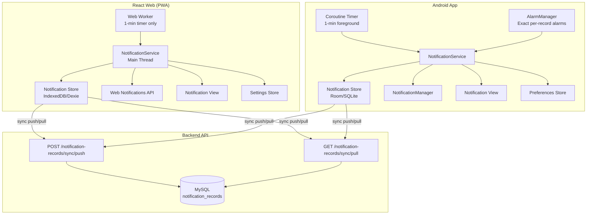
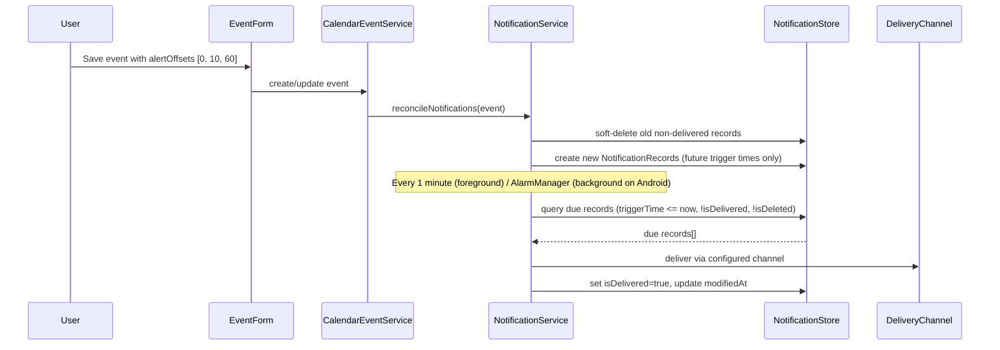
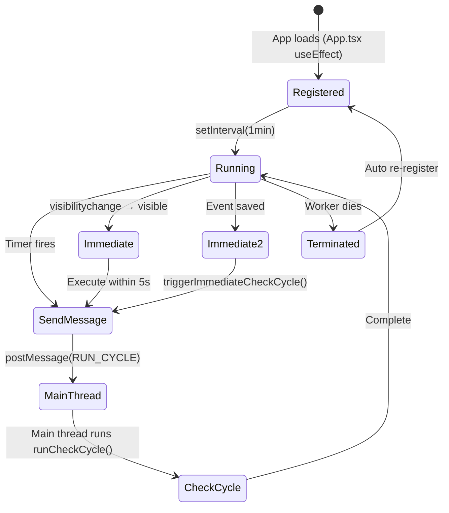
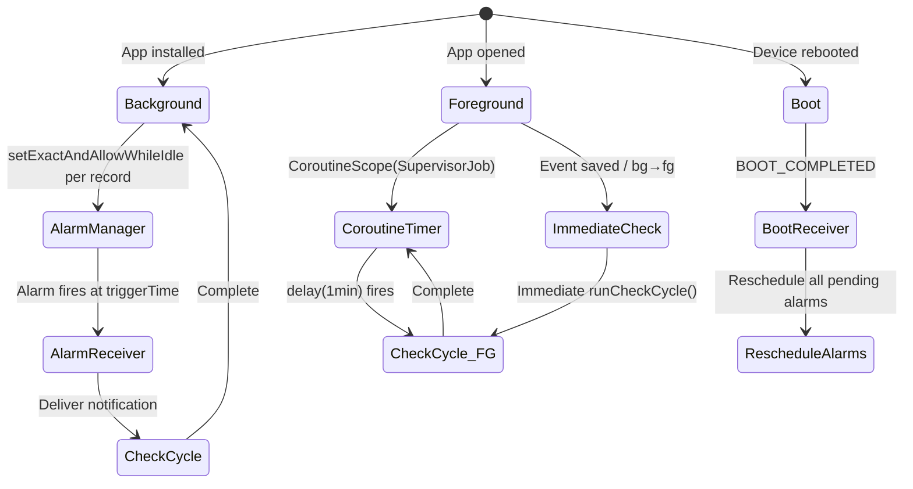
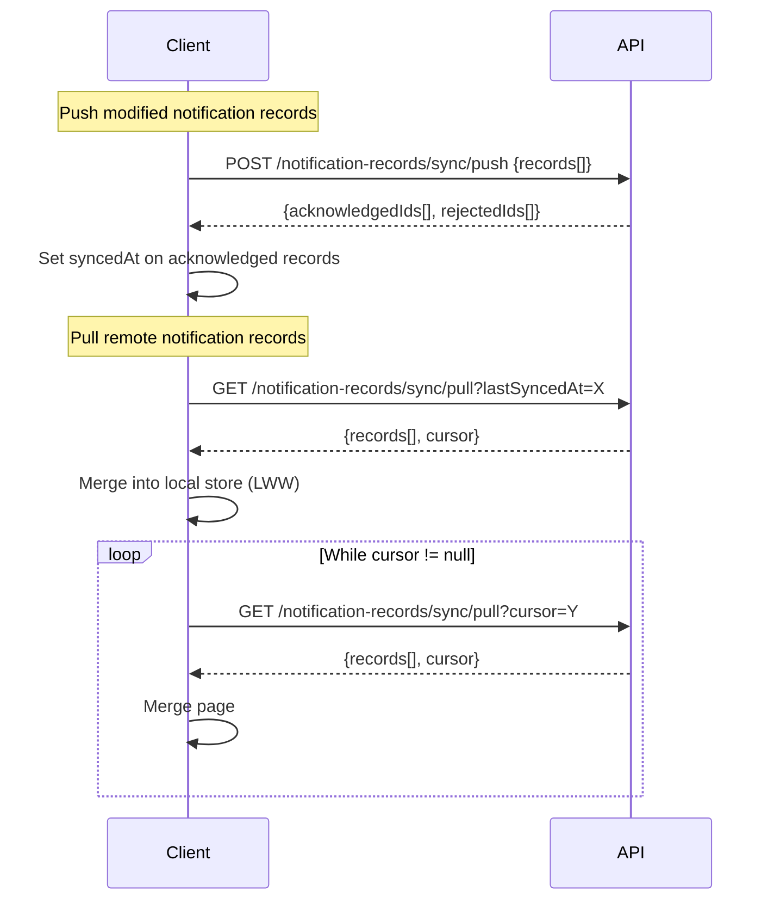

# Design Document: Notifications

## Overview

The Notifications feature adds timely alert delivery for upcoming calendar events across the React Web (PWA) and Android platforms. Users configure alert offsets on calendar events, and a background process checks for due notifications every 1 minute (foreground), delivering them through user-configured channels (in-app, system-native, or both).

The feature follows the existing offline-first architecture: all notification logic operates against local data stores (IndexedDB on web, SQLite on Android), with optional bidirectional sync for subscribed users via the existing sync infrastructure.

This feature includes creation of the PWA manifest and required icon assets (192×192 and 512×512 PNG) as part of the notification delivery infrastructure. The Planixor app icon is used in System_Notifications.

### Key Design Decisions

1. **Extend CalendarEvent with `alertOffsets` field** rather than creating a separate alert configuration entity — keeps event and alert config atomic and simplifies sync.
2. **Separate `NotificationRecord` entity** for tracking delivery state — decouples notification lifecycle (scheduling, delivery, read state) from the calendar event itself.
3. **Web Worker as pure timer for PWA** (not Service Worker) — Service Workers have limited timer support; a dedicated Web Worker provides reliable 1-minute interval timer. The Worker sends `RUN_CYCLE` messages to the main thread, which executes `runCheckCycle()` where the Notification API is available (Web Workers cannot access `Notification`).
4. **AlarmManager for Android notification delivery** — Samsung/OneUI aggressively delays WorkManager tasks. `AlarmManager.setExactAndAllowWhileIdle()` provides exact timing per notification record. `NotificationCheckWorker` code exists but is NOT enqueued. `NotificationTimerService` handles foreground 1-minute checks with a coroutine timer.
5. **Device-local notification settings** (not synced) — notification channel preference is device-specific behavior, not cross-device state.
6. **Default notification channel is "App"** (not "Both") — "Both" requires system notification permission that isn't automatically requested. Starting with "App" means users must explicitly opt-in to system notifications, which naturally triggers the permission dialog.
7. **"Both" channel uses best-effort system delivery** — Always marks `isDelivered=true` so the app notification is always visible. System notification is attempted but failure does not block the app notification.
8. **Immediate check cycle after event save** — `triggerImmediateCheckCycle()` (web) and `runCheckCycle()` (Android) called after every event create/update/delete for instant notification delivery.
9. **Immediate badge refresh on mark-as-read** — `refreshBadgeCount()` called immediately after markAsRead / markAllAsRead for instant UX feedback.

## Architecture

### High-Level System Diagram



### Data Flow: Notification Lifecycle



## Components and Interfaces

### React Web Components

| Component | Location | Responsibility |
|---|---|---|
| `NotificationWorker` | `src/workers/notification.worker.ts` | Web Worker running 5-min check cycle timer |
| `notificationService` | `src/features/notifications/services/notificationService.ts` | Core notification logic: check due, deliver, reconcile |
| `notificationStore` | Extension of `src/data/db.ts` | Dexie table for NotificationRecord |
| `NotificationView` | `src/features/notifications/components/NotificationView.tsx` | Bell dropdown with notification list |
| `NotificationBadge` | `src/features/notifications/components/NotificationBadge.tsx` | Badge counter on bell icon |
| `AlertConfigField` | `src/features/notifications/components/AlertConfigField.tsx` | Multi-select alert options in EventForm |
| `notificationSettings` | `src/features/notifications/services/notificationSettings.ts` | Device-local channel preference (IndexedDB/Dexie — accessible from Web Worker) |
| `notificationSync` | `src/features/notifications/services/notificationSync.ts` | Sync push/pull for NotificationRecords |
| `PWA Manifest & Icons` | `public/manifest.json`, `public/icons/` | Web app manifest with 192×192 and 512×512 PNG icons for installability and System_Notification display |

### Android Components

| Component | Location | Responsibility |
|---|---|---|
| `NotificationAlarmScheduler` | `data/notification/NotificationAlarmScheduler.kt` | Schedules/cancels exact AlarmManager alarms per NotificationRecord |
| `NotificationAlarmReceiver` | `data/notification/NotificationAlarmReceiver.kt` | BroadcastReceiver that triggers notification delivery when alarm fires |
| `BootReceiver` | `data/notification/BootReceiver.kt` | BroadcastReceiver that reschedules all pending alarms after device reboot |
| `NotificationCheckWorker` | `data/notification/NotificationCheckWorker.kt` | WorkManager periodic worker (NOT enqueued — retained as code only) |
| `NotificationTimerService` | `data/notification/NotificationTimerService.kt` | Lifecycle-aware service observing ProcessLifecycleOwner for foreground 1-min check cycles (with try-catch for resilience) |
| `NotificationService` | `data/notification/NotificationService.kt` | Core logic: check due, deliver, reconcile |
| `NotificationRecordDao` | `data/local/NotificationRecordDao.kt` | Room DAO for notification records |
| `NotificationRecordEntity` | `data/local/NotificationRecordEntity.kt` | Room entity |
| `NotificationSyncAdapter` | `data/sync/NotificationRecordSyncAdapter.kt` | Sync push/pull following CalendarEvent pattern |
| `NotificationsScreen` | `ui/notifications/NotificationsScreen.kt` | Full-screen notification list |
| `NotificationsViewModel` | `ui/notifications/NotificationsViewModel.kt` | ViewModel for notification view |
| `AlertConfigSelector` | `ui/components/AlertConfigSelector.kt` | Multi-select composable for event form |

### Backend Components

| Component | Location | Responsibility |
|---|---|---|
| `NotificationRecord` entity | `Core/Entities/NotificationRecord.cs` | Domain entity with sync methods |
| Sync Push endpoint | `Api/Endpoints/NotificationRecord/NotificationRecordSyncPushEndpoints.cs` | POST `/api/v1/notification-records/sync/push` |
| Sync Pull endpoint | `Api/Endpoints/NotificationRecord/NotificationRecordSyncPullEndpoints.cs` | GET `/api/v1/notification-records/sync/pull` |
| DTOs | `Dtos/NotificationRecord/Sync/` | Push/Pull request/response records |
| Repository | `Persistence.MySql.Efc.Repositories/NotificationRecord/` | EF Core data access |
| EF Configuration | `Persistence.MySql.Efc.DataContext/Entities/NotificationRecordConfiguration.cs` | Table mapping and indexes |

### Interface Contracts

#### NotificationService (shared logic — both platforms)

```typescript
// React Web — src/features/notifications/services/notificationService.ts
interface NotificationServiceAPI {
  /** Run a check cycle: find due notifications, deliver them */
  runCheckCycle(): Promise<void>;

  /** Reconcile notifications when event alertOffsets or start time changes */
  reconcileNotifications(event: CalendarEvent): Promise<void>;

  /** Soft-delete all notifications for a calendar event (cascade delete) */
  deleteNotificationsForEvent(calendarEventId: string): Promise<void>;

  /** Get unread delivered notification count for badge */
  getUnreadCount(): Promise<number>;
}
```

```kotlin
// Android — data/notification/NotificationService.kt
interface NotificationService {
    suspend fun runCheckCycle()
    suspend fun reconcileNotifications(event: CalendarEventEntity)
    suspend fun deleteNotificationsForEvent(calendarEventId: String)
    suspend fun getUnreadCount(): Int
}
```

#### NotificationSettings (device-local, not synced)

```typescript
// React Web — uses IndexedDB (Dexie) — accessible from Web Worker
interface NotificationSettings {
  getChannel(): NotificationChannel; // 'app' | 'system' | 'both'
  setChannel(channel: NotificationChannel): void;
}
// Default: 'app' (user must explicitly opt-in to system notifications)
```

```kotlin
// Android — uses DataStore preferences
interface NotificationPreferences {
    val channelFlow: Flow<NotificationChannel>
    suspend fun setChannel(channel: NotificationChannel)
}
```

## Data Models

### NotificationRecord — Cross-Platform Schema

| Field | Type | Constraints | Description |
|---|---|---|---|
| `id` | UUID (string) | PK, client-generated | Unique notification record identifier |
| `calendarEventId` | UUID (string) | FK → calendar_events.id, required | Referenced calendar event |
| `alertOffset` | int | Required, one of {0, 10, 60, 1440} | Minutes before event start |
| `triggerTime` | DateTime (UTC) | Required, computed | Event start time minus alertOffset |
| `isDelivered` | boolean | Required, default false | Whether notification has been delivered |
| `isRead` | boolean | Required, default false | Whether user has read/dismissed |
| `modifiedAt` | DateTime (UTC) | Required, updated on every write | Change tracking |
| `syncedAt` | DateTime (UTC) | Nullable | Last successful sync timestamp |
| `isDeleted` | boolean | Required, default false | Soft-delete flag |

**Uniqueness constraint:** `(calendarEventId, alertOffset)` among non-deleted records.

**Display field derivation:** Display fields (event name, icon, color) are derived by joining NotificationRecord with CalendarEvent on `calendarEventId`. Since CalendarEvents use soft-delete (records are never physically removed from local storage), the join always succeeds regardless of the event's `isDeleted` state. No field caching is required on the NotificationRecord.

### Trigger Time Computation

```
eventStartDateTime (LOCAL) = startDay (parsed as date) at 00:00 LOCAL + startTime minutes
triggerTime = eventStartDateTime - alertOffset minutes
```

- `startTime` represents minutes from local midnight (the user enters local time in the time picker), NOT UTC midnight. The trigger time is computed in local timezone and compared against local device time.
- For multi-day events (startDay ≠ endDay): always use `startDay + startTime` as the reference point. The endDay is irrelevant for notification scheduling — alerts notify before the START of the event.
- Clients compose the DateTime in local time since startDay + startTime represents the local moment as entered by the user.

### CalendarEvent Extension — `alertOffsets` Field

Added to the existing CalendarEvent model on all platforms:

| Field | Type | Constraints | Description |
|---|---|---|---|
| `alertOffsets` | int[] | Optional, default `[]`, max 4 elements, values ∈ {0, 10, 60, 1440} | Selected alert configuration |

**Platform migration notes for `alertOffsets`:**

- **React Web (Dexie):** No schema migration needed — Dexie/IndexedDB is schema-less for non-indexed fields. Simply adding `alertOffsets` to the CalendarEvent TypeScript interface is sufficient. Existing records will read `undefined` which is treated as `[]`.
- **Android (Room):** ADD to the migration 6→7 SQL: `ALTER TABLE calendar_events ADD COLUMN alertOffsets TEXT NOT NULL DEFAULT '[]';` and update `CalendarEventEntity` with `val alertOffsets: String = "[]"` (JSON string).
- **Backend:** Keep as `AlertOffsetsJson VARCHAR(50)` — pragmatic for a small array that avoids a join table.

### React Web — Dexie Schema (db.ts version 7)

```typescript
// New version 7 adds notifications table and notificationSettings
this.version(7).stores({
  calendarEvents: 'id, startDay, endDay, [startDay+eventType+isDeleted], eventType, isDeleted, modifiedAt',
  shifts: 'id, createdAt, isDeleted, isActive',
  reminders: 'id, createdAt, isDeleted, isActive',
  annualHoursConfig: 'id, year, isDeleted, modifiedAt',
  notifications: 'id, calendarEventId, triggerTime, [isDelivered+isRead+isDeleted], isDeleted, modifiedAt',
  notificationSettings: 'key',
});
```

**NotificationRecord TypeScript interface:**

```typescript
export interface NotificationRecord {
  id: string;
  calendarEventId: string;
  alertOffset: number; // 0 | 10 | 60 | 1440
  triggerTime: Date;
  isDelivered: boolean;
  isRead: boolean;
  modifiedAt: Date;
  syncedAt: Date | null;
  isDeleted: boolean;
}
```

> **Note on compound boolean index:** The `[isDelivered+isRead+isDeleted]` compound index uses boolean values stored as 0/1 integers in IndexedDB. All target browsers (Chrome, Edge, Firefox, Safari) support this in 2025+. If a query via compound index returns unexpected results, use `.filter()` as fallback — acceptable given typical notification volume (<1000 active records per device).

### Android — Room Entity

```kotlin
@Entity(
    tableName = "notification_records",
    indices = [
        Index(value = ["calendarEventId", "alertOffset", "isDeleted"]),
        Index(value = ["triggerTime", "isDelivered", "isDeleted"]),
        Index(value = ["isDelivered", "isRead", "isDeleted"]),
        Index(value = ["isDeleted"]),
        Index(value = ["modifiedAt"]),
    ],
)
data class NotificationRecordEntity(
    @PrimaryKey
    val id: String,
    val calendarEventId: String,
    val alertOffset: Int, // 0, 10, 60, or 1440
    val triggerTime: Long, // UTC millis
    val isDelivered: Boolean,
    val isRead: Boolean,
    val modifiedAt: Long, // UTC millis
    val syncedAt: Long?, // UTC millis, null = never synced
    val isDeleted: Boolean,
)
```

**Room Database migration (version 6 → 7):**

```kotlin
val MIGRATION_6_7 = object : Migration(6, 7) {
    override fun migrate(db: SupportSQLiteDatabase) {
        db.execSQL("""
            CREATE TABLE IF NOT EXISTS `notification_records` (
                `id` TEXT NOT NULL,
                `calendarEventId` TEXT NOT NULL,
                `alertOffset` INTEGER NOT NULL,
                `triggerTime` INTEGER NOT NULL,
                `isDelivered` INTEGER NOT NULL,
                `isRead` INTEGER NOT NULL,
                `modifiedAt` INTEGER NOT NULL,
                `syncedAt` INTEGER,
                `isDeleted` INTEGER NOT NULL,
                PRIMARY KEY(`id`)
            )
        """.trimIndent())
        db.execSQL("CREATE INDEX IF NOT EXISTS `index_notification_records_calendarEventId_alertOffset_isDeleted` ON `notification_records` (`calendarEventId`, `alertOffset`, `isDeleted`)")
        db.execSQL("CREATE INDEX IF NOT EXISTS `index_notification_records_triggerTime_isDelivered_isDeleted` ON `notification_records` (`triggerTime`, `isDelivered`, `isDeleted`)")
        db.execSQL("CREATE INDEX IF NOT EXISTS `index_notification_records_isDelivered_isRead_isDeleted` ON `notification_records` (`isDelivered`, `isRead`, `isDeleted`)")
        db.execSQL("CREATE INDEX IF NOT EXISTS `index_notification_records_isDeleted` ON `notification_records` (`isDeleted`)")
        db.execSQL("CREATE INDEX IF NOT EXISTS `index_notification_records_modifiedAt` ON `notification_records` (`modifiedAt`)")

        // Add alertOffsets column to existing calendar_events table
        db.execSQL("ALTER TABLE calendar_events ADD COLUMN alertOffsets TEXT NOT NULL DEFAULT '[]'")
    }
}
```

### Backend — Entity and EF Core Configuration

**Entity (`Core/Entities/NotificationRecord.cs`):**

```csharp
public sealed class NotificationRecord
{
    private NotificationRecord() { }

    public Guid Id { get; private set; }
    public Guid UserId { get; private set; }
    public Guid CalendarEventId { get; private set; }
    public int AlertOffset { get; private set; }
    public DateTime TriggerTime { get; private set; }
    public bool IsDelivered { get; private set; }
    public bool IsRead { get; private set; }
    public DateTime ModifiedAt { get; private set; }
    public DateTime? SyncedAt { get; private set; }
    public bool IsDeleted { get; private set; }

    public static NotificationRecord CreateFromSync(
        Guid id, Guid userId, Guid calendarEventId,
        int alertOffset, DateTime triggerTime,
        bool isDelivered, bool isRead,
        DateTime modifiedAt, bool isDeleted)
    {
        return new NotificationRecord
        {
            Id = id, UserId = userId, CalendarEventId = calendarEventId,
            AlertOffset = alertOffset, TriggerTime = triggerTime,
            IsDelivered = isDelivered, IsRead = isRead,
            ModifiedAt = modifiedAt, IsDeleted = isDeleted,
            SyncedAt = DateTime.UtcNow,
        };
    }

    public void ApplySync(
        Guid calendarEventId, int alertOffset, DateTime triggerTime,
        bool isDelivered, bool isRead, DateTime modifiedAt, bool isDeleted)
    {
        this.CalendarEventId = calendarEventId;
        this.AlertOffset = alertOffset;
        this.TriggerTime = triggerTime;
        this.IsDelivered = isDelivered;
        this.IsRead = isRead;
        this.ModifiedAt = modifiedAt;
        this.IsDeleted = isDeleted;
        this.SyncedAt = DateTime.UtcNow;
    }

    public void MarkSynced() { this.SyncedAt = DateTime.UtcNow; }
}
```

**EF Core Configuration:**

```csharp
public class NotificationRecordConfiguration : IEntityTypeConfiguration<NotificationRecord>
{
    public void Configure(EntityTypeBuilder<NotificationRecord> builder)
    {
        builder.ToTable("NotificationRecords");
        builder.HasKey(n => n.Id);

        builder.Property(n => n.UserId).IsRequired();
        builder.Property(n => n.CalendarEventId).IsRequired();
        builder.Property(n => n.AlertOffset).IsRequired();
        builder.Property(n => n.TriggerTime).IsRequired();
        builder.Property(n => n.IsDelivered).IsRequired();
        builder.Property(n => n.IsRead).IsRequired();
        builder.Property(n => n.ModifiedAt).IsRequired();
        builder.Property(n => n.IsDeleted).IsRequired();

        builder.HasIndex(n => new { n.UserId, n.ModifiedAt });
        builder.HasIndex(n => new { n.UserId, n.IsDeleted });
        builder.HasIndex(n => new { n.CalendarEventId, n.AlertOffset, n.IsDeleted });
    }
}
```

### CalendarEvent `alertOffsets` — Backend Extension

**Updated `CalendarEventSyncRecord` DTO:**

```csharp
public record CalendarEventSyncRecord(
    Guid Id,
    string EventType,
    Guid EventTypeId,
    string StartDay,
    string EndDay,
    int StartTime,
    int EndTime,
    int TotalHours,
    string? Notes,
    List<int> AlertOffsets, // NEW: [0, 10, 60, 1440] subset
    DateTime ModifiedAt,
    bool IsDeleted);
```

**Updated `CalendarEvent` entity** — add property:

```csharp
public string AlertOffsetsJson { get; private set; } = "[]";
```

Stored as JSON string in MySQL (`VARCHAR(50)`), parsed to `List<int>` in the sync record mapping. Max 4 elements, values constrained to {0, 10, 60, 1440}.

### Notification Sync DTOs (Backend)

**`NotificationRecordSyncRecord`:**

```csharp
public record NotificationRecordSyncRecord(
    Guid Id,
    Guid CalendarEventId,
    int AlertOffset,
    DateTime TriggerTime,
    bool IsDelivered,
    bool IsRead,
    DateTime ModifiedAt,
    bool IsDeleted);
```

**Push/Pull** follow the exact same pattern as `CalendarEventSyncPush/Pull` — batch of 100, acknowledged/rejected IDs on push, cursor-based pagination on pull.

### Android Sync Record

```kotlin
data class NotificationRecordSyncRecord(
    val id: String,
    val calendarEventId: String,
    val alertOffset: Int,
    val triggerTime: String, // ISO 8601
    val isDelivered: Boolean,
    val isRead: Boolean,
    val modifiedAt: String, // ISO 8601
    val isDeleted: Boolean,
)
```

## Background Process Design

### React Web — Web Worker (Timer-Only Architecture)



**Implementation:**

- `src/workers/notification.worker.ts` — standalone Web Worker file (pure timer)
- Registers on app load via `new Worker()` in `App.tsx` `useEffect` on mount (`registerNotificationWorker()`)
- The Web Worker owns the timer (`setInterval(60000)` — 1 min) but does NOT execute `runCheckCycle()` directly
- On each timer tick, the Worker sends `{ type: 'RUN_CYCLE' }` to the main thread
- **Main thread** receives the message and executes `runCheckCycle()` where the `Notification` API is available (Web Workers cannot access the Notification API)
- Main thread sends `{ type: 'CHECK_NOW' }` messages for exceptional triggers:
  - `visibilitychange` to "visible" (app regains focus)
  - Re-registration after Worker crash
  - After event create/update/delete (`triggerImmediateCheckCycle()`)
- Worker responds to `CHECK_NOW` by immediately sending `RUN_CYCLE` back
- Main thread updates badge count after each check cycle via `refreshBadgeCount()`
- If Worker terminates (error event), main thread re-registers and sends immediate `CHECK_NOW`

> **Why 1-minute interval:** Matches the precision of the time picker (minimum event duration). More responsive for "At start time" (0 offset) alerts where users expect immediate delivery.

### Android — AlarmManager + Foreground Timer



**Implementation:**

- **`NotificationAlarmScheduler`** — schedules individual `AlarmManager.setExactAndAllowWhileIdle()` alarms for each NotificationRecord's `triggerTime`
  - Alarms are scheduled when NotificationRecords are created during reconciliation
  - Alarms are cancelled when NotificationRecords are soft-deleted
  - Alarms are rescheduled when triggerTime is recomputed (event start time change)
- **`NotificationAlarmReceiver`** extends `BroadcastReceiver` — receives alarm intents and triggers notification delivery for the specific record
- **`BootReceiver`** extends `BroadcastReceiver` — listens for `BOOT_COMPLETED` and reschedules all pending alarms (alarms are lost on device reboot)
- **`NotificationTimerService`** — lifecycle-aware service for foreground 1-minute check cycles:
  - Implements `DefaultLifecycleObserver`, registered as observer of `ProcessLifecycleOwner` in `PlanixorApplication.onCreate()`
  - Uses its own `CoroutineScope(SupervisorJob() + Dispatchers.Default)`, NOT viewModelScope
  - `onStart()` starts the timer coroutine with `delay(60_000)` loop (1 min), `onStop()` cancels it
  - `@Singleton` via Hilt injection
  - Includes try-catch around `runCheckCycle()` calls to prevent app crashes if DataStore or DB has issues
- On qualifying bg→fg transition: immediate check cycle within 5 seconds
- On event save: immediate `runCheckCycle()` for instant notification delivery
- Both foreground timer and AlarmReceiver call the same `NotificationService.runCheckCycle()` method

**Required Permissions:**
- `SCHEDULE_EXACT_ALARM` — required for `setExactAndAllowWhileIdle()`
- `USE_EXACT_ALARM` — alternative permission for exact alarms (API 33+)
- `RECEIVE_BOOT_COMPLETED` — for `BootReceiver` to reschedule alarms after reboot

> **Note:** `NotificationCheckWorker` code still exists in the codebase but is NOT enqueued. WorkManager's 15-min minimum interval was too imprecise, and Samsung/OneUI aggressively delays WorkManager tasks further. AlarmManager provides exact timing.

## Permission Handling

### React Web (PWA)

1. User selects "System" or "Both" channel
2. Check `Notification.permission`:
   - `"granted"` → proceed, no prompt needed
   - `"default"` → call `Notification.requestPermission()`
     - Result `"granted"` → proceed
     - Result `"denied"` or `"default"` → show guidance message, revert to "App"
   - `"denied"` → show guidance message (direct to browser settings), revert to "App"
3. On each check cycle: verify `Notification.permission === "granted"` before System delivery
4. If permission revoked since last check: skip System delivery, show inline warning in settings

> **Atomicity of channel revert + guidance:** The channel revert and guidance display are implemented as sequential statements within a single synchronous scope. Since both operations are local state mutations (IndexedDB/DataStore write + UI state update), failure of the persistence write prevents the guidance display, maintaining the atomic semantics required by Req 5.2.

### Android

1. User selects "System" or "Both" channel
2. Check `NotificationManagerCompat.areNotificationsEnabled()`:
   - If API 33+ and no `POST_NOTIFICATIONS` permission: request runtime permission
     - Granted → proceed
     - Denied → show guidance, revert to "App"
   - If notifications disabled at system level: show guidance, revert to "App"
3. Create notification channel `"planixor_alerts"` with `IMPORTANCE_HIGH` on first run
4. On each check cycle: verify notifications enabled before System delivery

## UI Components

### Notification Bell Icon + Badge (Top Bar)

- Visible when channel is "App" or "Both"; hidden when "System"
- Badge shows unread delivered count: exact number for 1–99, "99+" for >99, hidden at 0
- Click/tap opens NotificationView (dropdown on web, full screen on Android)
- Badge updates reactively from NotificationStore query

### Notification View

**Web (dropdown panel):**
- Anchored to bell icon, opens below
- Max height 400px, scrollable
- Header: "Notifications" title + "Mark all as read" button
- List items: event icon + event name (truncated 60 chars) + alert label + relative/absolute time
- Empty state: localized "No pending notifications" message
- Click item → mark as read, remove from list

**Android (full screen):**
- Scaffold with TopAppBar "Notifications"
- LazyColumn with notification items
- Same layout: icon + name + alert label + time
- Swipe or tap to mark as read
- "Mark all as read" action in top bar

### Alert Config Field (Event Form)

- Multi-select chip/checkbox group with 4 options:
  - "At start time" (offset: 0)
  - "10 minutes before" (offset: 10)
  - "1 hour before" (offset: 60)
  - "1 day before" (offset: 1440)
- Only visible when event start is strictly in the future
- Hidden entirely when event start ≤ current device time
- Persists selection to `alertOffsets` array on the calendar event

### Notification Settings Section

- Located in the Settings page under a "Notifications" heading
- Single-select radio/segmented control with 3 options: App, System, Both
- Default: "App"
- Inline warning when System selected but permission denied
- Persists to device-local storage immediately on selection
- **Web limitation notice:** Informational text displayed below the channel selector: "Notifications will only be sent while the application is open or minimized in the browser." (Localized in both Spanish and English)

## Sync Design

### NotificationRecord Sync

Follows the identical pattern as CalendarEvent sync:

1. **Push**: Query records where `syncedAt IS NULL OR modifiedAt > syncedAt`, batch 100, POST to `/api/v1/notification-records/sync/push`
2. **Pull**: GET `/api/v1/notification-records/sync/pull?lastSyncedAt={ts}&cursor={cursor}`, paginated at 100
3. **Merge**: Insert new, LWW for conflicts (remote wins on tie), propagate deletions
4. **Trigger**: Runs as part of the existing sync cycle (alongside CalendarEvent, Shift, Reminder, AnnualHoursConfig sync)

### alertOffsets on CalendarEvent Sync

- The `alertOffsets` field is added to the existing `CalendarEventSyncRecord` payload
- No separate sync endpoint needed
- Backend stores as JSON string column; clients serialize/deserialize during sync mapping

### Sync Order and Reconciliation Rules

- The CalendarEvent pull does NOT trigger local notification reconciliation. NotificationRecords are always created/modified on the originating device and propagated to other devices via the NotificationRecord sync channel.
- Sync order within a cycle: 1. Push CalendarEvents (includes alertOffsets), 2. Push NotificationRecords, 3. Pull CalendarEvents, 4. Pull NotificationRecords.
- If a pulled CalendarEvent has modified startTime, the corresponding NotificationRecords with updated triggerTimes will arrive via the NotificationRecord pull — no local recomputation needed on the receiving device.

### Sync Sequence



## Correctness Properties

*A property is a characteristic or behavior that should hold true across all valid executions of a system — essentially, a formal statement about what the system should do. Properties serve as the bridge between human-readable specifications and machine-verifiable correctness guarantees.*

### Property 1: Alert field visibility is determined by event start time

*For any* calendar event start DateTime and reference "now" DateTime, the alert configuration field SHALL be visible if and only if the event start is strictly in the future (start > now).

**Validates: Requirements 1.1, 1.3**

### Property 2: Notification record creation filters by future trigger time

*For any* calendar event with a future start time and any subset of alertOffsets [0, 10, 60, 1440], the system SHALL create exactly one NotificationRecord for each offset whose computed trigger time (event start minus offset minutes) is strictly in the future relative to the current device time, and SHALL NOT create records for offsets whose trigger time is in the past or equal to now.

**Validates: Requirements 1.4**

### Property 3: Alert config reconciliation produces correct diff

*For any* existing set of non-delivered NotificationRecords for an event and any new alertOffsets array, after reconciliation: (a) all previously existing non-delivered records for removed offsets have isDeleted=true, (b) new records exist for each added offset with future trigger time, and (c) records for unchanged offsets with future trigger times remain unaffected.

**Validates: Requirements 1.5, 1.6, 8.7**

### Property 4: alertOffsets persistence round-trip

*For any* valid alertOffsets array (0–4 elements from {0, 10, 60, 1440}), saving the array to the calendar event and reading it back SHALL produce an identical array. When serialized for sync and deserialized on another platform, the array SHALL be equivalent.

**Validates: Requirements 1.7, 10.6**

### Property 5: Trigger time recomputation on start time change

*For any* calendar event with non-deleted NotificationRecords and any new start time, after recomputation each remaining non-deleted record's triggerTime SHALL equal the new event start DateTime (UTC) minus alertOffset minutes, and modifiedAt SHALL be updated to the current UTC timestamp.

**Validates: Requirements 1.8, 8.8, 9.1**

### Property 6: Due notification identification

*For any* set of NotificationRecords and a reference "now" timestamp, the set of due notifications SHALL be exactly those records where triggerTime ≤ now AND isDelivered = false AND isDeleted = false, with no age-based expiration threshold.

**Validates: Requirements 2.1, 2.2, 2.9, 6.6**

### Property 7: Notification view query correctness

*For any* set of NotificationRecords, the notification view SHALL display exactly those records where isRead = false AND isDelivered = true AND isDeleted = false, ordered by triggerTime descending, limited to the most recent 100 records.

**Validates: Requirements 3.1**

### Property 8: Time display formatting

*For any* trigger time and a reference "now" time, if the difference (now - triggerTime) is less than 24 hours, the display SHALL use relative duration format; otherwise it SHALL use absolute date-time format in the device locale.

**Validates: Requirements 3.2**

### Property 9: Badge count display

*For any* integer count of unread delivered notifications: if count = 0 the badge SHALL be hidden, if 1 ≤ count ≤ 99 the badge SHALL show the exact count, and if count > 99 the badge SHALL show "99+".

**Validates: Requirements 3.6**

### Property 10: Bell icon visibility based on channel

*For any* notification channel setting, the bell icon SHALL be visible if and only if the channel is "App" or "Both" (hidden when "System").

**Validates: Requirements 4.4, 4.5, 11.4**

### Property 11: System notification content formatting

*For any* calendar event name, emoji icon, alert offset, and event start time, the System_Notification SHALL display: the Planixor app icon, the event emoji + event name as the notification title (truncated to 65 characters), and the notification body with date + time (line 1) and time remaining label (line 2, localized). Android uses `BigTextStyle` for multiline; Web uses `\n` in body.

**Example:** Title: "☀️ Turno Mañana" / Body: "20 jun 2025 · 10:00\nEn 10 minutos"

**Validates: Requirements 5.5**

### Property 12: Uniqueness constraint on (calendarEventId, alertOffset)

*For any* non-deleted NotificationRecords in the store, there SHALL exist at most one record for each unique combination of (calendarEventId, alertOffset). Attempting to create a duplicate SHALL either be prevented or result in an update of the existing record.

**Validates: Requirements 8.1**

### Property 13: modifiedAt updated on every write

*For any* write operation (create, update, or soft-delete) on a NotificationRecord, the resulting record's modifiedAt SHALL be greater than or equal to the timestamp at which the operation was initiated.

**Validates: Requirements 8.3**

### Property 14: Cascade soft-delete on calendar event deletion

*For any* calendar event that is soft-deleted, ALL associated NotificationRecords (regardless of their isDelivered or isRead state) SHALL have isDeleted set to true and modifiedAt updated to the current UTC timestamp.

**Validates: Requirements 8.5, 9.4**

### Property 15: alertOffsets validation

*For any* alertOffsets value, it SHALL be accepted if and only if it is an array of 0–4 elements where each element is one of {0, 10, 60, 1440} with no duplicate values.

**Validates: Requirements 8.6**

### Property 16: Past trigger time soft-deletion after recomputation

*For any* NotificationRecord whose triggerTime is recomputed (due to event start time change), if the new triggerTime ≤ current device UTC time, that record SHALL be soft-deleted (isDeleted = true, modifiedAt = current UTC).

**Validates: Requirements 9.2, 9.3**

### Property 17: Future restoration creates notifications

*For any* calendar event with alertOffsets that transitions from past start to future start, the system SHALL create new NotificationRecords for each configured alertOffset whose trigger time (new start minus offset) is strictly in the future.

**Validates: Requirements 9.5**

### Property 18: Push candidate identification

*For any* set of NotificationRecords, the sync push candidates SHALL be exactly those records where syncedAt is null OR modifiedAt > syncedAt, batched into groups of at most 100 records per request.

**Validates: Requirements 10.1**

### Property 19: Sync merge with LWW conflict resolution

*For any* pulled remote NotificationRecord: (a) if no local record with the same ID exists, it SHALL be inserted with syncedAt = now; (b) if a local record exists with modifiedAt ≤ syncedAt (unmodified), the remote SHALL overwrite; (c) if a conflict exists (local modifiedAt > syncedAt), the record with the later modifiedAt wins, with remote winning on tie; (d) if the remote has isDeleted = true, the local record's isDeleted SHALL be set to true.

**Validates: Requirements 10.3, 10.4, 10.5**

## Error Handling

### Notification Delivery Failures

| Scenario | Behavior |
|---|---|
| System permission denied | Retain `isDelivered=false`, reattempt next cycle; show inline warning in settings |
| System permission revoked mid-use | Skip System delivery, deliver App if channel is "Both"; show warning |
| Web Worker terminates | Auto re-register, execute immediate check cycle |
| WorkManager task fails | Android retries automatically per WorkManager retry policy |
| Partial delivery (App succeeds, System fails) when channel is "Both" | Always mark `isDelivered=true` — app notification is always visible. System notification is best-effort; failure does not block app delivery or retry. |
| Referenced calendar event deleted | Display notification with cached name/icon; disable navigation action |
| Network failure during sync push | Leave `syncedAt` unchanged; records remain eligible for next cycle |
| Network failure during sync pull | Stop pull pagination; retry on next sync cycle |

### Validation Errors

| Scenario | Behavior |
|---|---|
| Invalid alertOffset value (not in {0,10,60,1440}) | Reject silently; do not create NotificationRecord |
| alertOffsets array exceeds 4 elements | Truncate to first 4; log warning |
| Duplicate (calendarEventId, alertOffset) non-deleted | Skip creation; existing record takes precedence |
| triggerTime computation results in past time | Do not create record; skip silently |

### Platform-Specific Error Handling

**React Web:**
- `Notification.requestPermission()` rejected → revert channel to "App", display guidance
- Web Worker `onerror` event → log error, re-create Worker instance
- IndexedDB quota exceeded → log error, stop creating new records (existing records still functional)

**Android:**
- `POST_NOTIFICATIONS` permission denied → revert channel to "App", display guidance
- WorkManager constraint failure → relies on WorkManager's built-in exponential backoff
- Room database corruption → standard Android Room fallback (destructive recreation as last resort)

## Testing Strategy

### Property-Based Testing (PBT)

PBT is appropriate for this feature because the core notification logic consists of pure functions with clear input/output behavior operating over a wide input space (timestamps, offset combinations, record states).

**Library:** `fast-check` (React Web / TypeScript), `kotest-property` (Android / Kotlin)

**Configuration:** Minimum 100 iterations per property test.

**Tag format:** `Feature: gh12-notifications, Property {N}: {title}`

Properties 1–19 from the Correctness Properties section above SHALL each be implemented as a single property-based test with generators for:
- Random DateTimes (past, present, future relative to a fixed "now")
- Random subsets of `[0, 10, 60, 1440]` for alertOffsets
- Random NotificationRecord states (varying isDelivered, isRead, isDeleted, triggerTime)
- Random CalendarEvent instances with valid field values
- Random notification channel selections ("app", "system", "both")
- Random unread counts (0–200) for badge display

### Unit Tests (Example-Based)

| Area | Tests |
|---|---|
| Alert field visibility | Exact boundary: start = now (hidden), start = now+1ms (visible) |
| Notification creation | Create with 3 offsets where 1 is in the past → 2 records created |
| Mark as read | Single item and "mark all" actions |
| Channel revert on permission deny | Mock permission deny → verify revert to "App" |
| Partial delivery | "Both" channel: App succeeds, System fails → isDelivered stays false |
| Empty state | Zero unread → empty state message shown |
| Badge boundary | Count=99 → "99", Count=100 → "99+" |
| Orphaned event display | Deleted event → notification shows with name, no nav |
| Web Worker recovery | Simulate termination → re-registration |

### Integration Tests

| Area | Tests |
|---|---|
| Check cycle timing | Verify 5-min interval fires (Web Worker / coroutine) |
| Visibility change trigger | App gains focus → check within 5s |
| Sync push/pull | Round-trip with mocked API |
| Permission flow | Request → grant/deny → correct channel state |
| Full lifecycle | Create event with alerts → wait → delivery → mark read |

### Platform-Specific Tests

**React Web:**
- Web Worker message passing (postMessage/onmessage contract)
- Dexie schema migration (v6 → v7)
- `Notification.requestPermission()` flow mocking

**Android:**
- WorkManager periodic task registration
- Room migration (v6 → v7)
- NotificationManager channel creation
- Foreground/background lifecycle transitions
