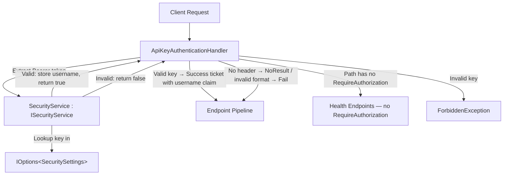

# Design Document: API Security (API Key Authentication)

## Overview

This design implements API key authentication for the Planixor backend API. All endpoints except health checks (`/api/status`, `/api/health`) are protected by a custom ASP.NET Core `AuthenticationHandler` that validates API keys provided via the `Authorization: Bearer <key>` header.

The solution consists of four components:

1. **SecuritySettings** — Configuration POCO holding username-to-API-key mappings, validated at startup via `AddOptions().Validate().ValidateOnStart()`
2. **SecurityService** — Scoped service that validates API keys and stores the authenticated username
3. **ApiKeyAuthenticationHandler** — ASP.NET Core `AuthenticationHandler<AuthenticationSchemeOptions>` that intercepts requests and delegates validation to the service
4. **Validation Endpoint** — GET `/api/validate` returning the authenticated username

This uses ASP.NET Core's built-in authentication system with a custom scheme. The existing `.RequireAuthorization()` calls on endpoint groups remain in place — the handler integrates with them. Health endpoints remain public because they are registered via `MapHealthChecksEndpoint()` without `.RequireAuthorization()`.

## Architecture



### Design Decision: AuthenticationHandler vs Custom Middleware

**Choice**: ASP.NET Core `AuthenticationHandler<AuthenticationSchemeOptions>`.

**Rationale**: This is the idiomatic ASP.NET Core approach for custom authentication schemes. It integrates with the framework's `UseAuthentication()` / `UseAuthorization()` pipeline and the existing `.RequireAuthorization()` calls on endpoint groups. The handler validates the API key, and on success creates a `ClaimsPrincipal` with the username as a claim. On failure, it throws `UnauthorizedException` or `ForbiddenException` which are handled by the existing `Codenized.Exceptions.GlobalExceptionStrategy`.

### Design Decision: Exception-based error signaling

**Choice**: The handler uses `AuthenticateResult.NoResult()` / `AuthenticateResult.Fail()` for authentication flow, and throws exceptions via `HandleChallengeAsync()` / `HandleForbiddenAsync()` overrides.

**Rationale**: Returning `NoResult()` when no Authorization header is present allows anonymous endpoints (health checks, Swagger UI, OpenAPI spec) to function without authentication. The `HandleChallengeAsync()` and `HandleForbiddenAsync()` overrides throw `UnauthorizedException` / `ForbiddenException` which are caught by `Codenized.Exceptions.GlobalExceptionStrategy` to produce consistent 401/403 JSON responses. `ForbiddenException` is thrown directly in `HandleAuthenticateAsync()` for invalid API keys since this is an immediate rejection.

### Design Decision: ISecurityService in Core (Tier 1)

**Choice**: The `ISecurityService` interface lives in `Core/Services/Security/` (Tier 1), while the implementation lives in `Services/Security/` (Tier 3).

**Rationale**: This follows the Clean Architecture dependency rule — the interface (abstraction) is in the inner ring, the implementation is in the outer ring. Other Tier 2 use case services can depend on `ISecurityService` without referencing the Services project.

## Components and Interfaces

### SecuritySettings (Tier 1 — Core/Settings)

**File**: `Core/Settings/SecuritySettings.cs`

```csharp
public sealed class SecuritySettings
{
    public Dictionary<string, string> ApiKeys { get; set; } = new();
}
```

- Simple POCO bound via `IOptions<SecuritySettings>`
- Keys = usernames, Values = API keys
- Validated at startup via `AddOptions<SecuritySettings>().Validate().ValidateOnStart()`

### ISecurityService (Tier 1 — Core/Services/Security)

**File**: `Core/Services/Security/ISecurityService.cs`

```csharp
public interface ISecurityService
{
    bool ValidateAPIKey(string apiKey);
    string? GetAuthenticatedUsername();
}
```

- Lives in Core (Tier 1) so inner layers can depend on it
- Implementation lives in Tier 3 (Services)

### SecurityService (Tier 3 — Services/Security)

**File**: `Services/Security/SecurityService.cs`

```csharp
public sealed class SecurityService : ISecurityService, IAppServiceScoped
{
    private readonly SecuritySettings settings;
    private string? authenticatedUsername;

    public SecurityService(IOptions<SecuritySettings> options)
    {
        this.settings = options.Value;
    }

    public bool ValidateAPIKey(string apiKey)
    {
        if (string.IsNullOrEmpty(apiKey))
        {
            return false;
        }

        foreach (KeyValuePair<string, string> entry in this.settings.ApiKeys)
        {
            if (string.Equals(entry.Value, apiKey, StringComparison.Ordinal))
            {
                this.authenticatedUsername = entry.Key;
                return true;
            }
        }

        return false;
    }

    public string? GetAuthenticatedUsername()
    {
        return this.authenticatedUsername;
    }
}
```

- Scoped lifetime via `IAppServiceScoped` marker — fresh instance per request
- Case-sensitive comparison (`StringComparison.Ordinal`)
- Stores the matched username for retrieval later in the same request

### ApiKeyAuthenticationHandler (Tier 3 — Services/Authentication)

**File**: `Services/Authentication/ApiKeyAuthenticationHandler.cs`

```csharp
public sealed class ApiKeyAuthenticationHandler : AuthenticationHandler<AuthenticationSchemeOptions>
{
    private readonly ISecurityService securityService;

    public ApiKeyAuthenticationHandler(
        IOptionsMonitor<AuthenticationSchemeOptions> options,
        ILoggerFactory logger,
        UrlEncoder encoder,
        ISecurityService securityService)
        : base(options, logger, encoder)
    {
        this.securityService = securityService;
    }

    protected override Task<AuthenticateResult> HandleAuthenticateAsync()
    {
        string? authHeader = this.Request.Headers["Authorization"].FirstOrDefault();

        if (string.IsNullOrEmpty(authHeader))
        {
            return Task.FromResult(AuthenticateResult.NoResult());
        }

        if (!authHeader.StartsWith("Bearer ", StringComparison.OrdinalIgnoreCase))
        {
            return Task.FromResult(AuthenticateResult.Fail("Invalid authorization format."));
        }

        string apiKey = authHeader.Substring("Bearer ".Length).Trim();

        if (string.IsNullOrWhiteSpace(apiKey))
        {
            return Task.FromResult(AuthenticateResult.Fail("Authorization token is empty."));
        }

        if (!this.securityService.ValidateAPIKey(apiKey))
        {
            throw new ForbiddenException(
                "AUTH_INVALID_KEY",
                "API key not authorized",
                "The provided API key is not authorized.");
        }

        string username = this.securityService.GetAuthenticatedUsername()!;
        var claims = new[] { new Claim(ClaimTypes.Name, username) };
        var identity = new ClaimsIdentity(claims, this.Scheme.Name);
        var principal = new ClaimsPrincipal(identity);
        var ticket = new AuthenticationTicket(principal, this.Scheme.Name);

        return Task.FromResult(AuthenticateResult.Success(ticket));
    }

    protected override Task HandleChallengeAsync(AuthenticationProperties properties)
    {
        throw new UnauthorizedException(
            "AUTH_REQUIRED",
            "Authentication required",
            "Provide a valid API key using the 'Authorization: Bearer <key>' header.");
    }

    protected override Task HandleForbiddenAsync(AuthenticationProperties properties)
    {
        throw new ForbiddenException(
            "AUTH_FORBIDDEN",
            "Access forbidden",
            "You do not have permission to access this resource.");
    }
}
```

- Returns `AuthenticateResult.NoResult()` when no Authorization header is present (allows anonymous endpoints like Swagger and health checks to pass through)
- Returns `AuthenticateResult.Fail(...)` for invalid format or empty token
- Throws `ForbiddenException` when the key is present but not valid (→ 403 via GlobalExceptionStrategy)
- On success, creates a `ClaimsPrincipal` with the username as `ClaimTypes.Name` claim
- `HandleChallengeAsync()` throws `UnauthorizedException` (→ 401) — called by authorization middleware when endpoint requires auth but no valid credentials provided
- `HandleForbiddenAsync()` throws `ForbiddenException` (→ 403) — called when user is authenticated but not authorized

### Validation Endpoint (Tier 4 — Api/Endpoints/Security)

**File**: `Api/Endpoints/Security/SecurityRegisterEndpoints.cs`

```csharp
internal static class SecurityRegisterEndpoints
{
    public static IEndpointRouteBuilder MapSecurityEndpoints(
        this IEndpointRouteBuilder app,
        string apiBasePath)
    {
        RouteGroupBuilder group = app
            .MapGroup($"{apiBasePath}/security")
            .WithTags("Security")
            .RequireAuthorization();

        group.MapGet("/validate", (ISecurityService securityService) =>
        {
            string? username = securityService.GetAuthenticatedUsername();
            return Results.Ok(new { username });
        })
        .WithName("ValidateApiKey")
        .Produces<object>(StatusCodes.Status200OK);

        return app;
    }
}
```

- Protected by `.RequireAuthorization()` on the group — requires valid API key
- Returns anonymous object `{ username: "..." }` serialized as JSON

### Settings Registration with Validation (AddOptions pattern)

Added to `DependencyContainer.MapSettings()`:

```csharp
services.AddOptions<SecuritySettings>()
    .Bind(configuration.GetSection(nameof(SecuritySettings)))
    .Validate(s => s.ApiKeys != null && s.ApiKeys.Count > 0,
        "SecuritySettings must contain at least one API key entry.")
    .Validate(s => s.ApiKeys == null || s.ApiKeys.All(kv => !string.IsNullOrWhiteSpace(kv.Value)),
        "SecuritySettings contains an API key entry with an empty or whitespace value.")
    .ValidateOnStart();
```

- Replaces any manual `ValidateSecuritySettings()` method
- Replaces `services.Configure<SecuritySettings>(...)` for this section
- `ValidateOnStart()` ensures validation runs immediately during startup, failing the app before it enters the running state
- Validation messages are descriptive and identify the specific issue

### Authentication Scheme Registration

Added to `Program.cs` (not DependencyContainer, to avoid circular project reference):

```csharp
builder.Services.AddAuthentication("ApiKey")
    .AddScheme<AuthenticationSchemeOptions, ApiKeyAuthenticationHandler>("ApiKey", null);
builder.Services.AddAuthorization();
```

### Changes to Existing Code

1. **Keep `.RequireAuthorization()`** on all endpoint groups (Shift, Reminder, CalendarEvent, AnnualHoursConfig, NotificationRecord) — the authentication handler integrates with the authorization pipeline to protect these groups.

2. **Add authentication and authorization middleware** in `Program.cs`:
   ```csharp
   app.UseApiGlobalExceptionStrategy();
   app.UseAuthentication();
   app.UseAuthorization();
   ```

3. **Add settings binding with validation** in `DependencyContainer.MapSettings()`:
   ```csharp
   services.AddOptions<SecuritySettings>()
       .Bind(configuration.GetSection(nameof(SecuritySettings)))
       .Validate(s => s.ApiKeys != null && s.ApiKeys.Count > 0,
           "SecuritySettings must contain at least one API key entry.")
       .Validate(s => s.ApiKeys == null || s.ApiKeys.All(kv => !string.IsNullOrWhiteSpace(kv.Value)),
           "SecuritySettings contains an API key entry with an empty or whitespace value.")
       .ValidateOnStart();
   ```

4. **Add authentication scheme registration** in `Program.cs` (not DependencyContainer, to avoid circular project reference):
   ```csharp
   builder.Services.AddAuthentication("ApiKey")
       .AddScheme<AuthenticationSchemeOptions, ApiKeyAuthenticationHandler>("ApiKey", null);
   builder.Services.AddAuthorization();
   ```

5. **Add endpoint registration** in `RegisterEndpoints.UseAppEndpoints()`:
   ```csharp
   app.MapSecurityEndpoints(apiBasePath);
   ```

6. **Add configuration** to `appsettings.Development.json`:
   ```json
   {
     "SecuritySettings": {
       "ApiKeys": {
         "testuser": "4f034mWW3AyTAbMnQ1hqcwjq6xUNaBjUrn5aIkeYpwELHRnh0j"
       }
     }
   }
   ```

7. **Health endpoints remain public** — `MapHealthChecksEndpoint()` does not add `.RequireAuthorization()`, so health endpoints are not challenged by the authentication handler.

8. **Swagger/OpenAPI are anonymous** — `app.MapOpenApi(openApiEndpoint).AllowAnonymous()` ensures the spec JSON is accessible without auth. `UseSwaggerUI` middleware serves static files that pass through since the handler returns `NoResult()` for unauthenticated requests to non-protected endpoints. The OpenAPI document includes a Bearer security scheme definition via a document transformer, enabling the Swagger UI 'Authorize' button.

9. **Refactor `UserId` from `Guid` to `string`** across all syncable entities (Shift, Reminder, CalendarEvent, AnnualHoursConfig, NotificationRecord), their DTOs, repository interfaces, and repository implementations.

10. **Resolve username in sync endpoints** — Replace the TODO comments in all sync endpoints with:
   ```csharp
   request.UserId = securityService.GetAuthenticatedUsername()
       ?? throw new UnauthorizedException("Authenticated user not found.");
   ```
   Where `ISecurityService securityService` is injected into the endpoint lambda.

11. **Create a new EF Core migration** that alters the `UserId` column from `char(36)` to `varchar(50)` on all affected tables (Shifts, Reminders, CalendarEvents, AnnualHoursConfigs, NotificationRecords).

12. **Fix the existing migration** `20260617100000_MigrateCalendarEventToMultiDay.cs` by replacing `migrationBuilder.DropCheckConstraint(...)` with `migrationBuilder.Sql("ALTER TABLE \`CalendarEvents\` DROP CHECK \`CK_CalendarEvents_EndTimeAfterStartTime\`;");`

## Data Models

### SecuritySettings

| Property | Type | Description |
|---|---|---|
| `ApiKeys` | `Dictionary<string, string>` | Maps usernames (keys) to API key tokens (values) |

### Validation Endpoint Response

```json
{
  "username": "testuser"
}
```

## Correctness Properties

*A property is a characteristic or behavior that should hold true across all valid executions of a system — essentially, a formal statement about what the system should do. Properties serve as the bridge between human-readable specifications and machine-verifiable correctness guarantees.*

### Property 1: Settings validation rejects invalid configurations

*For any* SecuritySettings dictionary that is either null, empty (zero entries), or contains at least one entry whose value is empty or whitespace-only, the `ValidateOnStart()` validation SHALL fail, preventing the application from starting.

**Validates: Requirements 1.3, 1.5**

### Property 2: API key validation round-trip

*For any* SecuritySettings dictionary with at least one entry, and *for any* API key string, calling `ValidateAPIKey(key)` SHALL return `true` if and only if `key` exists as a value in the dictionary (case-sensitive), and subsequently `GetAuthenticatedUsername()` SHALL return the corresponding username key. If `ValidateAPIKey(key)` returns `false`, then `GetAuthenticatedUsername()` SHALL return `null`.

**Validates: Requirements 2.1, 2.2, 2.3, 2.5**

### Property 3: Bearer header parsing

*For any* Authorization header string, the authentication handler SHALL extract the token portion (after removing the prefix) when the header starts with `Bearer ` (case-insensitive comparison on the scheme), and SHALL throw `UnauthorizedException` when the header does not start with `Bearer ` (case-insensitive).

**Validates: Requirements 3.1, 3.3**

### Property 4: Authentication handler decision

*For any* request to a secured endpoint carrying a well-formed `Authorization: Bearer <key>` header, the authentication handler SHALL throw `ForbiddenException` if the key does not match any configured API key, and SHALL return a success ticket with the username as a claim if the key matches a configured API key.

**Validates: Requirements 3.5, 3.6, 5.3, 5.4**

### Property 5: Validation endpoint returns correct username

*For any* valid API key from the SecuritySettings dictionary, a GET request to `/api/security/validate` with that key in the `Authorization: Bearer <key>` header SHALL return HTTP 200 with a JSON body containing a `username` property equal to the username associated with that API key in the configuration.

**Validates: Requirements 4.3**

## Error Handling

| Scenario | Exception | HTTP Status | Response Body |
|---|---|---|---|
| No Authorization header on secured endpoint | `UnauthorizedException` (via HandleChallengeAsync) | 401 | Error message: authentication required |
| Authorization header without `Bearer ` prefix | `AuthenticateResult.Fail` → HandleChallengeAsync → `UnauthorizedException` | 401 | Error message: authentication required |
| Bearer token is empty/whitespace | `AuthenticateResult.Fail` → HandleChallengeAsync → `UnauthorizedException` | 401 | Error message: authentication required |
| API key not found in configured keys | `ForbiddenException` | 403 | Error message: API key not authorized |
| No Authorization header on anonymous endpoint | N/A (NoResult, passes through) | N/A | Normal response |
| SecuritySettings missing/empty at startup | `OptionsValidationException` | N/A (startup crash) | Console error message from ValidateOnStart |
| API key value is whitespace at startup | `OptionsValidationException` | N/A (startup crash) | Console error message from ValidateOnStart |

All runtime exceptions (`UnauthorizedException`, `ForbiddenException`) are handled by the existing `Codenized.Exceptions.GlobalExceptionStrategy` middleware, which maps them to consistent JSON error responses.

Startup validation failures (`OptionsValidationException`) are thrown by the DI container when `ValidateOnStart()` detects invalid configuration — this crashes the app before it accepts any requests.

## Testing Strategy

### Unit Tests (TDD — mandatory)

Following the project's TDD workflow:

1. **SecurityService tests** (`UnitTest.Codenized.Planixor/Security/Services/SecurityServiceTests.cs`):
   - `ValidateAPIKey_WithValidKey_ReturnsTrue`
   - `ValidateAPIKey_WithInvalidKey_ReturnsFalse`
   - `ValidateAPIKey_WithNullOrEmpty_ReturnsFalse`
   - `ValidateAPIKey_WithValidKey_StoresUsername`
   - `GetAuthenticatedUsername_BeforeValidation_ReturnsNull`
   - `ValidateAPIKey_CaseSensitive_ReturnsFalseForDifferentCase`

2. **AuthenticationHandler tests** (`UnitTest.Codenized.Planixor/Security/Authentication/ApiKeyAuthenticationHandlerTests.cs`):
   - `HandleAuthenticateAsync_NoAuthorizationHeader_ThrowsUnauthorizedException`
   - `HandleAuthenticateAsync_InvalidPrefix_ThrowsUnauthorizedException`
   - `HandleAuthenticateAsync_EmptyToken_ThrowsUnauthorizedException`
   - `HandleAuthenticateAsync_InvalidApiKey_ThrowsForbiddenException`
   - `HandleAuthenticateAsync_ValidApiKey_ReturnsSuccessWithUsernameClaim`

3. **Settings validation tests** (`UnitTest.Codenized.Planixor/Security/Settings/SecuritySettingsValidationTests.cs`):
   - `Validate_EmptyDictionary_FailsValidation`
   - `Validate_NullDictionary_FailsValidation`
   - `Validate_WhitespaceValue_FailsValidation`
   - `Validate_ValidSettings_PassesValidation`

### Property-Based Tests (NUnit + FsCheck)

**Library**: FsCheck.NUnit (well-established PBT library for .NET)

**Configuration**: Minimum 100 iterations per property test.

Each property test references its design document property:

- **Feature: gh14-api-security, Property 1: Settings validation rejects invalid configurations**
  - Generate random dictionaries with empty/whitespace values → verify validation fails

- **Feature: gh14-api-security, Property 2: API key validation round-trip**
  - Generate random dictionaries (1–10 entries with random username/key strings)
  - For each dictionary: pick a random value → validate → verify username matches
  - For each dictionary: generate a key NOT in values → validate → verify false + null username

- **Feature: gh14-api-security, Property 3: Bearer header parsing**
  - Generate random strings with and without "Bearer " prefix (various casings)
  - Verify correct extraction or UnauthorizedException

- **Feature: gh14-api-security, Property 4: Authentication handler decision**
  - Generate random configured settings and random request keys
  - Verify ForbiddenException iff key not in configured values, success ticket iff key in values

- **Feature: gh14-api-security, Property 5: Validation endpoint returns correct username**
  - Generate random valid keys from settings → verify endpoint returns correct username

### Integration Tests (optional, post-implementation)

- Full pipeline test with `WebApplicationFactory<Program>` verifying end-to-end behavior
- Health endpoints accessible without auth
- Secured endpoints return 401/403 as expected
- Valid API key returns 200 with correct username on validate endpoint


---

## Additional Concern: UserId → Username Refactor

### Context

Currently, all syncable entities (Shift, Reminder, CalendarEvent, AnnualHoursConfig, NotificationRecord) have a `UserId` property of type `Guid` (stored as `char(36)` in MySQL). The sync endpoints have a TODO comment: "Extract UserId from authenticated user claims and assign to request.UserId".

With the new API key security model, the user is identified by the `username` string from the SecuritySettings dictionary — NOT a GUID. Therefore:

1. **All entities** must change `UserId` from `Guid` to `string` (the username from SecuritySettings).
2. **All DTOs** (`ShiftSyncPushRequest`, `ShiftSyncPullRequest`, etc.) must change `UserId` from `Guid` to `string`.
3. **All endpoints** must resolve the username from `ISecurityService.GetAuthenticatedUsername()` and assign it to `request.UserId`.
4. **Database columns** must migrate from `char(36)` to `varchar(50)` (matching the username max length).
5. **Repository queries** (e.g., `UpsertAsync(Guid userId, ...)`) must change to `string userId`.

### Design

#### Entity changes (all syncable entities)

```csharp
// BEFORE:
public Guid UserId { get; private set; }

// AFTER:
public string UserId { get; private set; } = string.Empty;
```

This applies to: `Shift`, `Reminder`, `CalendarEvent`, `AnnualHoursConfig`, `NotificationRecord`.

Factory methods (`Create`, `CreateFromSync`) change the `userId` parameter from `Guid` to `string`:

```csharp
// BEFORE:
public static Shift Create(Guid id, Guid userId, ...)
public static Shift CreateFromSync(Guid id, Guid userId, ...)

// AFTER:
public static Shift Create(Guid id, string userId, ...)
public static Shift CreateFromSync(Guid id, string userId, ...)
```

#### DTO changes (all sync push requests)

```csharp
// BEFORE:
[JsonIgnore]
public Guid UserId { get; set; }

// AFTER:
[JsonIgnore]
public string UserId { get; set; } = string.Empty;
```

#### Pull request DTO changes

```csharp
// BEFORE:
public record ShiftSyncPullRequest(Guid UserId, DateTime? LastSyncedAt, string? Cursor);

// AFTER:
public record ShiftSyncPullRequest(string UserId, DateTime? LastSyncedAt, string? Cursor);
```

Same pattern for: `ReminderSyncPullRequest`, `CalendarEventSyncPullRequest`, `AnnualHoursConfigSyncPullRequest`, `NotificationRecordSyncPullRequest`.

#### Endpoint changes (all sync endpoints)

```csharp
// BEFORE (with TODO):
// TODO: Extract UserId from authenticated user claims and assign to request.UserId

// AFTER (push endpoints):
request.UserId = securityService.GetAuthenticatedUsername()
    ?? throw new UnauthorizedException("Authenticated user not found.");

// AFTER (pull endpoints):
string userId = securityService.GetAuthenticatedUsername()
    ?? throw new UnauthorizedException("Authenticated user not found.");
var request = new ShiftSyncPullRequest(userId, lastSyncedAt, cursor);
```

The endpoint injects `ISecurityService` alongside the controller. Since the `ApiKeyAuthenticationHandler` already validated the key and stored the username, `GetAuthenticatedUsername()` will always return a value for protected endpoints.

#### Repository interface changes

```csharp
// BEFORE:
Task UpsertAsync(Guid userId, IReadOnlyList<Shift> shifts);
Task<ShiftSyncPullResult> GetModifiedAfterAsync(Guid userId, DateTime lastSyncedAt, string? cursor);
Task<IReadOnlyList<ShiftEntity>> GetByIdsAsync(IReadOnlyList<Guid> ids, Guid userId);

// AFTER:
Task UpsertAsync(string userId, IReadOnlyList<Shift> shifts);
Task<ShiftSyncPullResult> GetModifiedAfterAsync(string userId, DateTime lastSyncedAt, string? cursor);
Task<IReadOnlyList<ShiftEntity>> GetByIdsAsync(IReadOnlyList<Guid> ids, string userId);
```

Same pattern for all entity repository interfaces and implementations (Shift, Reminder, CalendarEvent, AnnualHoursConfig, NotificationRecord).

#### Database migration

A new migration will alter the `UserId` column on all affected tables:

```sql
ALTER TABLE Shifts MODIFY COLUMN UserId VARCHAR(50) NOT NULL;
ALTER TABLE Reminders MODIFY COLUMN UserId VARCHAR(50) NOT NULL;
ALTER TABLE CalendarEvents MODIFY COLUMN UserId VARCHAR(50) NOT NULL;
ALTER TABLE AnnualHoursConfigs MODIFY COLUMN UserId VARCHAR(50) NOT NULL;
ALTER TABLE NotificationRecords MODIFY COLUMN UserId VARCHAR(50) NOT NULL;
```

Index names remain the same (`IX_{Table}_UserId`, `IX_{Table}_UserId_ModifiedAt`) — only the column type changes.

#### EF Core configuration changes

For each entity configuration:

```csharp
// BEFORE:
builder.Property(e => e.UserId)
    .HasColumnName("UserId")
    .HasColumnType("char(36)")
    .IsRequired();

// AFTER:
builder.Property(e => e.UserId)
    .HasColumnName("UserId")
    .HasColumnType("varchar(50)")
    .IsRequired();
```

---

## Additional Concern: MySQL Migration Fix (DROP CHECK CONSTRAINT)

### Context

The migration `20260617100000_MigrateCalendarEventToMultiDay` uses `migrationBuilder.DropCheckConstraint(...)` which generates:

```sql
ALTER TABLE `CalendarEvents` DROP CONSTRAINT `CK_CalendarEvents_EndTimeAfterStartTime`;
```

This fails on MySQL because MySQL uses `ALTER TABLE ... DROP CHECK ...` syntax (not `DROP CONSTRAINT`) for check constraints.

### Root Cause

EF Core's `DropCheckConstraint` generates provider-agnostic SQL that uses `DROP CONSTRAINT`. MySQL 8.0.16+ supports check constraints but uses different DDL syntax:

- **SQL Server**: `ALTER TABLE ... DROP CONSTRAINT ...` ✅
- **MySQL**: `ALTER TABLE ... DROP CHECK ...` ✅ (not `DROP CONSTRAINT`)

The `MySql.EntityFrameworkCore` provider should handle this translation, but either the version being used doesn't, or there's a bug in the provider.

### Design — Fix

Replace the EF Core `DropCheckConstraint` call in the migration with raw SQL that uses the correct MySQL syntax:

```csharp
// BEFORE (generated, fails on MySQL):
migrationBuilder.DropCheckConstraint(
    name: "CK_CalendarEvents_EndTimeAfterStartTime",
    table: "CalendarEvents");

// AFTER (manual fix):
migrationBuilder.Sql("ALTER TABLE `CalendarEvents` DROP CHECK `CK_CalendarEvents_EndTimeAfterStartTime`;");
```

This is a one-time manual fix to the existing migration file. Future migrations should be tested against MySQL before committing.

**Note**: The `EndTimeAfterStartTime` constraint was dropped in this migration because the multi-day event feature allows events that span multiple days, making `EndTime > StartTime` not always valid (the times represent time-of-day on different days). The constraint was intentionally removed and NOT re-added in the `Up` method — only the `Down` method re-adds it for rollback purposes.
