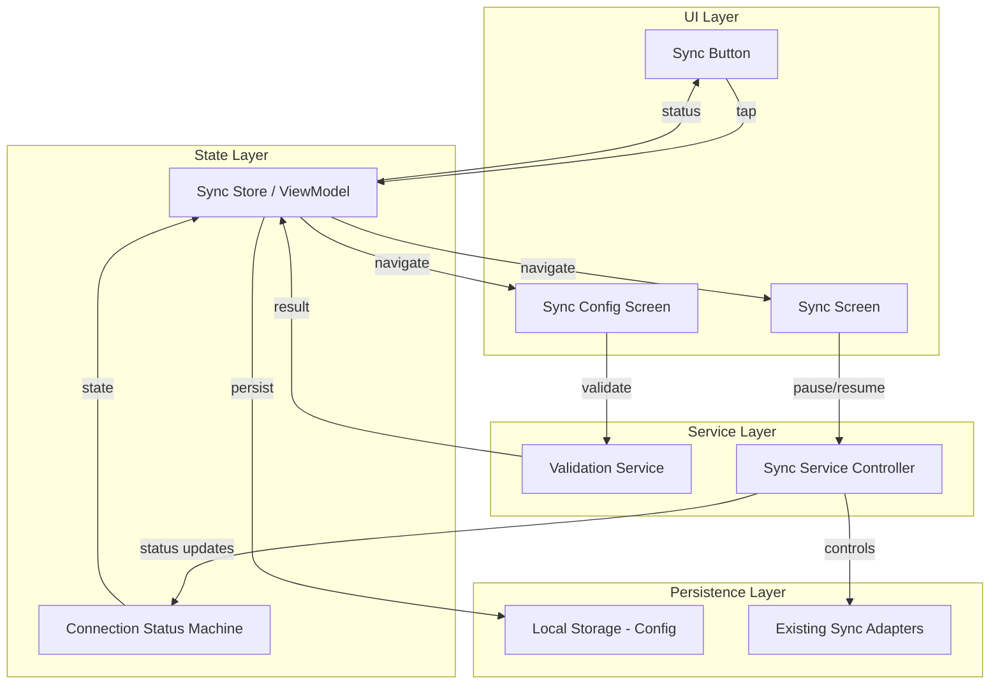
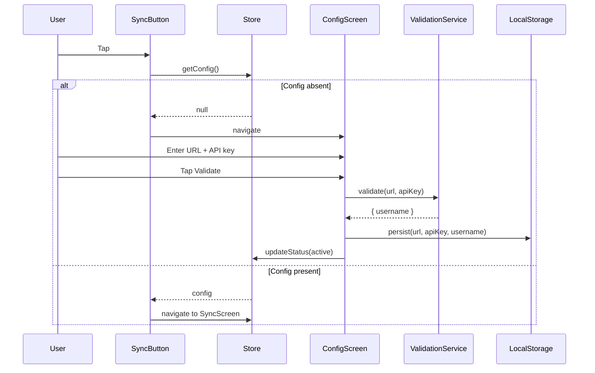
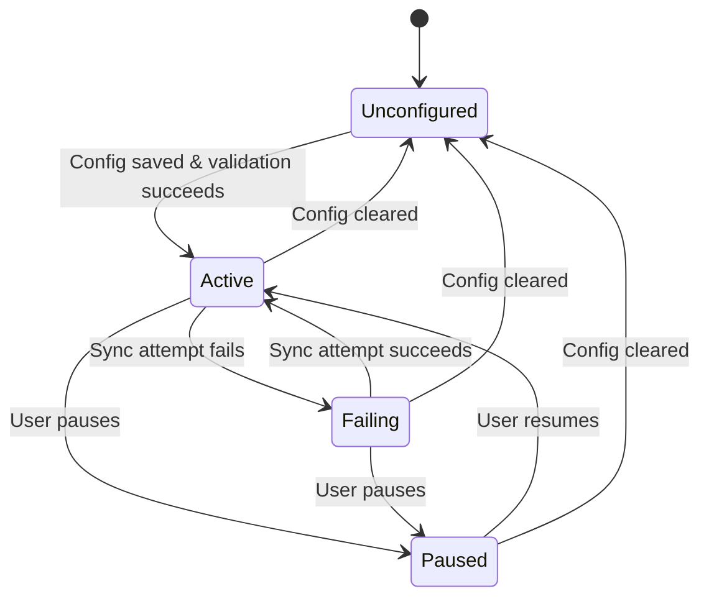

# Design Document: Synchronization Configuration & Management

## Overview

This feature adds synchronization configuration and management UI to both the React Web PWA and Android clients. It replaces the existing user avatar icon in the top navigation bar with a sync status button, introduces a configuration screen for establishing server connectivity, and a sync management screen for monitoring and controlling sync operations.

The feature is purely client-side — no new backend endpoints are required. The existing `GET /api/security/validate` endpoint serves as the validation mechanism for user-entered credentials.

### Key Design Decisions

1. **Sync config stored in local-only storage** — Uses Dexie (IndexedDB) on web and DataStore on Android. Never participates in sync operations.
2. **State machine for connection status** — A finite state machine drives the sync button icon, screen behavior, and service lifecycle.
3. **Replace user avatar** — The sync button takes the avatar's position in the top bar, serving double duty as status indicator and navigation entry point.
4. **Zustand store on web, ViewModel on Android** — Following existing patterns for state management on each platform.

## Architecture



### Component Interaction Flow



## Components and Interfaces

### 1. Sync Button Component

**Location:**
- Web: Replace `<User>` icon button in `src/components/layout/HeaderBar.tsx`
- Android: Replace `Icons.Outlined.Person` IconButton in `AppNavigation.kt`

**Props/State:**
```typescript
// Web
interface SyncButtonProps {
  status: ConnectionStatus;
  onClick: () => void;
}
```

**Icon Mapping:**

| Connection Status | Web Icon (Lucide) | Android Icon (Material) | Color |
|---|---|---|---|
| `unconfigured` | `CloudOff` | `Icons.Outlined.CloudOff` | `text-secondary` (#6B7280) |
| `active` | `CloudCheck` (or `Cloud` with check) | `Icons.Outlined.Cloud` | `success` (#10B981) |
| `failing` | `CloudAlert` (or `CloudOff` tinted) | `Icons.Outlined.CloudOff` | `error` (#EF4444) |
| `paused` | `PauseCircle` | `Icons.Outlined.PauseCircle` | `text-secondary` (#6B7280) |

**Behavior:**
- If `syncConfig` is absent → navigate to `/sync/config` (web) or `Screen.SyncConfig.route` (Android)
- If `syncConfig` is present → navigate to `/sync` (web) or `Screen.Sync.route` (Android)

### 2. Sync Configuration Screen

**Location:**
- Web: `src/features/sync/components/SyncConfigScreen.tsx` (rendered via route `/sync/config`)
- Android: `ui/sync/SyncConfigScreen.kt` (route `sync/config`)

**Layout:**
```
┌──────────────────────────────────────┐
│  [← Back]        Configure Sync      │
├──────────────────────────────────────┤
│                                      │
│  Server URL                          │
│  ┌──────────────────────────────┐    │
│  │ backend.planixor.com         │    │
│  └──────────────────────────────┘    │
│                                      │
│  API Key                             │
│  ┌──────────────────────────────┐    │
│  │ ••••••••••••••••             │    │
│  └──────────────────────────────┘    │
│                                      │
│  [Error message area]                │
│                                      │
│  ┌──────────┐  ┌──────────────┐      │
│  │  Cancel  │  │   Validate   │      │
│  └──────────┘  └──────────────┘      │
│                                      │
└──────────────────────────────────────┘
```

**Validation Flow:**
1. User enters URL and API key
2. Client-side validation: both fields must be non-empty
3. On "Validate" tap: send `GET {url}/api/security/validate` with `Authorization: Bearer {apiKey}`
4. On 200: extract `username` from response body, persist config, navigate to Sync Screen
5. On non-200: show error message, retain field values, keep buttons active
6. On "Cancel" tap: clear fields, navigate back

### 3. Sync Screen

**Location:**
- Web: `src/features/sync/components/SyncScreen.tsx` (rendered via route `/sync`)
- Android: `ui/sync/SyncScreen.kt` (route `sync`)

**Layout:**
```
┌──────────────────────────────────────┐
│  [← Back]      Synchronization       │
├──────────────────────────────────────┤
│                                      │
│  Status: ● Active                    │
│                                      │
│  Server URL                          │
│  https://backend.planixor.com        │
│                                      │
│  API Key                             │
│  sk-••••••••1234                     │
│                                      │
│  Username                            │
│  pepito                              │
│                                      │
│  Last synced                         │
│  2025-01-15 14:30                    │
│                                      │
│  ┌──────────────────────────────┐    │
│  │       ⏸ Pause Sync           │    │
│  └──────────────────────────────┘    │
│                                      │
│  ┌──────────────────────────────┐    │
│  │      ⚙ Configuration         │    │
│  └──────────────────────────────┘    │
│                                      │
└──────────────────────────────────────┘
```

### 4. Sync Store (Web) / Sync ViewModel (Android)

**Web — Zustand Store** (`src/features/sync/stores/syncStore.ts`):
```typescript
interface SyncState {
  config: SyncConfig | null;
  connectionStatus: ConnectionStatus;
  isPaused: boolean;
  lastSyncedAt: string | null;
  // Actions
  loadConfig: () => Promise<void>;
  saveConfig: (config: SyncConfig) => Promise<void>;
  clearConfig: () => Promise<void>;
  pause: () => void;
  resume: () => void;
  setConnectionStatus: (status: ConnectionStatus) => void;
  setLastSyncedAt: (timestamp: string) => void;
}
```

**Android — ViewModel** (`ui/sync/SyncViewModel.kt`):
```kotlin
data class SyncUiState(
    val config: SyncConfig? = null,
    val connectionStatus: ConnectionStatus = ConnectionStatus.UNCONFIGURED,
    val isPaused: Boolean = false,
    val lastSyncedAt: Long? = null,
    val isValidating: Boolean = false,
    val validationError: String? = null,
)
```

### 5. Validation Service

**Web** (`src/features/sync/services/syncValidationService.ts`):
```typescript
interface ValidationResult {
  success: boolean;
  username?: string;
  error?: string;
}

const validateConnection = async (url: string, apiKey: string): Promise<ValidationResult> => {
  // GET {url}/api/security/validate
  // Authorization: Bearer {apiKey}
};
```

**Android** (`data/sync/SyncValidationService.kt`):
```kotlin
data class ValidationResult(
    val success: Boolean,
    val username: String? = null,
    val error: String? = null,
)

interface SyncValidationService {
    suspend fun validate(url: String, apiKey: String): ValidationResult
}
```

### 6. Sync Service Controller

The controller bridges the sync config UI with the existing sync adapters. It reads config (URL, API key, isPaused) and decides whether to run sync cycles.

**Web** — Integrates with the existing sync worker pattern in `src/workers/`:
- On `isPaused = true`: stop sending messages to the sync worker
- On `isPaused = false` and config present: resume periodic sync

**Android** — Integrates with existing `CalendarEventSyncAdapter`, `AnnualHoursConfigSyncAdapter`, etc.:
- On `isPaused = true`: cancel scheduled WorkManager tasks
- On `isPaused = false` and config present: enqueue periodic WorkManager tasks

## Data Models

### SyncConfig (both platforms)

```typescript
// Web (TypeScript)
interface SyncConfig {
  serverUrl: string;      // e.g., "https://backend.planixor.com"
  apiKey: string;         // The API key for authentication
  username: string;       // Linked username from validation endpoint
  isPaused: boolean;      // Whether sync is paused
  lastSyncedAt: string | null;  // ISO 8601 timestamp of last successful sync
}
```

```kotlin
// Android (Kotlin)
data class SyncConfig(
    val serverUrl: String,
    val apiKey: String,
    val username: String,
    val isPaused: Boolean = false,
    val lastSyncedAt: Long? = null,  // UTC millis
)
```

### ConnectionStatus (both platforms)

```typescript
// Web
type ConnectionStatus = 'unconfigured' | 'active' | 'failing' | 'paused';
```

```kotlin
// Android
enum class ConnectionStatus {
    UNCONFIGURED,
    ACTIVE,
    FAILING,
    PAUSED,
}
```

### Connection Status State Machine



**Transition Rules:**
| From | Event | To |
|---|---|---|
| Unconfigured | Config saved + validation OK | Active |
| Active | User taps Pause | Paused |
| Active | Sync cycle fails (network/auth) | Failing |
| Failing | Sync cycle succeeds | Active |
| Failing | User taps Pause | Paused |
| Paused | User taps Resume | Active |
| Any configured | Config cleared/deleted | Unconfigured |

### Storage Strategy

**Web (IndexedDB via Dexie):**
- Add a `syncConfig` table to the existing `PlanixorDatabase` (new version upgrade)
- Schema: `'key'` (single-row table, key = `'default'`)
- The config is a single record, retrieved by the constant key `'default'`

```typescript
// In db.ts — new version
this.version(8).stores({
  // ... existing tables unchanged ...
  syncConfig: 'key',
});
```

**Android (DataStore preferences):**
- Add sync-related keys to the existing `PreferencesRepository`
- Keys: `sync_server_url`, `sync_api_key`, `sync_username`, `sync_is_paused`, `sync_last_synced_at`
- All stored as strings (timestamp as ISO string)

### Navigation Routes

**Web (React Router):**
| Route | Component | Access |
|---|---|---|
| `/sync/config` | `SyncConfigScreen` | Always accessible |
| `/sync` | `SyncScreen` | Only when config exists |

**Android (Compose Navigation):**
| Route | Screen | Access |
|---|---|---|
| `sync/config` | `SyncConfigScreen` | Always accessible |
| `sync` | `SyncScreen` | Only when config exists |

New `Screen` sealed class entries:
```kotlin
data object SyncConfig : Screen("sync/config")
data object Sync : Screen("sync")
```

## Correctness Properties

*A property is a characteristic or behavior that should hold true across all valid executions of a system — essentially, a formal statement about what the system should do. Properties serve as the bridge between human-readable specifications and machine-verifiable correctness guarantees.*

### Property 1: Sync button icon reflects connection status

*For any* `ConnectionStatus` value (unconfigured, active, failing, paused), the sync button component SHALL render the icon variant corresponding to that status, and no other.

**Validates: Requirements 1.2, 1.3, 1.4, 1.5**

### Property 2: Sync button navigation depends on config presence

*For any* application state, when the sync button is tapped: if `SyncConfig` is absent, navigation SHALL target the configuration screen; if `SyncConfig` is present (regardless of `ConnectionStatus` value), navigation SHALL target the sync screen.

**Validates: Requirements 2.1, 2.2**

### Property 3: Cancel action clears form state

*For any* non-empty URL string and non-empty API key string entered in the configuration form, invoking the cancel action SHALL result in both fields being empty (zero-length strings).

**Validates: Requirements 4.1**

### Property 4: Validation request construction

*For any* valid server URL and API key pair, the validation service SHALL construct a GET request to `{serverUrl}/api/security/validate` with the header `Authorization: Bearer {apiKey}`.

**Validates: Requirements 5.1**

### Property 5: Config persistence round-trip

*For any* valid SyncConfig (non-empty serverUrl, apiKey, username), persisting it to local storage and then reading it back SHALL produce an equivalent SyncConfig with identical field values.

**Validates: Requirements 5.3, 7.1**

### Property 6: Non-200 response preserves form state and shows error

*For any* HTTP status code that is not 200 (including 400, 401, 403, 404, 500, 502, 503), and *for any* URL and API key values in the form fields, after the validation service returns this status: the form fields SHALL retain their original values, and an error message SHALL be present in the UI state.

**Validates: Requirements 6.1, 6.3**

### Property 7: Sync config excluded from sync operations

*For any* set of records produced by the sync push candidate selection logic, no record SHALL be of type SyncConfig. Equivalently, the SyncConfig table/store SHALL never appear in the list of syncable entity types.

**Validates: Requirements 7.1, 7.2**

### Property 8: Pause/resume toggles sync execution

*For any* application state where SyncConfig is present: after pausing, the sync service SHALL not execute push or pull operations; after resuming from a paused state, the sync service SHALL be permitted to execute push and pull operations.

**Validates: Requirements 10.3, 10.4**

### Property 9: Empty fields rejected by input validation

*For any* string composed entirely of whitespace (including the empty string), attempting to validate with that string as the server URL or API key SHALL produce a validation error and SHALL NOT send a network request.

**Validates: Requirements 12.1, 12.2**

## Error Handling

### Validation Errors

| Scenario | Behavior |
|---|---|
| Empty URL field | Show i18n error "URL is required" below the field; no network request |
| Empty API key field | Show i18n error "API key is required" below the field; no network request |
| Network unreachable | Show i18n error "Unable to connect. Check your internet connection." |
| HTTP 401/403 | Show i18n error "Invalid API key. Please review your configuration." |
| HTTP 404 | Show i18n error "Server not found. Please check the URL." |
| HTTP 5xx | Show i18n error "Server error. Please try again later." |
| Timeout (>10s) | Show i18n error "Connection timed out. Please check the URL and try again." |

### Sync Service Errors

| Scenario | State Transition | User Feedback |
|---|---|---|
| Push/pull fails (network) | Active → Failing | Sync button shows error icon |
| Push/pull fails (auth) | Active → Failing | Sync button shows error icon |
| Push/pull succeeds after failure | Failing → Active | Sync button shows active icon |

### Edge Cases

- **Config stored but URL no longer reachable**: Status transitions to `failing` after the first failed sync cycle. User can pause, reconfigure, or wait.
- **API key revoked server-side**: Same as above — sync fails, status transitions to `failing`.
- **App closed while validating**: Validation result is lost; user must retry on next visit.
- **Multiple rapid validate taps**: Button is disabled during validation to prevent duplicate requests.

## Testing Strategy

### Unit Tests (Vitest for Web, JUnit for Android)

| Component | What to test |
|---|---|
| `syncValidationService` | Request construction, response parsing, error mapping |
| `syncStore` / `SyncViewModel` | State transitions, config persistence, pause/resume logic |
| `ConnectionStatus` transitions | State machine correctness |
| Input validation | Empty/whitespace rejection, valid input acceptance |
| `SyncButton` | Icon selection based on status, navigation target selection |

### Property-Based Tests (fast-check for Web, jqwik/kotlin-test for Android)

Property-based testing is applicable here because:
- The connection status → icon mapping is a pure function with enumerable inputs
- The navigation logic is a pure function of config presence
- The validation service request construction is a pure function of URL + API key inputs
- The config persistence is a round-trip (serialize/deserialize)
- Input validation is a pure function over the string input space

**Library:** `fast-check` (Web), `kotlin-test` property testing or `kotest` (Android)

**Configuration:** Minimum 100 iterations per property test.

Each property test must be tagged:
```typescript
// Feature: gh16-synchronization, Property 1: Sync button icon reflects connection status
```

### Integration Tests

| Scenario | Method |
|---|---|
| Full validation flow (mock API) | Render config screen, fill form, submit, verify navigation |
| Pause/resume round-trip | Render sync screen, pause, verify service state, resume, verify |
| Navigation from sync button | Render header, click sync button, verify correct route |

### i18n Verification

- Verify all user-facing strings exist in both `en` and `es` translation files
- No hardcoded strings in component source files
