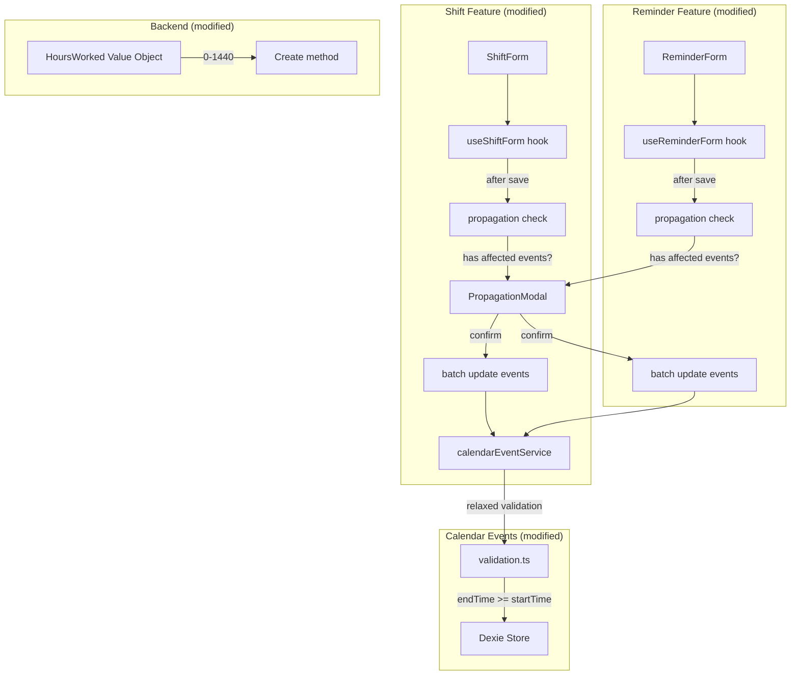

# Design Document: Calendar, Shift & Reminder Improvements

## Overview

This feature delivers three categories of improvements to existing Planixor systems:

1. **Validation relaxation** — Allow `HoursWorked` to be 0 (zero) on shifts, and allow `endTime == startTime` on same-day reminder events (producing 0 `totalHours`). The upper bound (1440) is already supported.
2. **Propagation mechanism** — A new cross-cutting feature that detects when a shift or reminder template is modified, checks if it's referenced by current-year calendar events, and offers to batch-update those events via a `Propagation_Modal`.
3. **Day pre-selection fix** — Correct the `computePreSelectedDay` function so that all view modes (not just Day) pre-select the currently displayed/navigated day rather than falling back to the device date.

These changes span all three sub-projects (React Web, Android, Backend) and maintain the offline-first architecture. The propagation feature is entirely local — no new API endpoints are needed.

### Key Design Decisions

1. **Minimal validation boundary change**: Only the lower bound of `HoursWorked` changes (1→0) on backend, web Zod, and Android. The upper bound (1440) and all other validation rules remain unchanged. The `validateTimeForReminder` function changes `>` to `>=` for the same-day case.

2. **Propagation is post-save, not pre-save**: The propagation check happens *after* the shift/reminder is successfully persisted, but *before* navigation away from the form. This ensures the template is saved regardless of whether the user confirms or declines propagation.

3. **Propagation is local-only**: The batch update of calendar events happens against the local store. Updated events get `syncedAt = null`, which means they'll sync on the next cycle. No new API endpoints are required.

4. **Day pre-selection simplification**: The `computePreSelectedDay` function is simplified to always use `currentDate` from the calendar store (the navigated-to date) for all view modes, removing the conditional fallback to device date.

5. **Shared propagation logic**: The propagation detection and batch-update logic is implemented as a pure utility function (`checkPropagationNeeded`, `propagateShiftChanges`, `propagateReminderChanges`) co-located in each feature module (shifts, reminders). The `PropagationModal` UI component lives in `shared/components/` since it's used by both features.

## Architecture

The changes touch existing modules without introducing new architectural layers:



### Affected Files by Change Category

| Change | React Web | Android | Backend |
|---|---|---|---|
| HoursWorked 0-1440 | `shifts/constants.ts`, `shiftValidation.ts`, `shiftService.ts` | `ShiftFormViewModel.kt` | `HoursWorked.cs`, `ShiftSyncItemValidator` |
| Reminder time relaxation | `calendar-events/validation.ts`, `calendarEventService.ts` | `CalendarEventValidation.kt` | N/A (backend has no time validation constraint) |
| Propagation modal | `shared/components/PropagationModal.tsx`, `shifts/hooks/useShiftForm.ts`, `reminders/hooks/useReminderForm.ts` | `ui/components/PropagationDialog.kt`, `ShiftFormViewModel.kt`, `ReminderFormViewModel.kt` | N/A |
| Day pre-selection fix | `calendar-events/hooks/useEventForm.ts` (`computePreSelectedDay`) | `CalendarViewModel.kt` | N/A |
| Store-level validation | `shifts/services/shiftService.ts` | `ShiftRepository.kt` | Already enforced via Value Object |
| i18n keys | `en.json`, `es.json` | `strings.xml`, `strings-es.xml` | N/A |

## Components and Interfaces

### 1. Validation Changes

#### Backend — `HoursWorked` Value Object (modified)

```csharp
// Change: lower bound from 1 → 0
public static HoursWorked Create(int totalMinutes)
{
    if (totalMinutes < 0 || totalMinutes > 1440)
    {
        throw new DomainException("Hours worked must be between 0 and 1440 minutes.");
    }

    return new HoursWorked(totalMinutes);
}
```

#### React Web — `shifts/constants.ts` (modified)

```typescript
// Change: SHIFT_HOURS_WORKED_MIN from 1 → 0
export const SHIFT_HOURS_WORKED_MIN = 0;
export const SHIFT_HOURS_WORKED_MAX = 1440;
```

#### React Web — `shifts/services/shiftValidation.ts` (modified)

The Zod schema already references `SHIFT_HOURS_WORKED_MIN` — changing the constant is sufficient. The error message i18n key changes to reflect the new range.

#### React Web — `shifts/services/shiftService.ts` (new store-level validation)

```typescript
// Add range enforcement in create() and update() methods
const validateHoursWorkedRange = (hoursWorked: number): void => {
  if (hoursWorked < SHIFT_HOURS_WORKED_MIN || hoursWorked > SHIFT_HOURS_WORKED_MAX) {
    throw new Error(SHIFT_I18N_KEYS.VALIDATION_HOURS_WORKED_RANGE);
  }
};
```

#### React Web — `calendar-events/validation.ts` (modified)

```typescript
// Change: >= instead of > for same-day reminder time validation
export const validateTimeForReminder = (
  startDay: string,
  endDay: string,
  startTime: number,
  endTime: number,
): boolean => {
  if (endDay > startDay) {
    return true;
  }
  return endTime >= startTime; // Changed from > to >=
};
```

#### Android — Shift validation (modified)

```kotlin
// In ShiftFormViewModel or validation utility
// Change: hoursWorked range from 1..1440 to 0..1440
private fun validateHoursWorked(value: Int): Boolean = value in 0..1440
```

#### Android — Calendar event time validation (modified)

```kotlin
// In CalendarEventValidation.kt
// Change: endTime > startTime → endTime >= startTime for same-day reminders
fun validateTimeForReminder(startDay: String, endDay: String, startTime: Int, endTime: Int): Boolean {
    if (endDay > startDay) return true
    return endTime >= startTime // Changed from > to >=
}
```

### 2. Propagation Mechanism

#### Shared Component — `PropagationModal` (new)

```typescript
// shared/components/PropagationModal.tsx
interface PropagationModalProps {
  isOpen: boolean;
  templateName: string;
  templateType: 'shift' | 'reminder';
  affectedEventCount: number;
  onConfirm: () => void;
  onDecline: () => void;
}

export const PropagationModal = ({
  isOpen,
  templateName,
  templateType,
  affectedEventCount,
  onConfirm,
  onDecline,
}: PropagationModalProps) => { ... };
```

The modal displays:
- The name of the modified template
- That only current-year events will be affected
- The count of affected events
- Confirm ("Update events") and Decline ("Keep as is") buttons

#### Propagation Utility Functions (new, per-feature)

```typescript
// features/shifts/services/shiftPropagation.ts

/**
 * Checks if a shift has non-deleted calendar events in the current year.
 * Returns the count of affected events, or 0 if none.
 */
export const checkShiftPropagationNeeded = async (shiftId: string): Promise<number> => {
  const currentYear = new Date().getFullYear();
  const startOfYear = `${currentYear}-01-01`;
  const endOfYear = `${currentYear}-12-31`;

  const events = await db.calendarEvents
    .where('eventType').equals('shift')
    .filter((e) =>
      !e.isDeleted &&
      e.eventTypeId === shiftId &&
      e.startDay >= startOfYear &&
      e.startDay <= endOfYear
    )
    .count();

  return events;
};

/**
 * Propagates shift template changes to all affected current-year calendar events.
 * Updates: startTime, endTime, totalHours (from hoursWorked), modifiedAt, syncedAt=null.
 */
export const propagateShiftChanges = async (
  shiftId: string,
  startTime: number,
  endTime: number,
  hoursWorked: number,
): Promise<void> => {
  const currentYear = new Date().getFullYear();
  const startOfYear = `${currentYear}-01-01`;
  const endOfYear = `${currentYear}-12-31`;
  const now = new Date();

  await db.calendarEvents
    .where('eventType').equals('shift')
    .filter((e) =>
      !e.isDeleted &&
      e.eventTypeId === shiftId &&
      e.startDay >= startOfYear &&
      e.startDay <= endOfYear
    )
    .modify((event) => {
      event.startTime = startTime;
      event.endTime = endTime;
      event.totalHours = hoursWorked;
      event.endDay = computeEndDayForShift(event.startDay, startTime, endTime);
      event.modifiedAt = now;
      event.syncedAt = null;
    });
};
```

```typescript
// features/reminders/services/reminderPropagation.ts

/**
 * Checks if a reminder has non-deleted calendar events in the current year.
 */
export const checkReminderPropagationNeeded = async (reminderId: string): Promise<number> => {
  const currentYear = new Date().getFullYear();
  const startOfYear = `${currentYear}-01-01`;
  const endOfYear = `${currentYear}-12-31`;

  return db.calendarEvents
    .where('eventType').equals('reminder')
    .filter((e) =>
      !e.isDeleted &&
      e.eventTypeId === reminderId &&
      e.startDay >= startOfYear &&
      e.startDay <= endOfYear
    )
    .count();
};

/**
 * Propagates reminder template changes by touching modifiedAt/syncedAt on
 * affected events. Display fields (name, icon, backgroundColor) are derived
 * at read time — no direct field update needed. The modifiedAt touch ensures
 * sync propagation and signals freshness.
 */
export const propagateReminderChanges = async (reminderId: string): Promise<void> => {
  const currentYear = new Date().getFullYear();
  const startOfYear = `${currentYear}-01-01`;
  const endOfYear = `${currentYear}-12-31`;
  const now = new Date();

  await db.calendarEvents
    .where('eventType').equals('reminder')
    .filter((e) =>
      !e.isDeleted &&
      e.eventTypeId === reminderId &&
      e.startDay >= startOfYear &&
      e.startDay <= endOfYear
    )
    .modify((event) => {
      event.modifiedAt = now;
      event.syncedAt = null;
    });
};
```

#### `useShiftForm` Hook Modification

The `submit` function is modified to:
1. Save the shift (as before)
2. If in edit mode and save succeeded: call `checkShiftPropagationNeeded(shiftId)`
3. If count > 0: show the `PropagationModal` (via state) instead of navigating away
4. On confirm: call `propagateShiftChanges(...)`, then navigate
5. On decline: navigate without propagating

```typescript
// New state in useShiftForm:
const [propagationState, setPropagationState] = useState<{
  isOpen: boolean;
  affectedCount: number;
  shiftData: { startTime: number; endTime: number; hoursWorked: number } | null;
}>({ isOpen: false, affectedCount: 0, shiftData: null });

// Modified submit flow (edit mode only):
// After successful shiftService.update():
if (shiftId) {
  const count = await checkShiftPropagationNeeded(shiftId);
  if (count > 0) {
    setPropagationState({
      isOpen: true,
      affectedCount: count,
      shiftData: { startTime, endTime, hoursWorked },
    });
    return true; // Save succeeded, modal handles navigation
  }
}
```

#### `useReminderForm` Hook Modification

Identical pattern to shifts — after saving a reminder edit, check for affected events and show modal.

#### Android — `PropagationDialog` Composable (new)

```kotlin
// ui/components/PropagationDialog.kt
@Composable
fun PropagationDialog(
    isOpen: Boolean,
    templateName: String,
    templateType: String, // "shift" or "reminder"
    affectedEventCount: Int,
    onConfirm: () -> Unit,
    onDecline: () -> Unit,
)
```

#### Android ViewModel Modifications

Both `ShiftFormViewModel` and `ReminderFormViewModel` gain:
- A `PropagationUiState` (sealed class: Hidden, Showing(name, count))
- After save in edit mode: query the local DB for affected events
- Expose propagation state to the composable
- Handle confirm/decline actions

### 3. Day Pre-Selection Fix

#### Current Behavior (Bug)

The `computePreSelectedDay` function in `useEventForm.ts` currently uses device `today` as a fallback when the device date falls within the displayed range (Week, Month, Year views). This means:
- User navigates to March 15 in Day View → navigates to Month View → creates event → pre-selects device date (e.g., June 10) instead of March 15.

#### New Behavior

All view modes consistently use `currentDate` from the calendar store (the navigated-to date):

```typescript
const computePreSelectedDay = (activeView: string, currentDate: Date): string => {
  // All view modes use the navigated-to date from the calendar store
  return formatDateToISO(currentDate);
};
```

This is a significant simplification. The `currentDate` in the store already represents the day the user is "looking at" regardless of view mode. The store's navigation methods (`navigateDay`, `navigateMonth`, etc.) maintain this state correctly.

**Fallback behavior**: If `currentDate` is somehow invalid (null/undefined — which shouldn't happen with Zustand), fall back to device date. This is enforced at the store initialization level, not in `computePreSelectedDay`.

#### Android — Equivalent Fix

```kotlin
// In CalendarViewModel or wherever pre-selection is computed:
// Use the ViewModel's navigatedDate state instead of LocalDate.now()
fun getPreSelectedDay(): LocalDate = _uiState.value.currentDate
```

#### Android — Navigation Argument Approach

The CalendarViewModel creates a fresh instance for the event form route (with `_currentDate = LocalDate.now()`). To pass the actual navigated date:

1. The `Screen.EventCreate` route accepts an optional `preSelectedDate` query parameter
2. The calendar screen passes `calendarCurrentDate.toString()` when navigating to create
3. `CalendarEventFormDestination` calls `viewModel.initCreateFormWithDate(LocalDate.parse(preSelectedDate))` when the argument is present
4. Fallback: if no `preSelectedDate` is provided, `initCreateForm()` uses `LocalDate.now()`

### 4. Store-Level Validation for HoursWorked

#### React Web — `shiftService.ts` (modified)

Add range enforcement in `create()` and `update()`:

```typescript
import { SHIFT_HOURS_WORKED_MIN, SHIFT_HOURS_WORKED_MAX } from '../constants';

// Inside create():
if (shift.hoursWorked < SHIFT_HOURS_WORKED_MIN || shift.hoursWorked > SHIFT_HOURS_WORKED_MAX) {
  throw new Error(SHIFT_I18N_KEYS.VALIDATION_HOURS_WORKED_RANGE);
}

// Inside update() — same check on hoursWorked if provided in changes
```

This mirrors the existing dual-validation pattern used in `calendarEventService.ts`.

### 5. i18n Keys

#### New Keys for Propagation Modal

| Key | English | Spanish |
|---|---|---|
| `propagation.modal.title` | Update Calendar Events? | Actualizar eventos del calendario? |
| `propagation.modal.description.shift` | You modified the shift "{{name}}". Do you want to update all calendar events that use this shift in {{year}}? Events in previous years will not be affected. | Modificaste el turno "{{name}}". Deseas actualizar todos los eventos del calendario que usan este turno en {{year}}? Los eventos de anos anteriores no se veran afectados. |
| `propagation.modal.description.reminder` | You modified the reminder "{{name}}". Do you want to update all calendar events that use this reminder in {{year}}? Events in previous years will not be affected. | Modificaste el recordatorio "{{name}}". Deseas actualizar todos los eventos del calendario que usan este recordatorio en {{year}}? Los eventos de anos anteriores no se veran afectados. |
| `propagation.modal.affectedCount` | {{count}} event(s) will be updated | {{count}} evento(s) seran actualizados |
| `propagation.modal.confirm` | Update | Actualizar |
| `propagation.modal.decline` | Skip | Omitir |

#### Modified Keys

| Key | Old English | New English | New Spanish |
|---|---|---|---|
| `shift.validation.hoursWorked.range` | Hours worked must be between 1 minute and 24 hours | Hours worked must be between 0 and 24 hours | Las horas trabajadas deben estar entre 0 y 24 horas |

## Data Models

No new database tables or schema changes are required. The existing `CalendarEvent`, `Shift`, and `Reminder` models remain unchanged.

### Modified Validation Constraints

| Entity | Field | Old Constraint | New Constraint |
|---|---|---|---|
| Shift | `hoursWorked` | 1–1440 minutes | 0–1440 minutes |
| CalendarEvent (reminder, same-day) | time validation | `endTime > startTime` | `endTime >= startTime` |
| CalendarEvent | `totalHours` | implicitly > 0 | 0 is valid (for 0-hour shifts or point-in-time reminders) |

### Backend Sync Impact

The backend `ShiftSyncItemValidator` currently rejects `HoursWorked = 0`. This validator must be updated to accept the new range. The sync push/pull DTOs don't change structure — they already carry `hoursWorked` as an integer.

No migration is needed — the MySQL column type (`INT`) already stores 0. Only the application-level validation changes.

## Correctness Properties

*A property is a characteristic or behavior that should hold true across all valid executions of a system — essentially, a formal statement about what the system should do. Properties serve as the bridge between human-readable specifications and machine-verifiable correctness guarantees.*

### Property 1: HoursWorked accepts full range 0-1440

*For any* integer value in the range [0, 1440], the `HoursWorked` value object (backend), Zod schema (web), and Kotlin validation (Android) SHALL accept it as valid. *For any* integer value outside [0, 1440], all three validation layers SHALL reject it.

**Validates: Requirements 1.1, 1.2, 1.5, 1.6, 2.1, 2.3**

### Property 2: Reminder same-day time validation allows equality

*For any* reminder-type calendar event where `endDay` equals `startDay`, if `endTime >= startTime` the time validation SHALL pass. If `endTime < startTime` the time validation SHALL fail. *For any* reminder where `endDay > startDay`, any combination of `startTime` and `endTime` (0-1439) SHALL be valid.

**Validates: Requirements 3.1, 3.2, 4.1**

### Property 3: Shift store-level validation enforces HoursWorked range

*For any* shift create or update operation at the persistence layer, if the `hoursWorked` value is outside [0, 1440], the operation SHALL be rejected with a validation error, regardless of whether form-level validation was bypassed.

**Validates: Requirements 1.5, 1.6**

### Property 4: Propagation only affects current-year events

*For any* set of non-deleted calendar events referencing a modified shift/reminder, the propagation operation SHALL update only those events whose `startDay` falls within the current calendar year (Jan 1 – Dec 31). Events in other years SHALL remain unchanged.

**Validates: Requirements 6.3, 6.6, 7.3, 7.6**

### Property 5: Propagation updates correct fields for shifts

*For any* shift propagation operation, each affected calendar event SHALL have its `startTime`, `endTime`, `totalHours`, and `endDay` (via crossing-midnight computation) updated to match the modified shift's values, and SHALL have `modifiedAt` set to the current UTC timestamp and `syncedAt` set to null.

**Validates: Requirements 6.3, 6.8**

### Property 6: Propagation touches modifiedAt/syncedAt for reminders

*For any* reminder propagation operation, each affected calendar event SHALL have `modifiedAt` set to the current UTC timestamp and `syncedAt` set to null. No other event fields SHALL be modified (display fields are derived at read time).

**Validates: Requirements 7.3, 7.8**

### Property 7: Day pre-selection uses navigated date across all view modes

*For any* view mode (Day, Week, Month, Year) and any navigated date in the calendar store, the Event_Form SHALL pre-select both `startDay` and `endDay` with the store's `currentDate` formatted as an ISO date string.

**Validates: Requirements 5.1, 5.2, 5.3**

### Property 8: Propagation modal is skipped when no affected events exist

*For any* shift or reminder modification where zero non-deleted calendar events reference it in the current year, the system SHALL save the template and navigate away without displaying the Propagation_Modal.

**Validates: Requirements 6.5, 7.5**

### Property 9: Declining propagation preserves all calendar events unchanged

*For any* template modification where the user declines propagation, all calendar events (regardless of year or reference) SHALL remain unchanged — no `modifiedAt`, `syncedAt`, or data field modifications.

**Validates: Requirements 6.4, 7.4**

### Property 10: TotalHours computation allows zero for reminders

*For any* reminder-type calendar event where `startDay == endDay` and `startTime == endTime`, the `computeTotalHours` function SHALL return 0 minutes.

**Validates: Requirements 3.1, 3.3, 3.4**

### Property 11: TotalHours for shift events reflects shift's HoursWorked including zero

*For any* shift-type calendar event referencing a shift with `hoursWorked` of 0, the event's `totalHours` SHALL be 0 and the event SHALL be persisted without validation error.

**Validates: Requirements 3.5**

## Error Handling

### Propagation-Specific Errors

| Scenario | Handling |
|---|---|
| Propagation count query fails (IndexedDB error) | Log error, skip propagation modal, save template and navigate normally |
| Batch update fails mid-operation (partial propagation) | Log error, show localized toast "Some events could not be updated", navigate away. Partial updates are acceptable — Dexie's `modify()` is best-effort per record |
| User closes app during propagation | Dexie writes are atomic per-record. Some events will be updated, others won't. Next template edit will detect them again |

### Validation Error Changes

| Scenario | Old Behavior | New Behavior |
|---|---|---|
| HoursWorked = 0 on shift form | Error: "must be between 1 minute and 24 hours" | Valid — no error |
| startTime == endTime on same-day reminder | Error: "End time must be after start time" | Valid — totalHours = 0 |
| HoursWorked = -1 on shift form | Error (via range check) | Error: "must be between 0 and 24 hours" |

### Cross-Platform Consistency

Both platforms show identical behavior for:
- Validation acceptance/rejection at the same boundaries
- Propagation modal content and options
- Day pre-selection logic

If the day pre-selection mechanism fails on either platform (e.g., store state is corrupted), the fallback is the current device date (Req 8.4).

## Implementation Notes (learned during development)

### `computeEndDayForShift` uses `<=` not `<`

The condition for computing endDay is `endTime <= startTime` (not strictly `<`). When `startTime === endTime`, the shift is 24 hours and the end day is the next day. This matches `calculateHoursWorked` which returns 1440 for equal times.

### Events ending at 00:00 are not displayed on the end day

When a multi-day event has `endTime = 0` and the current rendering day is the `endDay`, the event occupies zero time on that day (it ended at the very start). Both DayView implementations (web and Android) filter out events with `effectiveEnd <= effectiveStart` to prevent rendering phantom zero-height blocks.

### react-i18next interpolation requires double curly braces

i18n strings with variable interpolation must use `{{variable}}` syntax (not `{variable}`) for react-i18next. This applies to all propagation modal strings.

### HoursWorked field uses `type="text"` on React Web

The HTML `<input type="time">` only accepts values in range 00:00–23:59. Since HoursWorked is a **duration** that can be 24:00 (1440 minutes), the field uses `type="text"` with `inputMode="numeric"` and `placeholder="HH:mm"`.

### Android TimePicker constraint for 24-hour HoursWorked

Material 3's `rememberTimePickerState` requires `initialHour` in [0..23]. When hoursWorked is 1440 (24h), the picker opens at 23:59. If the user confirms without changing, the stored value remains 1440.

### PropagationModal must be rendered by the parent page component

The `useShiftForm` and `useReminderForm` hooks expose `propagationState`, `confirmPropagation`, and `declinePropagation` but do NOT render the modal themselves. The parent page/component (ShiftEditPage, ReminderForm) must import and render `PropagationModal`/`PropagationDialog` and wire the state.

### Android day pre-selection passes date via navigation argument

Since the event form creates a new `CalendarViewModel` instance (with `_currentDate = LocalDate.now()`), the calendar screen's navigated date is passed as a `preSelectedDate` route argument. The `CalendarEventFormDestination` composable calls `initCreateFormWithDate(date)` when this argument is present.

### ShiftEditPage uses state + useEffect for post-submit navigation

The `ShiftEditPage` cannot navigate immediately after `submit()` returns `true` because `propagationState` is updated asynchronously. It uses a `submitSucceeded` state flag + `useEffect` that watches both `submitSucceeded` and `propagationState.isOpen` to defer navigation until propagation is resolved.

## Testing Strategy

### Dual Testing Approach

This feature uses both **property-based tests** and **example-based unit tests**.

- **Property-based tests**: Verify Properties 1–11 across many generated inputs
- **Unit tests**: Specific edge cases, UI rendering, propagation flow
- **Integration tests**: End-to-end propagation flow against Dexie

### Property-Based Testing Configuration

- **Library (React Web):** `fast-check` with Vitest
- **Library (Android):** `Kotest` property testing module with JUnit 4
- **Library (Backend):** `FsCheck` with NUnit
- **Minimum iterations:** 100 per property test
- **Tag format:** `Feature: gh18-calendar-shift-reminder-improvements, Property {N}: {title}`

### Test Distribution by Layer

#### Backend (.NET)

| Layer | Test Type | What |
|---|---|---|
| `HoursWorked` Value Object | Property (FsCheck) | Property 1 — full range [0, 1440] acceptance, rejection outside range |
| `ShiftSyncItemValidator` | Unit (NUnit) | Edge cases: 0, 1440, -1, 1441 |

#### React Web (TypeScript)

| Layer | Test Type | What |
|---|---|---|
| `validation.ts` (`validateTimeForReminder`) | Property (fast-check) | Property 2 — same-day equality, multi-day any-times |
| `shiftValidation.ts` (Zod schema) | Property (fast-check) | Property 1 — hoursWorked range acceptance |
| `shiftService.ts` (store validation) | Property (fast-check) | Property 3 — store-level enforcement |
| `shiftPropagation.ts` | Property (fast-check) | Properties 4, 5 — year scoping, correct field updates |
| `reminderPropagation.ts` | Property (fast-check) | Properties 4, 6 — year scoping, modifiedAt touch |
| `computePreSelectedDay` | Property (fast-check) | Property 7 — all view modes return currentDate |
| `computeTotalHours` | Property (fast-check) | Properties 10, 11 — zero computation |
| `PropagationModal.tsx` | Unit (Vitest + RTL) | Rendering, accessibility, button clicks |
| `useShiftForm.ts` | Unit (Vitest) | Propagation flow integration, skip when 0 events |
| `useReminderForm.ts` | Unit (Vitest) | Propagation flow integration, decline behavior |

#### Android (Kotlin)

| Layer | Test Type | What |
|---|---|---|
| Validation utils | Property (Kotest) | Properties 1, 2 — range and time validation |
| Propagation logic | Property (Kotest) | Properties 4, 5, 6 — year scoping, field updates |
| Pre-selection logic | Property (Kotest) | Property 7 — navigated date used |
| ViewModels | Unit (JUnit) | Propagation state transitions, modal show/hide |
| Composables | Unit (Compose Testing) | PropagationDialog rendering |

### Example-Based Tests (Key Scenarios)

| Scenario | Platform | Validates |
|---|---|---|
| Create shift with hoursWorked = 0 succeeds | All | Req 1.2 |
| Create shift with hoursWorked = -1 rejected | All | Req 1.6 |
| startTime == endTime auto-calculates 1440 (shift) | Web, Android | Req 1.3 |
| Manual override to 0 persists correctly | Web, Android | Req 1.4 |
| Reminder same-day startTime == endTime accepted | All | Req 3.1 |
| Reminder same-day endTime < startTime rejected | All | Req 3.2 |
| "0h 0m" displayed for 0-total-hours reminder | Web, Android | Req 3.4 |
| Shift edit with 0 affected events — no modal | Web, Android | Req 6.5 |
| Shift edit with 3 affected events — modal shown | Web, Android | Req 6.1 |
| Confirm propagation updates all current-year events | Web, Android | Req 6.3 |
| Decline propagation leaves events untouched | Web, Android | Req 6.4 |
| Events from previous year not affected by propagation | Web, Android | Req 6.6 |
| Day View pre-selects navigated day (not device date) | Web, Android | Req 5.1 |
| Month View pre-selects navigated day | Web, Android | Req 5.2 |
| Propagation modal renders in Spanish when locale=es | Web, Android | Req 8.5 |
