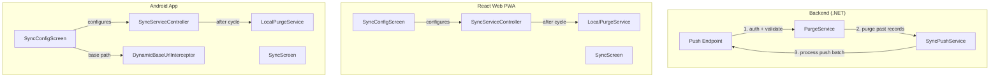
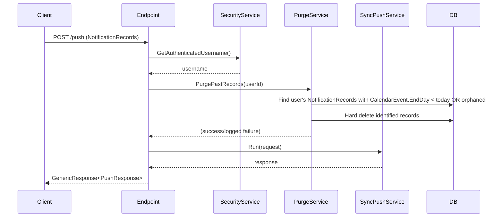
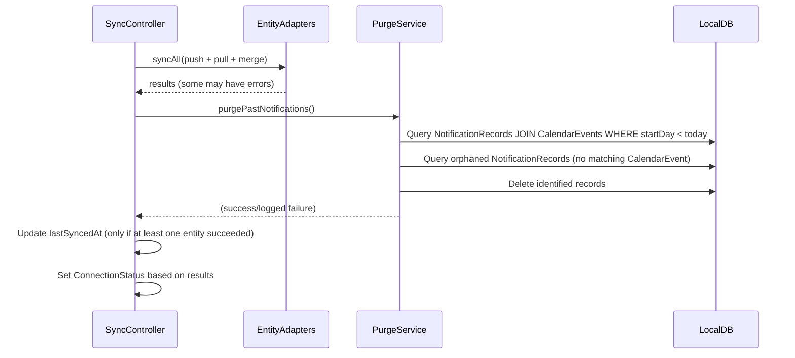
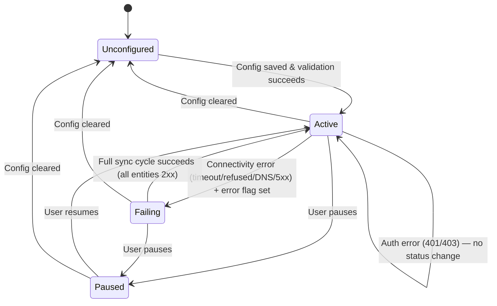
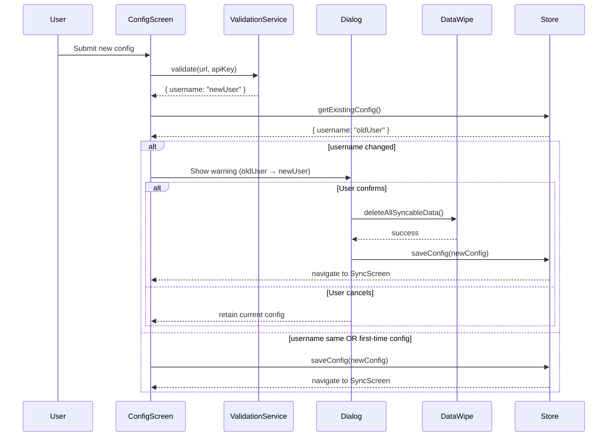

# Design Document: Synchronization Improvements

## Overview

This feature delivers eight synchronization improvements across all three platforms (backend .NET API, React Web PWA, Android app):

1. **Backend notification purge** — hard-deletes past NotificationRecords during sync push
2. **Client notification purge** — removes past notifications from local storage after each sync cycle
3. **Android connectivity monitoring** — fixes inaccurate ConnectionStatus transitions on sync failure
4. **Configurable API base path** — replaces hardcoded `/api` with a user-configurable path segment
5. **Configurable sync interval** — replaces hardcoded 5-minute interval with user-selectable values
6. **Username change detection** — warns users and wipes local data when switching accounts
7. **Cross-platform consistency** — ensures identical behavior across React Web and Android
8. **Sync interval display** — shows configured interval on the Sync Screen

### Key Design Decisions

1. **Purge runs server-side in the push handler** — purge executes after auth validation but before upsert logic, within the same request pipeline. No separate scheduled job needed.
2. **Client purge is post-cycle** — runs after all push/pull/merge operations complete, to avoid deleting records that would fail to push.
3. **Error classification drives status** — connectivity errors (timeout, refused, DNS, 5xx) set `failing`; auth errors (401/403) remain distinct and do NOT transition to `failing`.
4. **lastSyncedAt conditional update** — only updates when at least one entity sync succeeds (fixes the existing bug on Android where it always updates).
5. **API base path normalized on save** — prepend `/` if absent, strip trailing `/`. Validated against a path-safe character set.
6. **Sync interval stored as minutes** — integer value from a fixed set `[5, 10, 15, 20, 25, 30, 45, 60]`.
7. **Username change triggers full wipe** — all syncable entities deleted atomically; if any deletion fails, the entire operation aborts and existing config is preserved.

## Architecture



### Backend Purge Sequence



### Client Purge Sequence (both platforms)



### Android Connectivity Monitoring Fix



## Components and Interfaces

### Backend Changes

| File | Change |
|---|---|
| `UseCases/NotificationRecord/SyncPush/NotificationRecordSyncPushService.cs` | Add purge step before processing push batch |
| `UseCases/NotificationRecord/SyncPush/Commands/INotificationRecordSyncPushCommands.cs` | Add `PurgePastRecordsAsync(string userId)` method |
| `Persistence.MySql.Efc.Repositories/NotificationRecord/SyncPush/NotificationRecordSyncPushCommands.cs` | Implement purge query with CalendarEvent join |

**Purge Query Logic (repository):**
```
1. Load all NotificationRecords WHERE UserId = userId
2. For each record, look up CalendarEvent by Id
3. If CalendarEvent not found (orphaned) → mark for purge
4. If CalendarEvent.EndDay < DateOnly.FromDateTime(DateTime.UtcNow) → mark for purge
5. Hard delete all marked records via context.RemoveRange()
6. SaveChangesAsync()
```

Note: Due to EF Core + MySQL `.Contains()` limitation, the purge loads user-scoped notification records and resolves calendar events individually or loads all user's calendar events into a dictionary for in-memory lookup.

### React Web PWA Changes

| File | Change |
|---|---|
| `features/sync/models.ts` | Add `apiBasePath` and `syncIntervalMinutes` to `SyncConfig` |
| `features/sync/services/syncServiceController.ts` | Replace hardcoded `SYNC_INTERVAL_MS` with config value; replace hardcoded `/api` with `apiBasePath`; add post-cycle purge call; fix `lastSyncedAt` to only update on success |
| `features/sync/services/syncValidationService.ts` | Use `apiBasePath` in validation URL |
| `features/sync/services/notificationPurgeService.ts` | **New** — purge past notifications from IndexedDB |
| `features/sync/stores/syncStore.ts` | Add `apiBasePath` and `syncIntervalMinutes` to state |
| `features/sync/components/SyncConfigScreen.tsx` | Add API base path input + sync interval selector + username change detection dialog |
| `features/sync/components/SyncScreen.tsx` | Display sync interval value |
| `data/db.ts` | No schema change needed (SyncConfig is a single-row key-value) |

### Android App Changes

| File | Change |
|---|---|
| `data/sync/SyncConfig.kt` | Add `apiBasePath: String = "/api"` and `syncIntervalMinutes: Int = 5` |
| `data/sync/SyncServiceController.kt` | Replace hardcoded `SYNC_INTERVAL_MS` with config-driven value; add error classification; fix `lastSyncedAt` conditional update; add post-cycle purge; persist failing state |
| `data/sync/DynamicBaseUrlInterceptor.kt` | Add `apiBasePath` property; apply path segment when rewriting URLs |
| `data/sync/ConnectionStatus.kt` | No change (enum values are sufficient) |
| `data/sync/NotificationPurgeService.kt` | **New** — purge past notifications from Room |
| `data/local/PreferencesRepository.kt` | Add `KEY_SYNC_API_BASE_PATH` and `KEY_SYNC_INTERVAL_MINUTES` keys; read/write in `syncConfigFlow`/`saveSyncConfig`; persist `ConnectionStatus` |
| `data/local/NotificationRecordDao.kt` | Add query for past notification records (join calendar_events) |
| `ui/sync/SyncConfigScreen.kt` | Add API base path field + sync interval dropdown + username change confirmation dialog |
| `ui/sync/SyncScreen.kt` | Display sync interval value |
| `ui/sync/SyncViewModel.kt` | Add username change detection logic; add data wipe method |

### New Services

**`notificationPurgeService` (Web — TypeScript):**
```typescript
interface PurgeResult {
  purgedCount: number;
  error?: string;
}

const purgePastNotifications = async (): Promise<PurgeResult>;
```

**`NotificationPurgeService` (Android — Kotlin):**
```kotlin
class NotificationPurgeService @Inject constructor(
    private val notificationRecordDao: NotificationRecordDao,
    private val calendarEventDao: CalendarEventDao,
) {
    suspend fun purgePastNotifications(): Int  // returns count of purged records
}
```

## Data Models

### SyncConfig Expansion

**Web (TypeScript) — updated:**
```typescript
interface SyncConfig {
  key?: string;
  serverUrl: string;
  apiKey: string;
  username: string;
  apiBasePath: string;       // NEW — default "/api"
  syncIntervalMinutes: number; // NEW — default 5
  isPaused: boolean;
  lastSyncedAt: string | null;
}
```

**Android (Kotlin) — updated:**
```kotlin
data class SyncConfig(
    val serverUrl: String,
    val apiKey: String,
    val username: String,
    val apiBasePath: String = "/api",        // NEW
    val syncIntervalMinutes: Int = 5,        // NEW
    val isPaused: Boolean = false,
    val lastSyncedAt: Long? = null,
)
```

### API Base Path Validation Rules

| Rule | Description |
|---|---|
| Must start with `/` | Prepend if absent on save |
| Must not end with `/` | Strip trailing on save |
| Max 128 characters | Reject longer values |
| Characters allowed | `[a-zA-Z0-9\-\_\.\/ ]` (alphanumeric, hyphens, underscores, dots, forward slashes) |
| Empty → default `/api` | Treated as `/api` on save |

**Normalization function (pure, shared logic):**
```
normalize(input):
  if empty → return "/api"
  trim whitespace
  if not starts with "/" → prepend "/"
  if ends with "/" and length > 1 → remove trailing "/"
  return result
```

### Sync Interval Selectable Values

```
[5, 10, 15, 20, 25, 30, 45, 60]  // minutes
```

Default: `5` minutes.

### URL Construction Pattern

All sync URLs are constructed as:
```
{serverUrl}{apiBasePath}/{entity-kebab}/sync/{action}
```

Validation URL:
```
{serverUrl}{apiBasePath}/security/validate
```

Examples with `serverUrl = "https://backend.planixor.com"`, `apiBasePath = "/api"`:
- `https://backend.planixor.com/api/calendar-events/sync/push`
- `https://backend.planixor.com/api/security/validate`

With `apiBasePath = "/custom/v2"`:
- `https://backend.planixor.com/custom/v2/calendar-events/sync/push`

### ConnectionStatus Persistence (Android)

Add a new DataStore key `KEY_SYNC_CONNECTION_STATUS` (string) to persist the `ConnectionStatus` enum across app restarts. On app launch, restore the persisted value.

### Username Change Detection Flow



### Error Classification (Android Fix)

| Error Type | Classification | Status Transition |
|---|---|---|
| `SocketTimeoutException` | Connectivity | Active → Failing |
| `ConnectRefusedException` | Connectivity | Active → Failing |
| `UnknownHostException` (DNS) | Connectivity | Active → Failing |
| HTTP 5xx | Connectivity | Active → Failing |
| HTTP 401 | Auth | No status change |
| HTTP 403 | Auth | No status change |
| HTTP 4xx (other) | Client error | No status change |
| Generic `IOException` | Connectivity | Active → Failing |

### lastSyncedAt Conditional Update (Bug Fix)

**Current behavior (buggy):** Both platforms always update `lastSyncedAt` after every cycle, even on complete failure.

**New behavior:** `lastSyncedAt` is updated only when at least one entity sync completes successfully (push AND pull for that entity return 2xx). If ALL entities fail, `lastSyncedAt` remains unchanged.

```
hasAnySuccess = false

for each entity:
  try:
    sync(entity)
    hasAnySuccess = true
  catch:
    set error flag

if hasAnySuccess:
  update lastSyncedAt = now

if hasError:
  set ConnectionStatus = failing
else:
  set ConnectionStatus = active
```

## Correctness Properties

*A property is a characteristic or behavior that should hold true across all valid executions of a system — essentially, a formal statement about what the system should do. Properties serve as the bridge between human-readable specifications and machine-verifiable correctness guarantees.*

### Property 1: Backend purge identifies correct records

*For any* authenticated user and any set of NotificationRecord entities belonging to that user, the purge logic SHALL identify for deletion exactly those records whose associated CalendarEvent has `EndDay < DateOnly.FromDateTime(DateTime.UtcNow)` OR whose associated CalendarEvent does not exist in the database (orphaned). No records belonging to other users SHALL be identified.

**Validates: Requirements 1.1, 1.3, 1.6**

### Property 2: Backend purge failure does not abort sync push

*For any* exception thrown during the purge operation, the sync push service SHALL still process the incoming batch of records and return a valid response with acknowledged and rejected IDs.

**Validates: Requirements 1.4**

### Property 3: Client purge identifies correct records

*For any* set of local NotificationRecord entries, the client purge logic SHALL identify for deletion exactly those entries whose associated CalendarEvent has `startDay` (as date string `YYYY-MM-DD`) strictly before the current device date, OR whose associated CalendarEvent does not exist in local storage. Entries with `startDay >= today` SHALL never be included in the purge set.

**Validates: Requirements 2.1, 2.3, 2.7**

### Property 4: Connectivity error classification drives status transition

*For any* sync cycle error classified as a connectivity failure (SocketTimeoutException, ConnectRefusedException, UnknownHostException, or HTTP 5xx), the Android application SHALL transition ConnectionStatus to `failing`. *For any* auth error (HTTP 401 or 403), the ConnectionStatus SHALL NOT transition to `failing`.

**Validates: Requirements 3.1, 3.6**

### Property 5: Failed sync preserves lastSyncedAt

*For any* sync cycle where ALL entity sync operations fail (no entity completes successfully), the `lastSyncedAt` timestamp SHALL remain unchanged from its value before the cycle started.

**Validates: Requirements 3.4**

### Property 6: SyncConfig round-trip persistence

*For any* valid SyncConfig (including non-empty serverUrl, apiKey, username, valid apiBasePath, and valid syncIntervalMinutes), persisting it to local storage and reading it back SHALL produce an equivalent SyncConfig with identical field values.

**Validates: Requirements 4.2, 5.4**

### Property 7: URL construction uses configured base path

*For any* valid server URL and any valid normalized API base path, the sync service SHALL construct endpoint URLs in the format `{serverUrl}{apiBasePath}/{entity-kebab}/sync/{action}` and validation URLs as `{serverUrl}{apiBasePath}/security/validate`. No hardcoded `/api` segment SHALL appear in constructed URLs when a custom base path is configured.

**Validates: Requirements 4.3, 4.4, 4.5**

### Property 8: API base path normalization

*For any* input string, the normalization function SHALL produce a result that starts with `/` and does not end with `/` (unless the result is exactly `/`). Empty input SHALL produce `/api`.

**Validates: Requirements 4.6, 4.7**

### Property 9: API base path validation rejects invalid characters

*For any* string containing characters outside the set `[a-zA-Z0-9\-\_\.\/]`, the validation function SHALL reject the input. *For any* string composed only of characters within that set (and length ≤ 128), validation SHALL accept the input.

**Validates: Requirements 4.10**

### Property 10: Sync interval applied to scheduler

*For any* configured `syncIntervalMinutes` value from the valid set `[5, 10, 15, 20, 25, 30, 45, 60]`, the sync service's periodic scheduling delay SHALL equal `syncIntervalMinutes * 60 * 1000` milliseconds (±30s on web, ±60s on Android for intervals < 15 min).

**Validates: Requirements 5.5**

### Property 11: Username change detection triggers on mismatch

*For any* existing SyncConfig with username `A` and any validation response returning username `B` where `A !== B` (case-sensitive), the application SHALL display the username change confirmation dialog. If `A === B`, no dialog SHALL be shown.

**Validates: Requirements 6.1, 6.7**

## Error Handling

### Backend Purge Errors

| Scenario | Behavior |
|---|---|
| Database error during purge query | Log warning, continue to push processing |
| Database error during purge delete | Log warning, continue to push processing |
| No records to purge | Skip silently, proceed to push |

### Client Purge Errors

| Scenario | Behavior |
|---|---|
| IndexedDB/Room query fails | Log error, continue normal operation |
| IndexedDB/Room delete fails | Log error, continue — retry on next cycle |

### Connectivity Monitoring Errors

| Scenario | Android Status | Web Status |
|---|---|---|
| Timeout (>30s) | → Failing | → Failing |
| Connection refused | → Failing | → Failing |
| DNS failure | → Failing | → Failing |
| HTTP 5xx | → Failing | → Failing |
| HTTP 401/403 | No change | → Failing (existing web behavior preserved) |
| All entities succeed after failure | → Active | → Active |

### Username Change Data Wipe Errors

| Scenario | Behavior |
|---|---|
| Deletion of any entity category fails | Abort entire operation, retain existing config, show error |
| Partial deletion (some entities deleted before failure) | Abort — but already-deleted data is lost (acceptable: next sync will repopulate) |

### API Base Path Validation Errors

| Scenario | Behavior |
|---|---|
| Invalid characters | Show i18n error below field, block save |
| Exceeds 128 characters | Show i18n error below field, block save |
| Empty value | Silently normalize to `/api` on save |

## Testing Strategy

### Unit Tests

**Backend (NUnit + NSubstitute):**

| Component | What to test |
|---|---|
| `NotificationRecordSyncPushService` | Purge called before upsert; purge failure doesn't abort push; correct records identified |
| Purge query logic (repository) | User-scoped filtering; orphaned record detection; date comparison boundary |

**Web (Vitest):**

| Component | What to test |
|---|---|
| `notificationPurgeService` | Correct identification of past records; orphaned record handling; date boundary (today excluded) |
| `syncServiceController` | Interval change applies; URL construction with base path; lastSyncedAt conditional update |
| `SyncConfigScreen` | Username change detection; validation; normalization |
| API base path normalization | Pure function — all edge cases |
| API base path validation | Character set enforcement |

**Android (JUnit + MockK):**

| Component | What to test |
|---|---|
| `NotificationPurgeService` | Correct identification; orphaned handling; date boundary |
| `SyncServiceController` | Error classification; status transitions; lastSyncedAt conditional; interval from config |
| `DynamicBaseUrlInterceptor` | Base path applied to URL; path segment ordering |
| `SyncViewModel` | Username change detection; data wipe flow; abort on failure |
| API base path normalization/validation | Same rules as web |

### Property-Based Tests

Property-based testing is applicable here because:
- Purge identification is a pure filter function over a data set (varies with input dates)
- URL construction is a pure function of URL + path inputs
- Normalization is a pure string transformation
- Validation is a pure character-set check
- Error classification is a pure function of error type → status

**Library:** `fast-check` (Web), `kotlin-test` property testing (Android)

**Configuration:** Minimum 100 iterations per property test.

Tag format: `Feature: gh19-synchronization-improvements, Property {N}: {title}`

### Integration Tests

| Scenario | Method |
|---|---|
| Full sync cycle with purge (web) | Mock API, seed IndexedDB with past records, run cycle, verify deletion |
| Full sync cycle with purge (Android) | Mock API, seed Room with past records, run cycle, verify deletion |
| Username change flow | Render config screen, submit different username, verify dialog + wipe |
| API base path applied to requests | Intercept fetch/OkHttp calls, verify URL contains custom path |
| Connectivity failure → status change (Android) | Simulate timeout, verify ViewModel state is `failing` |
| Sync interval change (web) | Change interval in config, verify setInterval uses new value |

### i18n Verification

New translation keys required (both `en` and `es`):
- `sync.config.apiBasePath` / `sync.config.apiBasePathPlaceholder`
- `sync.config.apiBasePathError`
- `sync.config.syncInterval` / `sync.config.syncIntervalUnit`
- `sync.config.syncIntervalOptions.*`
- `sync.usernameChange.title` / `sync.usernameChange.message` / `sync.usernameChange.confirm` / `sync.usernameChange.cancel`
- `sync.usernameChange.dataCategories`
- `sync.syncInterval` (Sync Screen label)
- `sync.errors.dataResetFailed`
