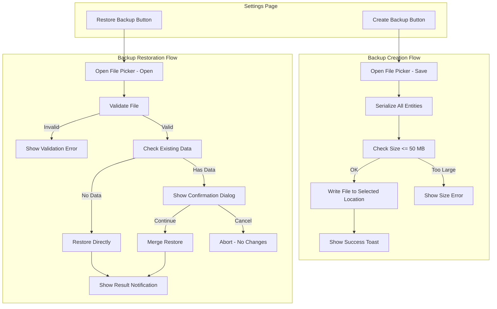

# Design Document — Backups Feature

## Overview

The Backups feature provides client-side backup creation and restoration for Planixor. Users can export all local application data to a portable `.bak` JSON file and later restore that file — on the same or a different device/platform. The feature lives in the Settings page on both platforms (React Web PWA and Android App) and requires no backend involvement.

Both platforms produce and consume an identical canonical JSON format, enabling cross-platform data portability. The implementation uses platform-native file I/O APIs (File System Access API on web, Storage Access Framework on Android) and reads all data from existing local stores (IndexedDB via Dexie on web, Room/SQLite + DataStore on Android).

### Key Design Decisions

| Decision | Rationale |
|---|---|
| Client-side only (no backend) | Backups serve users who don't use sync — keeping it local simplifies implementation and removes network dependency |
| Single JSON file format | Simpler than zip/binary; human-inspectable; adequate for the expected data volumes (<50 MB cap) |
| camelCase JSON keys | Platform-agnostic; matches TypeScript conventions and avoids mapping complexity |
| LWW merge on restore | Consistent with the existing sync conflict resolution strategy |
| Dependency-order insertion | Prevents foreign key issues (calendar events reference shifts/reminders) |
| Per-entity-table atomicity | One failing table doesn't block others; maximizes data recovered on partial failure |
| Schema versioning from day one | Enables future format evolution without breaking older backups |

---

## Architecture



### Platform-Specific Architecture

**React Web (PWA)**

```
src/features/backup/
├── backup.tsx                    # Container component (settings section)
├── components/
│   └── RestoreConfirmDialog.tsx  # Confirmation dialog presentational component
├── hooks/
│   └── useBackup.ts             # Orchestration hook (create + restore logic)
├── services/
│   ├── backupSerializer.ts      # Serialize all entities → JSON
│   ├── backupDeserializer.ts    # JSON → entity models (parsing + type coercion)
│   ├── backupValidator.ts       # Schema + size + version validation
│   ├── backupFileService.ts     # File System Access API / download fallback
│   └── backupRestoreService.ts  # Merge logic (LWW, insert, dependency order)
└── models.ts                    # BackupFile, BackupMetadata, ValidationError types
```

**Android App**

```
ui/backup/
├── BackupViewModel.kt           # ViewModel orchestrating create + restore
├── BackupUiState.kt             # Immutable UI state

domain/backup/
├── BackupFile.kt                # Domain model for the backup structure
├── BackupSerializer.kt          # Serialize all entities → JSON string
├── BackupDeserializer.kt        # JSON string → domain models
├── BackupValidator.kt           # Validation pipeline
└── BackupRestoreService.kt      # Merge logic (LWW, insert, dependency order)
```

The SettingsScreen on Android already exists. The BackupViewModel will be injected into the existing SettingsScreen (or a sub-composable) rather than creating a new screen, since backups are a section within Settings.

---

## Components and Interfaces

### Shared Backup File Format (TypeScript types — canonical reference)

```typescript
interface BackupFile {
  metadata: BackupMetadata;
  data: BackupData;
}

interface BackupMetadata {
  createdAt: string;           // ISO 8601 UTC with Z suffix
  appVersion: string;          // SemVer: "MAJOR.MINOR.PATCH"
  platform: 'web' | 'android';
  schemaVersion: number;       // Integer, starting at 1
}

interface BackupData {
  calendarEvents: BackupCalendarEvent[];
  notificationRecords: BackupNotificationRecord[];
  annualHoursConfig: BackupAnnualHoursConfig[];
  shifts: BackupShift[];
  reminders: BackupReminder[];
  syncConfig: BackupSyncConfig[];
}
```

### Entity Serialization Format

All entities are serialized to a canonical camelCase JSON representation. Date fields become ISO 8601 UTC strings with `Z` suffix. UUIDs are lowercase hyphenated strings. Nullable fields use JSON `null`.

```typescript
interface BackupShift {
  id: string;
  name: string;
  icon: string;
  backgroundColor: string;
  startTime: number;        // minutes from midnight
  endTime: number;
  hoursWorked: number;
  isActive: boolean;
  createdAt: string;        // ISO 8601 UTC
  modifiedAt: string;       // ISO 8601 UTC
  syncedAt: string | null;  // ISO 8601 UTC or null
  isDeleted: boolean;
}

interface BackupReminder {
  id: string;
  name: string;
  icon: string;
  backgroundColor: string;
  isActive: boolean;
  createdAt: string;
  modifiedAt: string;
  syncedAt: string | null;
  isDeleted: boolean;
}

interface BackupCalendarEvent {
  id: string;
  eventType: string;        // "shift" or "reminder"
  eventTypeId: string;
  startDay: string;         // "YYYY-MM-DD"
  endDay: string;           // "YYYY-MM-DD"
  startTime: number;
  endTime: number;
  totalHours: number;
  notes: string | null;
  alertOffsets: number[];   // e.g. [0, 10, 60]
  modifiedAt: string;
  syncedAt: string | null;
  isDeleted: boolean;
}

interface BackupNotificationRecord {
  id: string;
  calendarEventId: string;
  alertOffset: number;
  triggerTime: string;      // ISO 8601 UTC
  isDelivered: boolean;
  isRead: boolean;
  modifiedAt: string;
  syncedAt: string | null;
  isDeleted: boolean;
}

interface BackupAnnualHoursConfig {
  id: string;
  year: number;
  configuredHours: number;
  modifiedAt: string;
  syncedAt: string | null;
  isDeleted: boolean;
}

interface BackupSyncConfig {
  serverUrl: string;
  apiKey: string;
  username: string;
  apiBasePath: string;
  syncIntervalMinutes: number;
  isPaused: boolean;
  lastSyncedAt: string | null;
}
```

### React Web — Key Interfaces

```typescript
// services/backupSerializer.ts
export const serializeBackup = async (): Promise<string>;

// services/backupDeserializer.ts
export const deserializeBackup = (json: string): BackupFile;

// services/backupValidator.ts
export interface ValidationResult {
  isValid: boolean;
  error: ValidationError | null;
}
export type ValidationError =
  | { type: 'FILE_TOO_LARGE'; maxMb: number }
  | { type: 'INVALID_JSON'; details: string }
  | { type: 'INVALID_SCHEMA'; missingFields: string[] }
  | { type: 'INCOMPATIBLE_VERSION'; fileVersion: number; maxSupported: number };

export const validateBackupFile = (content: string, fileSize: number): ValidationResult;

// services/backupFileService.ts
export const saveBackupFile = async (content: string, filename: string): Promise<void>;
export const openBackupFile = async (): Promise<{ content: string; size: number } | null>;

// services/backupRestoreService.ts
export interface RestoreResult {
  success: boolean;
  restoredCount: number;
  failedEntities: string[];
  succeededEntities: string[];
}
export const restoreBackup = async (backup: BackupFile, hasExistingData: boolean): Promise<RestoreResult>;
```

### Android — Key Interfaces

```kotlin
// domain/backup/BackupSerializer.kt
class BackupSerializer @Inject constructor(
    private val calendarEventRepository: CalendarEventRepository,
    private val shiftRepository: ShiftRepository,
    private val reminderRepository: ReminderRepository,
    private val annualHoursConfigRepository: AnnualHoursConfigRepository,
    private val notificationRecordDao: NotificationRecordDao,
    private val preferencesRepository: PreferencesRepository,
) {
    suspend fun serialize(): String
}

// domain/backup/BackupValidator.kt
sealed class ValidationError {
    data class FileTooLarge(val maxMb: Int) : ValidationError()
    data class InvalidJson(val details: String) : ValidationError()
    data class InvalidSchema(val missingFields: List<String>) : ValidationError()
    data class IncompatibleVersion(val fileVersion: Int, val maxSupported: Int) : ValidationError()
}

class BackupValidator {
    fun validate(content: String, fileSize: Long): Result<BackupFile>
}

// domain/backup/BackupRestoreService.kt
data class RestoreResult(
    val success: Boolean,
    val restoredCount: Int,
    val failedEntities: List<String>,
    val succeededEntities: List<String>,
)

class BackupRestoreService @Inject constructor(...) {
    suspend fun restore(backup: BackupFile, hasExistingData: Boolean): RestoreResult
}
```

---

## Data Models

### Backup File JSON Schema (canonical reference)

```json
{
  "metadata": {
    "createdAt": "2025-06-20T13:07:59.878Z",
    "appVersion": "1.0.0",
    "platform": "web",
    "schemaVersion": 1
  },
  "data": {
    "calendarEvents": [...],
    "notificationRecords": [...],
    "annualHoursConfig": [...],
    "shifts": [...],
    "reminders": [...],
    "syncConfig": [...]
  }
}
```

### Platform-Specific Type Mapping

| Backup JSON Type | React Web (TypeScript) | Android (Kotlin) |
|---|---|---|
| ISO 8601 string (`modifiedAt`, `syncedAt`, `createdAt`, `triggerTime`) | `Date` object | `Long` (epoch millis) |
| UUID string | `string` | `String` |
| Integer (time in minutes, year, configuredHours) | `number` | `Int` |
| Boolean | `boolean` | `Boolean` |
| Nullable field (`null`) | `T \| null` | `T?` |
| Array (`alertOffsets`) | `number[]` | `String` (JSON serialized in Room) |

### Serialization Conversion Rules

**React Web (Date → ISO string):**
```typescript
// Serialize: Date → ISO string
const toIso = (date: Date): string => date.toISOString(); // already has Z suffix
const toIsoOrNull = (date: Date | null): string | null => date?.toISOString() ?? null;

// Deserialize: ISO string → Date
const fromIso = (iso: string): Date => new Date(iso);
const fromIsoOrNull = (iso: string | null): Date | null => iso ? new Date(iso) : null;
```

**Android (Long millis → ISO string):**
```kotlin
// Serialize: Long (millis) → ISO string
fun Long.toIsoString(): String = Instant.ofEpochMilli(this)
    .atOffset(ZoneOffset.UTC)
    .format(DateTimeFormatter.ISO_INSTANT)

fun Long?.toIsoStringOrNull(): String? = this?.toIsoString()

// Deserialize: ISO string → Long (millis)
fun String.toEpochMillis(): Long = Instant.parse(this).toEpochMilli()
fun String?.toEpochMillisOrNull(): Long? = this?.toEpochMillis()
```

### Dependency Order for Restoration

Entities are restored in this order to satisfy referential integrity:

1. **Shifts** — no dependencies
2. **Reminders** — no dependencies
3. **Calendar Events** — references shifts and reminders via `eventTypeId`
4. **Notification Records** — references calendar events via `calendarEventId`
5. **Annual Hours Configuration** — no dependencies (order is for consistency)
6. **Sync Configuration** — preferences, no DB entity dependencies

### Merge Logic (LWW)

```
For each entity in backup:
  1. Look up local record by UUID
  2. If no local record exists → INSERT backup record (with syncedAt = null)
  3. If local record exists:
     a. Compare backup.modifiedAt vs local.modifiedAt
     b. If backup.modifiedAt > local.modifiedAt → UPDATE local with backup data (syncedAt = null)
     c. If backup.modifiedAt <= local.modifiedAt → SKIP (local wins)

Special case — Sync Configuration:
  - If local sync config exists → SKIP (preserve local)
  - If no local sync config exists → INSERT backup sync config
```

---

## Correctness Properties

*A property is a characteristic or behavior that should hold true across all valid executions of a system — essentially, a formal statement about what the system should do. Properties serve as the bridge between human-readable specifications and machine-verifiable correctness guarantees.*

### Property 1: Serialization Round-Trip

*For any* valid application data state (any combination of calendar events, notification records, annual hours configs, shifts, reminders, and sync configuration with valid field values), serializing to a backup JSON string and then deserializing back SHALL produce data where every entity has identical field values to the original — UUIDs match exactly, dates match to millisecond precision, numbers are equal, strings are identical, booleans are equal, and null states are preserved.

**Validates: Requirements 9.7, 9.1, 9.3, 3.1, 3.2, 3.3, 3.4, 10.3**

### Property 2: Validation Correctness

*For any* file content and size, the validation pipeline SHALL accept the file if and only if: (a) the size is <= 50 MB, (b) the content is valid JSON, (c) the JSON contains a `metadata` object with `createdAt`, `appVersion`, `platform`, and `schemaVersion` fields, (d) the JSON contains all six entity arrays (`calendarEvents`, `notificationRecords`, `annualHoursConfig`, `shifts`, `reminders`, `syncConfig`), and (e) the `schemaVersion` is <= the current supported version. For any file failing one or more checks, the error type SHALL identify the specific failing rule.

**Validates: Requirements 6.1, 6.2, 6.3, 6.4**

### Property 3: Forward Compatibility (Unknown Fields Ignored)

*For any* valid backup file that also contains additional unrecognized JSON fields (at any nesting level within entity objects), deserialization SHALL succeed and produce entities with all recognized fields correctly populated, ignoring the unknown fields without error.

**Validates: Requirements 9.6, 10.4**

### Property 4: Merge Last-Writer-Wins

*For any* pair of records with the same UUID (one local, one from backup) regardless of `isDeleted` status, the merge operation SHALL keep the record whose `modifiedAt` timestamp is strictly more recent. If the backup record wins, the local record is updated with the backup data and `syncedAt` is set to null. If the local record wins (equal or more recent `modifiedAt`), it remains unchanged.

**Validates: Requirements 8.3, 8.4**

### Property 5: Merge Preserves Non-Overlapping Records

*For any* merge restore operation, all records in the backup that have UUIDs not present in local storage SHALL be inserted into local storage. All local records whose UUIDs are not present in the backup SHALL remain unchanged (no deletions of local-only data).

**Validates: Requirements 8.2**

### Property 6: Restored Records Have Null SyncedAt

*For any* set of records that are inserted or updated during a restore operation (whether fresh insert or LWW update), the resulting local record SHALL have `syncedAt = null`, ensuring it will be pushed to the server on the next sync cycle.

**Validates: Requirements 8.9**

---

## Error Handling

### Backup Creation Errors

| Error Condition | User-Facing Message (i18n key) | Behavior |
|---|---|---|
| File picker cancelled by user | `backup.createCancelled` | Abort silently, return to settings |
| Storage permission denied | `backup.permissionRequired` | Show dismissible toast, abort |
| File picker not supported | `backup.notSupported` | Show dismissible toast, abort |
| Serialization failure (memory/runtime) | `backup.createFailed` | Discard partial data, show error toast |
| File size exceeds 50 MB | `backup.fileTooLarge` | Abort before writing, show error toast |
| File write failure (disk full, permission) | `backup.saveFailed` | Show toast with failure category |

### Backup Restoration Errors

| Error Condition | User-Facing Message (i18n key) | Behavior |
|---|---|---|
| File picker cancelled by user | `backup.restoreCancelled` | Abort silently, return to settings |
| Storage permission denied | `backup.permissionRequired` | Show dismissible toast, abort |
| File too large (>50 MB) | `backup.fileTooLarge` | Show error, abort, no data modified |
| Invalid JSON | `backup.invalidJson` | Show error, abort, no data modified |
| Missing required schema fields | `backup.invalidSchema` | Show error, abort, no data modified |
| Incompatible schema version | `backup.incompatibleVersion` | Show error (update app), abort |
| Existing data check fails (DB read error) | `backup.verificationFailed` | Show error, abort, no data modified |
| Entity table restore fails | Per-table error | Roll back that table, continue others |
| All tables fail | `backup.restoreFailed` | Show comprehensive error |
| Partial success | Combined notifications | Show success (which/count) + error (which failed) |

### Concurrency Guards

- During backup creation: "Create" button disabled until write completes or fails
- During restore: "Restore" button disabled until restore pipeline completes or fails
- Loading indicators shown during async operations (file reading, validation, data check, restore)

---

## Testing Strategy

### Property-Based Tests (Vitest + fast-check)

The following property tests validate the core serialization and merge logic. Each test runs a minimum of 100 iterations with randomly generated data.

| Property | Test File | What it Validates |
|---|---|---|
| Property 1: Round-trip | `backupSerializer.property.test.ts` | Serialize → deserialize = identity for all entity types |
| Property 2: Validation | `backupValidator.property.test.ts` | Accept/reject correctness across random inputs |
| Property 3: Forward compat | `backupDeserializer.property.test.ts` | Unknown fields ignored during deserialization |
| Property 4: LWW merge | `backupRestoreService.property.test.ts` | Correct winner selected by modifiedAt |
| Property 5: Non-overlapping preserved | `backupRestoreService.property.test.ts` | New records inserted, local-only untouched |
| Property 6: SyncedAt reset | `backupRestoreService.property.test.ts` | All restored records have syncedAt = null |

**Library:** `fast-check` (already used in the project for existing property tests)

**Configuration:**
- Minimum 100 iterations per property
- Each test tagged: `// Feature: gh22-backups, Property {N}: {title}`

### Unit Tests (Example-Based)

| Area | Tests |
|---|---|
| Filename generation | Correct pattern `planixor-yyyyMMdd-HHmmss.bak` |
| File picker integration | Mock API calls, verify parameters |
| Validation error messages | Each error type produces correct i18n key |
| Sync config merge rule | Overwrite only when local empty |
| Dependency order | Verify insertion order (shifts, reminders, events, notifications, annual, sync) |
| UI states | Loading, success toast, error toast, dialog content |
| Concurrency guard | Button disabled during operation |
| Edge cases | Empty backup (all arrays empty), 50 MB boundary, orphaned references |

### Integration Tests

| Area | Tests |
|---|---|
| Full create → restore cycle | Create backup from populated DB, restore to empty DB, verify equality |
| Cross-platform format | Web-format JSON restored by web deserializer; Android-format JSON restored by web deserializer |
| Partial failure recovery | Simulate one entity table write failure, verify others succeed |
| Entity independence | Failing one table doesn't affect others |

### Android Testing

- **Unit tests (JVM):** BackupSerializer, BackupDeserializer, BackupValidator, BackupRestoreService, BackupViewModel state transitions
- **Instrumented tests:** File I/O with SAF mock, Room transaction atomicity

### Test Data Generators (fast-check arbitraries)

```typescript
// Arbitrary for valid Shift
const arbShift = fc.record({
  id: fc.uuid(),
  name: fc.string({ minLength: 1, maxLength: 50 }),
  icon: fc.constantFrom('🌅', '🌙', '☀️', '⭐'),
  backgroundColor: fc.constantFrom('#2563EB', '#7C3AED', '#10B981'),
  startTime: fc.integer({ min: 0, max: 1439 }),
  endTime: fc.integer({ min: 0, max: 1439 }),
  hoursWorked: fc.integer({ min: 1, max: 1440 }),
  isActive: fc.boolean(),
  createdAt: fc.date({ min: new Date('2020-01-01'), max: new Date('2030-12-31') }),
  modifiedAt: fc.date({ min: new Date('2020-01-01'), max: new Date('2030-12-31') }),
  syncedAt: fc.option(fc.date({ min: new Date('2020-01-01'), max: new Date('2030-12-31') }), { nil: null }),
  isDeleted: fc.boolean(),
});
```

Similar generators for all entity types.


---

## Implementation Notes (learned during development)

### Android SAF: Use `"*/*"` MIME type for custom file extensions

The Storage Access Framework contracts (`CreateDocument`, `OpenDocument`) must use `"*/*"` as the MIME type when working with `.bak` files. Using `"application/octet-stream"` causes:
- `CreateDocument`: some file managers don't return to the app after saving (the SAF activity stays in the foreground)
- `OpenDocument`: `.bak` files appear greyed out and cannot be selected

This is because `.bak` is not a registered MIME type — different file managers classify it differently (or not at all). Using `"*/*"` ensures universal compatibility.

### Android SettingsScreen: Single section call per feature

When integrating a new section composable into SettingsScreen, ensure it appears exactly once. During development, concurrent task execution caused a duplicate `BackupSection()` call. Always verify the Settings layout has no duplicate entries after integration.
