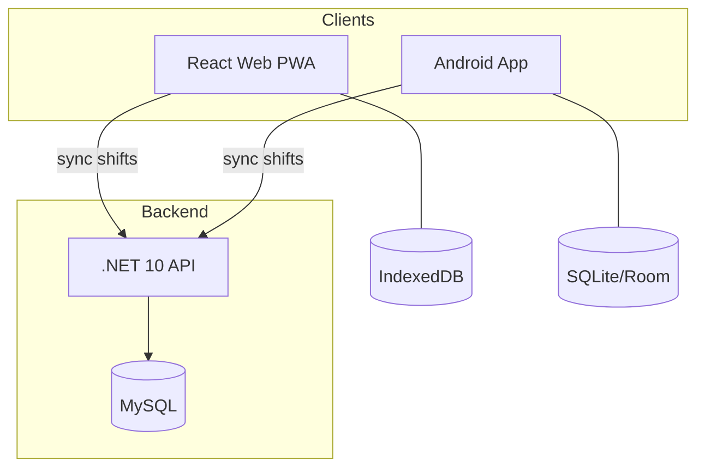

# Design Document: Shift Management

## Overview

Shift Management enables users to define reusable work shift templates (name, icon, color, start/end times, hours worked) across all Planixor platforms. Following the offline-first architecture, all CRUD operations execute locally first (IndexedDB on React Web, SQLite/Room on Android), with optional synchronization via the backend API for subscribed users.

The feature spans three sub-projects:

1. **Backend API** (.NET 10 / Clean Architecture) — sync endpoints for pushing/pulling shift records
2. **React Web PWA** (React / TypeScript) — Shifts page, shift form, local persistence via Dexie (IndexedDB)
3. **Android App** (Kotlin / Jetpack Compose) — Shifts screen, shift form, local persistence via Room (SQLite)

Business logic for CRUD operations lives in each client (offline-first). The backend only handles sync orchestration and storage for cross-device scenarios.

## Architecture

### System Context



### Backend Architecture (Clean Architecture Layers)

| Layer | Responsibility |
|---|---|
| **Core** (Tier 1) | `Shift` entity, Value Objects (`ShiftName`, `ShiftIcon`, `ShiftColor`, `ShiftTime`, `HoursWorked`), Domain Events |
| **Dtos** (Tier 2) | `ShiftSync` request/response DTOs, validators |
| **UseCases** (Tier 2) | `ShiftSyncPush` and `ShiftSyncPull` services |
| **Persistence** (Tier 3) | `ShiftConfiguration`, `ShiftSyncPushCommands`, `ShiftSyncPullQueries` |
| **Api** (Tier 4) | Sync endpoints under `/api/v1/shifts/sync` |

### React Web Architecture (Feature-Based)

```
src/features/shifts/
├── shifts.tsx                     # Container — ShiftsPage
├── components/
│   ├── ShiftCard.tsx              # Shift card presentation
│   ├── ShiftForm.tsx              # Create/edit form (presentational)
│   └── ConfirmationModal.tsx      # Reusable confirmation dialog
├── hooks/
│   ├── useShifts.ts               # CRUD operations hook
│   └── useShiftForm.ts            # Form state + validation
├── services/
│   └── shiftService.ts            # IndexedDB operations via Dexie
├── models.ts                      # Shift interface, validation schema
└── constants.ts                   # Predefined palette, validation limits
```

### Android Architecture (MVVM + Clean Architecture)

```
ui/shifts/
├── ShiftsScreen.kt                # Main screen composable
├── ShiftsViewModel.kt             # State management
├── ShiftsUiState.kt               # Immutable UI state
├── ShiftFormScreen.kt             # Create/edit form screen
├── ShiftFormViewModel.kt          # Form state + validation
└── ShiftFormUiState.kt            # Form UI state

data/local/
├── ShiftEntity.kt                 # Room entity
├── ShiftDao.kt                    # Room DAO

domain/model/
└── Shift.kt                       # Domain model

ui/components/
├── ShiftCard.kt                   # Reusable shift card
└── ConfirmationDialog.kt          # Reusable confirmation dialog
```

## Components and Interfaces

### Backend — Shift Entity (Core)

```csharp
public class Shift
{
    public Guid Id { get; private set; }
    public Guid UserId { get; private set; }
    public ShiftName Name { get; private set; }
    public ShiftIcon Icon { get; private set; }
    public ShiftColor BackgroundColor { get; private set; }
    public ShiftTime StartTime { get; private set; }
    public ShiftTime EndTime { get; private set; }
    public HoursWorked HoursWorked { get; private set; }
    public bool IsActive { get; private set; }
    public DateTime ModifiedAt { get; private set; }
    public DateTime? SyncedAt { get; private set; }
    public bool IsDeleted { get; private set; }
    public DateTime CreatedAt { get; private set; }
}
```

### Backend — Value Objects

| Value Object | Validation | Storage |
|---|---|---|
| `ShiftName` | 1–50 chars after trim, non-whitespace-only | `VARCHAR(50)` |
| `ShiftIcon` | Exactly 1 emoji character | `VARCHAR(10)` |
| `ShiftColor` | Must be in predefined palette set | `VARCHAR(7)` (hex) |
| `ShiftTime` | Hours 0–23, Minutes 0–59 | `TIME` or `INT` (minutes from midnight) |
| `HoursWorked` | 1–1440 minutes | `INT` (total minutes) |

### Backend — Sync Endpoints

| Endpoint | Method | Purpose |
|---|---|---|
| `/api/v1/shifts/sync/push` | POST | Accept batch of shift records from client |
| `/api/v1/shifts/sync/pull` | GET | Return shifts modified after `lastSyncedAt` |

### React Web — Shift Service Interface

```typescript
interface ShiftService {
  getAll(): Promise<Shift[]>;
  getById(id: string): Promise<Shift | undefined>;
  create(shift: Omit<Shift, 'id' | 'modifiedAt' | 'syncedAt' | 'isDeleted' | 'isActive' | 'createdAt'>): Promise<Shift>;
  update(id: string, data: Partial<Shift>): Promise<void>;
  softDelete(id: string): Promise<void>;
  deactivate(id: string): Promise<void>;
  activate(id: string): Promise<void>;
}
```

### Android — Shift DAO Interface

```kotlin
@Dao
interface ShiftDao {
    @Query("SELECT * FROM shifts WHERE isDeleted = 0 ORDER BY createdAt ASC")
    fun getAllActive(): Flow<List<ShiftEntity>>

    @Query("SELECT * FROM shifts WHERE id = :id")
    suspend fun getById(id: String): ShiftEntity?

    @Insert(onConflict = OnConflictStrategy.REPLACE)
    suspend fun upsert(shift: ShiftEntity)

    @Query("UPDATE shifts SET isDeleted = 1, modifiedAt = :now, syncedAt = NULL WHERE id = :id")
    suspend fun softDelete(id: String, now: Long)

    @Query("UPDATE shifts SET isActive = :isActive, modifiedAt = :now WHERE id = :id")
    suspend fun setActive(id: String, isActive: Boolean, now: Long)
}
```

### Shared — Predefined Color Palette

Both platforms use the same set of colors for shift backgrounds:

```typescript
const PREDEFINED_PALETTE = [
  '#EF4444', // Red
  '#F97316', // Orange
  '#F59E0B', // Amber
  '#10B981', // Green
  '#0B86D4', // Teal
  '#2563EB', // Blue
  '#7C3AED', // Purple
  '#EC4899', // Pink
  '#6B7280', // Gray
  '#1F2937', // Dark
] as const;
```

### Shared — Hours Worked Calculation Logic

```
function calculateHoursWorked(startTime, endTime):
  if startTime == endTime:
    return 1440  // 24 hours (special case)
  
  startMinutes = startTime.hours * 60 + startTime.minutes
  endMinutes = endTime.hours * 60 + endTime.minutes
  
  if endMinutes > startMinutes:
    return endMinutes - startMinutes
  else:
    return (1440 - startMinutes) + endMinutes  // crosses midnight
```

Maximum computed result for unequal times: 1439 minutes (23h 59m). Equal times special case: 1440 minutes (24h).

### Shift Form Validation Rules (Cross-Platform)

| Field | Rule | Error Key |
|---|---|---|
| Name | 1–50 chars after trim; not whitespace-only | `shift.validation.name` |
| Icon | Exactly 1 emoji | `shift.validation.icon` |
| Background Color | Must be in `PREDEFINED_PALETTE` | `shift.validation.color` |
| Start Time | Hours 0–23, Minutes 0–59 (set) | `shift.validation.startTime` |
| End Time | Hours 0–23, Minutes 0–59 (set) | `shift.validation.endTime` |
| Hours Worked | 1–1440 minutes inclusive | `shift.validation.hoursWorked` |

Validation triggers within 1 second of field change (debounced).

## Data Models

### React Web — Shift (IndexedDB via Dexie)

```typescript
interface Shift {
  id: string;                    // Client-generated UUID
  name: string;                  // 1–50 characters
  icon: string;                  // Single emoji
  backgroundColor: string;       // Hex from predefined palette
  startTime: number;             // Minutes from midnight (0–1439)
  endTime: number;               // Minutes from midnight (0–1439)
  hoursWorked: number;           // Total minutes (1–1440)
  isActive: boolean;             // Active/deactivated status
  createdAt: Date;               // Original creation timestamp (UTC)
  modifiedAt: Date;              // Last modification (UTC)
  syncedAt: Date | null;         // Last sync timestamp or null
  isDeleted: boolean;            // Soft-delete flag
}
```

Dexie schema addition:
```typescript
shifts: 'id, createdAt, isDeleted, isActive'
```

### Android — ShiftEntity (Room)

```kotlin
@Entity(tableName = "shifts")
data class ShiftEntity(
    @PrimaryKey val id: String,
    val name: String,
    val icon: String,
    val backgroundColor: String,
    val startTime: Int,           // Minutes from midnight
    val endTime: Int,             // Minutes from midnight
    val hoursWorked: Int,         // Total minutes
    val isActive: Boolean,
    val createdAt: Long,          // Epoch millis UTC
    val modifiedAt: Long,         // Epoch millis UTC
    val syncedAt: Long?,          // Epoch millis UTC or null
    val isDeleted: Boolean,
)
```

### Backend — Shift Table (MySQL)

```sql
CREATE TABLE Shifts (
    Id CHAR(36) NOT NULL PRIMARY KEY,
    UserId CHAR(36) NOT NULL,
    Name VARCHAR(50) NOT NULL,
    Icon VARCHAR(10) NOT NULL,
    BackgroundColor VARCHAR(7) NOT NULL,
    StartTime INT NOT NULL,          -- Minutes from midnight
    EndTime INT NOT NULL,            -- Minutes from midnight
    HoursWorked INT NOT NULL,        -- Total minutes
    IsActive TINYINT(1) NOT NULL DEFAULT 1,
    CreatedAt DATETIME(6) NOT NULL,
    ModifiedAt DATETIME(6) NOT NULL,
    SyncedAt DATETIME(6) NULL,
    IsDeleted TINYINT(1) NOT NULL DEFAULT 0,
    INDEX IX_Shifts_UserId (UserId),
    INDEX IX_Shifts_UserId_ModifiedAt (UserId, ModifiedAt)
);
```

### Backend — Sync DTOs

```csharp
// Push request (client → API)
public record ShiftSyncPushRequest(
    List<ShiftSyncItem> Shifts);

public record ShiftSyncItem(
    Guid Id,
    string Name,
    string Icon,
    string BackgroundColor,
    int StartTime,
    int EndTime,
    int HoursWorked,
    bool IsActive,
    DateTime CreatedAt,
    DateTime ModifiedAt,
    bool IsDeleted);

// Pull response (API → client)
public record ShiftSyncPullResponse(
    List<ShiftSyncItem> Shifts,
    string? Cursor,
    bool HasMore);
```


## Correctness Properties

*A property is a characteristic or behavior that should hold true across all valid executions of a system — essentially, a formal statement about what the system should do. Properties serve as the bridge between human-readable specifications and machine-verifiable correctness guarantees.*

### Property 1: Shift creation persists correct system fields

*For any* valid set of shift field values (name, icon, color, start time, end time, hours worked), creating a shift SHALL produce a record with a non-empty UUID as `id`, `modifiedAt` set to a timestamp no earlier than the moment before creation, `syncedAt` equal to null, `isDeleted` equal to false, `isActive` equal to true, and all user-provided field values preserved exactly.

**Validates: Requirements 1.1, 4.7**

### Property 2: Shift validation rejects invalid input

*For any* shift form input where at least one field violates its constraint (name empty or whitespace-only or >50 chars after trim, icon is not exactly one emoji, color not in the predefined palette, start/end time hours outside 0–23 or minutes outside 0–59, or hours worked outside 1–1440 minutes), the validation function SHALL return a failure result identifying the invalid field(s) and SHALL prevent persistence.

**Validates: Requirements 1.2, 1.6, 7.1, 7.2, 7.3, 7.4, 7.5, 7.6**

### Property 3: Hours worked calculation

*For any* pair of (startTime, endTime) represented as minutes from midnight (0–1439): if startTime equals endTime, the computed hours worked SHALL be 1440 minutes; otherwise, the computed hours worked SHALL equal `(endTime - startTime + 1440) % 1440`, which is always positive, at most 1439 minutes, and represents the forward duration treating end before start as crossing midnight.

**Validates: Requirements 1.3, 9.1, 9.4**

### Property 4: Shift listing filter and ordering

*For any* collection of shift records with mixed `isDeleted` values and various `createdAt` timestamps, the list query SHALL return exactly the subset where `isDeleted` is false, ordered by `createdAt` ascending (oldest first).

**Validates: Requirements 2.1, 5.4**

### Property 5: Shift update preserves identity fields

*For any* existing non-deleted shift and any valid set of field modifications, updating the shift SHALL preserve the original `id`, `syncedAt`, and `isDeleted` values unchanged, SHALL set `modifiedAt` to a timestamp no earlier than the moment before the update, and SHALL persist all new field values.

**Validates: Requirements 3.2**

### Property 6: Toggle active status

*For any* shift with `isActive` equal to a boolean value `V`, toggling the active status SHALL set `isActive` to `!V` and update `modifiedAt` to a timestamp no earlier than the moment before the toggle, without modifying any other field.

**Validates: Requirements 4.2, 4.5**

### Property 7: Soft delete sets correct flags

*For any* non-deleted shift, performing a soft delete SHALL set `isDeleted` to true, set `syncedAt` to null, and update `modifiedAt` to a timestamp no earlier than the moment before deletion, without modifying the `id` or any content fields.

**Validates: Requirements 5.2**

### Property 8: Sync push filter selects unsynced records

*For any* collection of shift records, the sync push filter SHALL select exactly those records where `syncedAt` is null OR `modifiedAt` is strictly greater than `syncedAt`.

**Validates: Requirements 6.1**

### Property 9: Conflict resolution — last writer wins with remote tie-break

*For any* pair of (local, remote) shift records with the same `id`: if the remote `modifiedAt` is later than the local `modifiedAt`, the remote record SHALL win; if the local `modifiedAt` is later, the local record SHALL win; if both `modifiedAt` values are identical, the remote record SHALL win.

**Validates: Requirements 6.3**

### Property 10: Pull merge inserts new remote records

*For any* remote shift record whose `id` does not exist in the local store, applying the pull merge SHALL insert that record into the local store with `syncedAt` set to a timestamp no earlier than the moment before the merge operation.

**Validates: Requirements 6.5**

### Property 11: Time change after manual override triggers recalculation

*For any* shift form state where hours worked has been manually overridden to a value `M`, modifying either start time or end time SHALL replace the hours worked value with the newly calculated value (per Property 3), discarding the manual override `M`.

**Validates: Requirements 9.3**

## Error Handling

### Client-Side (React Web & Android)

| Scenario | Handling |
|---|---|
| Shift_Store read failure | Display localized error message; offer retry |
| Shift_Store write failure | Display localized error message; do not navigate away |
| Validation failure | Display per-field error messages; prevent submission |
| Edit of deleted shift | Reject silently, navigate back to Shifts_Page |
| Sync push failure (network) | Retry on next sync cycle; no user notification for background sync |
| Sync pull conflict | Apply conflict resolution (Property 9); no user intervention |

### Backend API

| Scenario | HTTP Status | Response |
|---|---|---|
| Unauthenticated request | 401 | `UnauthorizedException` |
| No active subscription | 403 | `ForbiddenException` |
| Invalid sync payload | 400 | `ValidationException` with field-level failures |
| Batch exceeds 100 records | 400 | `BadRequestException` — "Batch size exceeds maximum of 100" |
| Database write failure | 500 | `DatabaseException` |
| Record not found on pull | N/A | Omit from response (not an error) |

### Validation Error Messages (i18n keys)

| Key | English | Spanish |
|---|---|---|
| `shift.validation.name.required` | Name is required | El nombre es obligatorio |
| `shift.validation.name.maxLength` | Name must be 50 characters or less | El nombre debe tener 50 caracteres o menos |
| `shift.validation.icon.required` | Select an icon | Selecciona un ícono |
| `shift.validation.color.required` | Select a background color | Selecciona un color de fondo |
| `shift.validation.startTime.required` | Start time is required | La hora de inicio es obligatoria |
| `shift.validation.endTime.required` | End time is required | La hora de fin es obligatoria |
| `shift.validation.hoursWorked.range` | Hours worked must be between 1 minute and 24 hours | Las horas trabajadas deben estar entre 1 minuto y 24 horas |
| `shift.error.loadFailed` | Could not load shifts | No se pudieron cargar los turnos |
| `shift.empty` | No shifts available | No hay turnos disponibles |
| `shift.deactivate.confirm` | Deactivate this shift? | ¿Desactivar este turno? |
| `shift.delete.confirm` | This action is permanent and cannot be undone. Delete this shift? | Esta acción es permanente y no se puede deshacer. ¿Eliminar este turno? |

## Testing Strategy

### Dual Testing Approach

This feature uses both **property-based tests** and **example-based unit tests** for comprehensive coverage.

- **Property-based tests** verify universal properties (Properties 1–11) across many generated inputs
- **Unit tests** verify specific examples, edge cases, UI rendering, and integration points
- **Integration tests** verify sync flow end-to-end, theme/language switching

### Property-Based Testing Configuration

- **Library (React Web):** `fast-check` with Vitest
- **Library (Android):** `Kotest` property testing module with JUnit 4
- **Library (Backend):** `FsCheck` with NUnit
- **Minimum iterations:** 100 per property test
- **Tag format:** `Feature: gh3-shift-management, Property {N}: {title}`

### Test Distribution by Layer

#### Backend (.NET)

| Layer | Test Type | What |
|---|---|---|
| Value Objects | Property (FsCheck) | Properties 2, 3 (validation, calculation) |
| Entity | Property (FsCheck) | Properties 1, 5, 6, 7 (create, update, toggle, delete) |
| Sync Service | Property (FsCheck) | Properties 8, 9, 10 (push filter, conflict resolution, pull merge) |
| Request Validators | Unit (NUnit) | Edge cases for sync DTOs |
| Endpoints | Unit (NUnit) | Auth/subscription guards |

#### React Web (TypeScript)

| Layer | Test Type | What |
|---|---|---|
| shiftService.ts | Property (fast-check) | Properties 1, 4, 5, 6, 7 (CRUD operations against Dexie) |
| validation (Zod) | Property (fast-check) | Property 2 (validation schema) |
| calculation util | Property (fast-check) | Properties 3, 11 (hours calculation, override reset) |
| sync filter | Property (fast-check) | Properties 8, 9, 10 (sync logic) |
| ShiftCard.tsx | Unit (Vitest + RTL) | Rendering examples, accessibility |
| ShiftForm.tsx | Unit (Vitest + RTL) | Form interactions, error display |
| shifts.tsx (page) | Unit (Vitest + RTL) | Loading/empty/error states |

#### Android (Kotlin)

| Layer | Test Type | What |
|---|---|---|
| ShiftRepository | Property (Kotest) | Properties 1, 4, 5, 6, 7 (CRUD operations) |
| Validation logic | Property (Kotest) | Property 2 |
| Calculation util | Property (Kotest) | Properties 3, 11 |
| Sync logic | Property (Kotest) | Properties 8, 9, 10 |
| ShiftsViewModel | Unit (JUnit) | State transitions, error handling |
| ShiftFormViewModel | Unit (JUnit) | Form state, validation trigger timing |
| Composables | Unit (Compose Testing) | Rendering, accessibility |

### Example-Based Tests (Key Scenarios)

| Scenario | Platform | Validates |
|---|---|---|
| Create shift with duplicate name succeeds | All | Req 1.7 |
| Cancel creation discards data | Web, Android | Req 1.5 |
| Empty state shows "No shifts" message | Web, Android | Req 2.3 |
| Edit pre-populates form with existing values | Web, Android | Req 3.1 |
| Edit of deleted shift navigates back | Web, Android | Req 3.5 |
| Deactivation shows confirmation modal | Web, Android | Req 4.1 |
| Cancel deactivation makes no changes | Web, Android | Req 4.3 |
| Deactivated card shows reduced opacity + badge | Web, Android | Req 4.4 |
| Delete shows permanent warning modal | Web, Android | Req 5.1 |
| Dismiss delete modal makes no changes | Web, Android | Req 5.3 |
| Clearing a time field clears hours worked | Web, Android | Req 9.5 |
| Equal start/end produces 24h (1440 min) | All | Req 9.4 |
