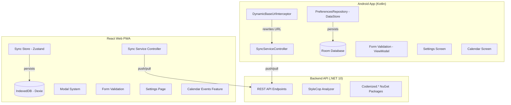
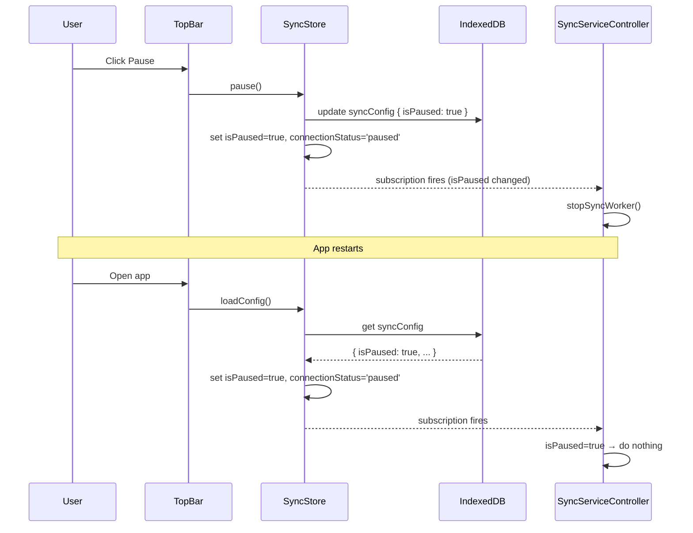
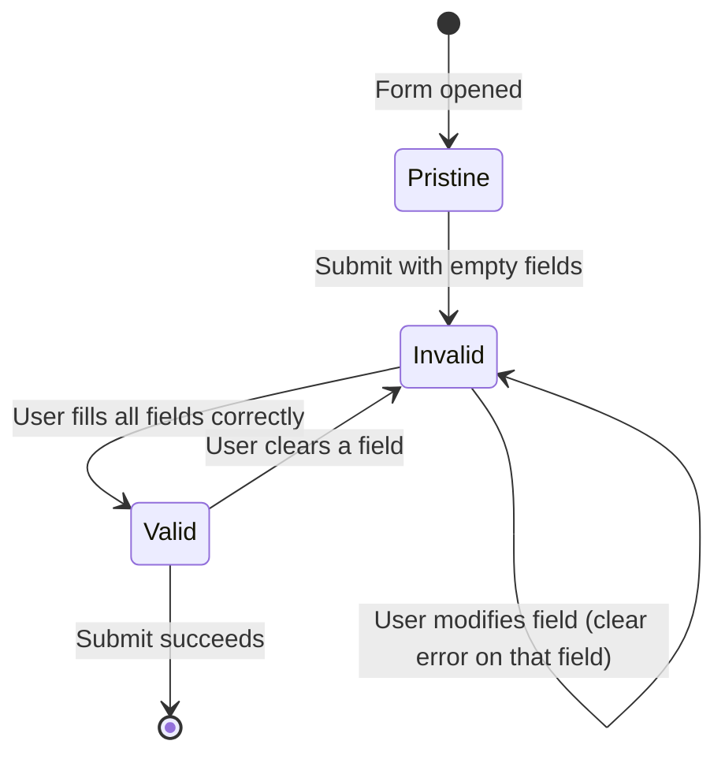

# Design Document: GH-32 Improvements and Bug Fixes

## Overview

This design document covers 14 requirements spanning all three Planixor sub-projects: Backend API (.NET 10), React Web PWA, and Android App. The changes are grouped into the following concerns:

1. **Build quality & dependency updates** (Reqs 1–3, 13) — warning elimination, NuGet/npm/Gradle dependency updates
2. **Sync pause persistence** (Reqs 4–5) — persist paused state across app restarts on both clients
3. **Calendar event prerequisites** (Reqs 6–7) — prerequisite modal before event creation on both clients
4. **Form validation** (Reqs 8–9) — mandatory field validation with inline errors on both clients
5. **Modal replacement** (Req 10) — replace browser alerts with styled modals on React Web
6. **Version display** (Reqs 11–12) — show app version in Settings on both clients
7. **Android sync regression** (Req 14) — fix URL parsing after field merge

Each concern is largely independent and can be implemented in parallel across sub-projects.

## Architecture

### High-Level System Diagram



### Change Impact by Sub-Project

| Sub-Project | Requirements | Impact |
|---|---|---|
| Backend | 1, 2 | Build warnings, dependency versions (no API changes) |
| React Web | 3, 4, 6, 8, 10, 11 | Dependencies, sync store, modal system, form validation, settings |
| Android | 5, 7, 9, 12, 13, 14 | Dependencies, sync config, prerequisites, validation, settings, URL parsing |

## Components and Interfaces

### 1. Backend Build & Dependency Updates (Reqs 1–2)

No new components. Changes are limited to:
- Fixing compiler/StyleCop warnings in existing code
- Updating `PackageReference` versions in `.csproj` files
- Adding `[SuppressMessage]` or `#pragma` where necessary with justification

### 2. React Web Dependency Updates (Req 3)

No new components. Changes limited to:
- Updating `package.json` dependency versions
- Adapting any breaking API changes in application code
- Regenerating `pnpm-lock.yaml`

### 3. Sync Pause Persistence — React Web (Req 4)

**Affected Components:**

| Component | File | Change |
|---|---|---|
| `SyncStore` | `features/sync/stores/syncStore.ts` | `pause()` and `resume()` must persist to IndexedDB |
| `SyncServiceController` | `features/sync/services/syncServiceController.ts` | Guard all triggers with pause check |
| `useSyncStore.loadConfig()` | `features/sync/stores/syncStore.ts` | Restore paused state from DB on load |

**Interface Changes:**

```typescript
// syncStore.ts — updated actions
pause: () => Promise<void>;   // was sync, now persists to DB
resume: () => Promise<void>;  // was sync, now persists to DB and triggers sync
```

**Flow Diagram:**



### 4. Sync Pause Persistence — Android (Req 5)

**Affected Components:**

| Component | File | Change |
|---|---|---|
| `SyncViewModel` | `ui/sync/SyncViewModel.kt` | `pause()` and `resume()` persist to DataStore |
| `SyncServiceController` | `data/sync/SyncServiceController.kt` | Already handles isPaused — verify persist-before-UI |
| `PreferencesRepository` | `data/local/PreferencesRepository.kt` | Ensure isPaused read on startup |

**Interface:**

```kotlin
// SyncViewModel — updated pause/resume
fun pause() {
    viewModelScope.launch {
        preferencesRepository.setSyncPaused(true)
        preferencesRepository.saveConnectionStatus(ConnectionStatus.PAUSED)
        _uiState.update { it.copy(connectionStatus = ConnectionStatus.PAUSED) }
    }
}
```

### 5. Calendar Event Prerequisites — React Web (Req 6)

**New Components:**

| Component | Location | Purpose |
|---|---|---|
| `PrerequisiteModal` | `features/calendar-events/components/PrerequisiteModal.tsx` | Modal showing missing prerequisites |
| `usePrerequisiteCheck` | `features/calendar-events/hooks/usePrerequisiteCheck.ts` | Hook that checks shift/reminder counts |
| `checkPrerequisites()` | `features/calendar-events/services/prerequisiteService.ts` | Pure function: counts → result |

**Interface:**

```typescript
type PrerequisiteResult =
  | { canCreate: true }
  | { canCreate: false; missingShifts: boolean; missingReminders: boolean };

const checkPrerequisites = (
  activeShiftCount: number,
  activeReminderCount: number,
): PrerequisiteResult => { ... };
```

### 6. Calendar Event Prerequisites — Android (Req 7)

**Changes:**

| Component | File | Change |
|---|---|---|
| `CalendarViewModel` | `ui/calendar/CalendarViewModel.kt` | Add prerequisite check before showing form |
| `CalendarUiState` | `ui/calendar/CalendarUiState.kt` | Add prerequisite modal state fields |
| `PrerequisiteDialog` | `ui/components/PrerequisiteDialog.kt` | New reusable dialog composable |

**Interface:**

```kotlin
data class PrerequisiteResult(
    val canCreate: Boolean,
    val missingShifts: Boolean,
    val missingReminders: Boolean,
)

fun checkPrerequisites(activeShiftCount: Int, activeReminderCount: Int): PrerequisiteResult
```

### 7. Form Validation — React Web (Req 8)

**New Components:**

| Component | Location | Purpose |
|---|---|---|
| `useFormValidation` | `shared/hooks/useFormValidation.ts` | Generic form validation hook |
| `ValidationError` | `shared/components/ValidationError.tsx` | Inline error display component |
| `FormField` | `shared/components/FormField.tsx` | Wrapper with validation integration |

**Interface:**

```typescript
interface FieldValidation {
  required?: boolean;
  validate?: (value: unknown) => string | null;
}

interface UseFormValidationResult<T> {
  errors: Partial<Record<keyof T, string>>;
  validateAll: () => boolean;
  validateField: (field: keyof T) => void;
  clearFieldError: (field: keyof T) => void;
  hasErrors: boolean;
}

const useFormValidation = <T extends Record<string, unknown>>(
  fields: Record<keyof T, FieldValidation>,
  values: T,
): UseFormValidationResult<T>;
```

**Validation Behavior:**



### 8. Form Validation — Android (Req 9)

**Changes:**

- Each ViewModel with a form (Shift, Reminder, Calendar Event, Sync Config) gains validation state in UiState
- Validation triggers on submit attempt (not on initial display or focus loss before first submit)
- Field errors clear immediately when field value becomes valid

**Interface:**

```kotlin
data class FieldError(
    val field: String,
    val messageResId: Int,  // R.string reference for i18n
)

// In each form ViewModel:
data class ShiftFormUiState(
    // ... existing fields ...
    val fieldErrors: Map<String, Int> = emptyMap(),  // field name → string resource
    val hasAttemptedSubmit: Boolean = false,
)
```

### 9. Modal System — React Web (Req 10)

**New Components:**

| Component | Location | Purpose |
|---|---|---|
| `ModalProvider` | `shared/components/modal/ModalProvider.tsx` | Context provider + queue manager |
| `useModal` | `shared/components/modal/useModal.ts` | Hook to trigger modals |
| `InfoModal` | `shared/components/modal/InfoModal.tsx` | Informational/error modal |
| `ConfirmModal` | `shared/components/modal/ConfirmModal.tsx` | Confirmation modal with actions |

**Interface:**

```typescript
interface ModalConfig {
  type: 'info' | 'error' | 'confirm';
  titleKey: string;
  messageKey: string;
  messageParams?: Record<string, string>;  // for item names
  onConfirm?: () => void;
  onCancel?: () => void;
}

interface ModalContext {
  show: (config: ModalConfig) => void;
  dismiss: () => void;
}
```

**Queue behavior:** Modals are queued in FIFO order. Only one modal is visible at a time. When dismissed, the next queued modal appears.

**Dismiss rules:**
- Info/Error: close button + overlay click + Escape key
- Confirm: only explicit button clicks (confirm or cancel). No overlay or Escape dismiss.

**Focus trap:** When modal is open, Tab/Shift+Tab cycles within modal elements. Focus returns to trigger element on dismiss.

### 10. Version Display — React Web (Req 11)

**Implementation:**

- Use Vite's `define` or `import.meta.env` to inject version from `package.json` at build time
- Add version display at bottom of `SettingsPage.tsx`
- No new component needed — just a `<p>` element with correct styling

```typescript
// vite.config.ts addition
define: {
  __APP_VERSION__: JSON.stringify(require('./package.json').version),
}
```

### 11. Version Display — Android (Req 12)

**Implementation:**

- `BuildConfig.VERSION_NAME` already available from `build.gradle.kts`
- Add version text composable at bottom of `SettingsScreen.kt`

```kotlin
Text(
    text = "v${BuildConfig.VERSION_NAME}",
    style = MaterialTheme.typography.bodyMedium.copy(
        fontFamily = poppins,
        fontWeight = FontWeight.Medium,
        color = TextSecondary,
    ),
)
```

### 12. Android Dependency Updates (Req 13)

No new components. Changes limited to:
- Updating `gradle/libs.versions.toml` version entries
- Adapting any breaking API changes
- Verifying build and tests pass

### 13. Android Sync URL Fix (Req 14)

**Affected Components:**

| Component | File | Change |
|---|---|---|
| `ApiBasePathUtils` | `data/sync/ApiBasePathUtils.kt` | Fix URL parsing logic |
| `SyncConfigScreen` | `ui/sync/SyncConfigScreen.kt` | Validate URL format before save |
| `SyncViewModel` | `ui/sync/SyncViewModel.kt` | Call parser on save, store both components |
| `DynamicBaseUrlInterceptor` | `data/sync/DynamicBaseUrlInterceptor.kt` | Verify no double-slash construction |

**URL Parsing Logic:**

```kotlin
data class ParsedUrl(
    val serverUrl: String,   // scheme + host + port (e.g., "https://backend.planixor.com")
    val apiBasePath: String, // path segment (e.g., "/api") — defaults to "/api" if none
)

fun parseServerUrl(rawUrl: String): Result<ParsedUrl> {
    // 1. Trim whitespace
    // 2. Validate scheme present (https:// or http://)
    // 3. Parse with URI/URL class
    // 4. Extract scheme+host+port as serverUrl
    // 5. Extract path as apiBasePath (default "/api" if empty or "/")
    // 6. Validate host is not empty
}
```

**URL Validation Rules:**
- Must have `https://` or `http://` scheme
- Must not contain whitespace
- Must parse to a valid host
- Invalid → show field error, don't save config

## Data Models

### Sync Pause State (both platforms)

The `isPaused` field already exists in `SyncConfig` on both platforms. The change ensures it is:
1. Written to persistent storage BEFORE updating UI state
2. Read from persistent storage on app startup
3. Checked before EVERY sync trigger

**React Web — IndexedDB (Dexie):**

```typescript
// Already exists in SyncConfig interface
interface SyncConfig {
  key?: string;
  serverUrl: string;
  apiKey: string;
  username: string;
  apiBasePath: string;
  syncIntervalMinutes: number;
  isPaused: boolean;              // ← persisted to IndexedDB
  lastSyncedAt: string | null;
}
```

**Android — DataStore Preferences:**

```kotlin
// Already exists in SyncConfig data class
data class SyncConfig(
    val serverUrl: String,
    val apiKey: String,
    val username: String,
    val apiBasePath: String = "/api",
    val syncIntervalMinutes: Int = 5,
    val isPaused: Boolean = false,     // ← persisted to DataStore
    val lastSyncedAt: Long? = null,
)
```

### Prerequisite Check Result

```typescript
// React Web
type PrerequisiteResult =
  | { canCreate: true }
  | { canCreate: false; missingShifts: boolean; missingReminders: boolean };
```

```kotlin
// Android
data class PrerequisiteResult(
    val canCreate: Boolean,
    val missingShifts: Boolean,
    val missingReminders: Boolean,
)
```

### Modal Queue State (React Web)

```typescript
interface ModalQueueState {
  queue: ModalConfig[];
  current: ModalConfig | null;
}
```

### Form Validation State

```typescript
// React Web — per-form hook state
interface FormValidationState {
  errors: Record<string, string>;
  hasAttemptedSubmit: boolean;
  touchedFields: Set<string>;
}
```

```kotlin
// Android — in UiState data class
data class FormUiState(
    // ... form fields ...
    val fieldErrors: Map<String, Int> = emptyMap(),
    val hasAttemptedSubmit: Boolean = false,
)
```

## Correctness Properties

*A property is a characteristic or behavior that should hold true across all valid executions of a system — essentially, a formal statement about what the system should do. Properties serve as the bridge between human-readable specifications and machine-verifiable correctness guarantees.*

### Property 1: Sync pause blocks all operations

*For any* sync trigger type (periodic timer, visibility change, manual trigger, connectivity restore) and *for any* SyncConfig where `isPaused` is `true`, the sync service SHALL NOT execute any push or pull operations.

**Validates: Requirements 4.2, 4.3, 5.2, 5.3**

### Property 2: Sync pause persistence round-trip

*For any* valid SyncConfig, pausing synchronization and then reloading the config from persistent storage SHALL produce a config with `isPaused=true` and a derived `connectionStatus` of `'paused'`.

**Validates: Requirements 4.1, 4.5, 5.1, 5.6**

### Property 3: Unconfigured takes precedence over paused

*For any* persisted `isPaused` value (true or false), when no SyncConfig record exists in storage, loading the sync state SHALL produce a `connectionStatus` of `'unconfigured'`.

**Validates: Requirements 4.6**

### Property 4: Resume triggers sync and persists active state

*For any* previously paused SyncConfig, resuming synchronization SHALL persist `isPaused=false`, set `connectionStatus` to `'active'`, and trigger a full sync cycle.

**Validates: Requirements 4.4, 5.4**

### Property 5: Calendar event prerequisite classification

*For any* pair of non-negative integers (activeShiftCount, activeReminderCount), the prerequisite check function SHALL return:
- `{ canCreate: true }` when both > 0
- `{ canCreate: false, missingShifts: true, missingReminders: true }` when both = 0
- `{ canCreate: false, missingShifts: true, missingReminders: false }` when shifts = 0 and reminders > 0
- `{ canCreate: false, missingShifts: false, missingReminders: true }` when shifts > 0 and reminders = 0

**Validates: Requirements 6.1, 6.2, 6.3, 6.4, 7.1, 7.2, 7.3, 7.4**

### Property 6: Prerequisite check uses only non-deleted records

*For any* collection of shift and reminder records with mixed `isDeleted` values, the prerequisite check SHALL count only records where `isDeleted === false`.

**Validates: Requirements 6.8, 7.1–7.4**

### Property 7: Form validation rejects empty mandatory fields

*For any* form with N mandatory fields, when at least one mandatory field is empty (null, undefined, or whitespace-only for text; unselected for other types), validation SHALL fail and produce an error message for each empty mandatory field.

**Validates: Requirements 8.1, 9.1**

### Property 8: Form validation passes when all mandatory fields are valid

*For any* form state where all mandatory fields contain non-empty values satisfying their type constraints, validation SHALL produce zero errors and allow submission.

**Validates: Requirements 8.3, 9.2**

### Property 9: Field modification clears its error

*For any* field currently displaying a validation error, modifying that field's value SHALL immediately remove the error message for that field (regardless of whether the new value is valid).

**Validates: Requirements 8.5, 9.4**

### Property 10: Modal queue ordering

*For any* sequence of N modal triggers, modals SHALL be displayed one at a time in FIFO order — the Nth modal displays only after the (N-1)th is dismissed.

**Validates: Requirements 10.7**

### Property 11: URL parsing produces correct components

*For any* valid URL string with a scheme (`https://` or `http://`), a valid host, and an optional path segment, the URL parser SHALL produce:
- `serverUrl` = scheme + host + port (no trailing slash)
- `apiBasePath` = path segment (or `/api` if no path provided)

Such that `serverUrl + apiBasePath` reconstructs the significant portion of the original URL.

**Validates: Requirements 14.1, 14.2**

### Property 12: URL construction produces no double slashes

*For any* valid `serverUrl` (scheme+host+port), `apiBasePath` (path segment), entity name, and action, the constructed endpoint URL SHALL match the pattern `{serverUrl}{apiBasePath}/{entity}/sync/{action}` with exactly one slash between each path segment (no `//` in the path portion).

**Validates: Requirements 14.3**

### Property 13: Invalid URLs are rejected

*For any* string that is missing a URL scheme, contains whitespace characters, or cannot be parsed into a valid host, the URL validation function SHALL return an error result and SHALL NOT save the configuration.

**Validates: Requirements 14.6**

## Error Handling

### Backend (Reqs 1–2)

- Build warnings treated as errors through configuration — CI fails on warnings
- Package update failures documented via code comments on pinned versions

### React Web

| Scenario | Handling |
|---|---|
| IndexedDB write fails during pause/resume | Retry once; if still fails, log error and keep in-memory state consistent (user sees correct UI but state may not survive restart) |
| Form validation error | Inline error below field, prevent submission, focus first error |
| Modal queue overflow | No limit — queue grows. Risk is negligible for normal usage |
| Version not available at build time | Fallback to empty string (should not happen with proper Vite config) |

### Android

| Scenario | Handling |
|---|---|
| DataStore write fails during pause/resume | Log error, retry in next operation; ViewModel still updates UI state |
| URL parsing fails (invalid input) | Show field-level error via UiState, do not save config |
| Form validation error | Material 3 error state on TextFields, scroll to first error |
| Sync cycle failure for one entity | Continue with remaining entities (existing behavior preserved) |
| DynamicBaseUrlInterceptor receives null config | Skip URL rewrite, request proceeds to placeholder (will fail gracefully) |

## Testing Strategy

### Property-Based Testing

This feature set includes several pure functions ideal for property-based testing:

- **React Web**: Uses `fast-check` (already in devDependencies)
- **Android**: Uses `kotest-property` (already in test dependencies)

**Configuration:**
- Minimum 100 iterations per property test
- Each test tagged with `Feature: gh32-improvements-and-bug-fixes, Property N: {description}`

**Property tests to implement:**

| Property | Platform | Library | Target |
|---|---|---|---|
| 1 (Pause blocks ops) | React Web | fast-check | `syncServiceController.ts` |
| 2 (Pause round-trip) | React Web | fast-check | `syncStore.ts` |
| 3 (Unconfigured precedence) | React Web | fast-check | `syncStore.ts` |
| 4 (Resume triggers sync) | React Web | fast-check | `syncStore.ts` + `syncServiceController.ts` |
| 5 (Prerequisite classification) | Both | fast-check / kotest | `prerequisiteService.ts` / ViewModel |
| 6 (Non-deleted filter) | Both | fast-check / kotest | `prerequisiteService.ts` / ViewModel |
| 7 (Empty field rejection) | Both | fast-check / kotest | `useFormValidation.ts` / ViewModel |
| 8 (Valid fields pass) | Both | fast-check / kotest | `useFormValidation.ts` / ViewModel |
| 9 (Error clears on modify) | React Web | fast-check | `useFormValidation.ts` |
| 10 (Modal queue FIFO) | React Web | fast-check | Modal queue reducer |
| 11 (URL parsing) | Android | kotest | `ApiBasePathUtils.kt` |
| 12 (No double slashes) | Android | kotest | `DynamicBaseUrlInterceptor.kt` |
| 13 (Invalid URL rejection) | Android | kotest | `ApiBasePathUtils.kt` |

### Unit Tests (Example-Based)

| Area | Tests |
|---|---|
| Prerequisite modal rendering | Verify correct message and navigation links for each missing type |
| Modal dismiss behaviors | Info: close/overlay/Escape; Confirm: only buttons |
| Focus trap | Tab cycling within modal |
| Version display | Correct format "v{MAJOR}.{MINOR}.{PATCH}" |
| Settings page layout | Version at bottom, below all sections |
| Form validation i18n | Errors display in current language |
| Form focus on error | First error field receives focus on submit |

### Integration Tests

| Area | Tests |
|---|---|
| Sync pause across restart | Simulate app close/reopen with paused state |
| Android URL → sync cycle | Configure URL, trigger sync, verify requests |
| Reset clears pause state | Reset app, verify sync config cleared |

### Build Verification (Smoke)

| Area | Command | Validates |
|---|---|---|
| Backend zero warnings | `dotnet build` | Reqs 1.1, 1.3 |
| Backend tests pass | `dotnet test` | Req 2.3 |
| React Web build | `tsc -b && vite build` | Req 3.3 |
| React Web lint | `pnpm run lint` | Req 3.5 |
| React Web types | `tsc --noEmit` | Req 3.6 |
| React Web tests | `pnpm vitest --run` | Req 3.4 |
| Android build | `./gradlew assembleDebug` | Req 13.5 |
| Android tests | `./gradlew testDebug` | Req 13.6 |
