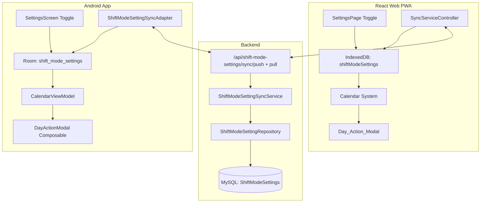

# Design Document: Shift Mode

## Overview

Shift Mode is a cross-platform feature that adds a specialized calendar operating mode for shift-focused users. When activated via a toggle in Settings, it restricts the calendar to Month and Year views, hides the "New Event" top-bar button, and introduces a streamlined day-tap interaction model using a Day_Action_Modal.

The feature spans three projects:
- **Backend (.NET 10, MySQL)**: New `ShiftModeSetting` syncable entity with push/pull API endpoints
- **React Web PWA (TypeScript, IndexedDB/Dexie)**: Settings toggle, calendar behavior modifications, Day_Action_Modal component
- **Android App (Kotlin, Room/SQLite)**: Settings toggle, calendar behavior modifications, Day_Action_Modal composable

The setting persists locally (offline-first) and syncs across devices via the standard bidirectional sync cycle when synchronization is configured.

## Architecture

The feature integrates into the existing clean architecture across all three projects without introducing new architectural layers.



### Key Architectural Decisions

1. **Single-row entity pattern**: Only one `ShiftModeSetting` record exists per user (per device in local storage, per userId on the backend). The record is created on first access with `enabled=false`.

2. **Reactive state propagation**: Both clients use reactive state observation (Dexie `useLiveQuery` on web, Room Flow on Android) so the calendar system immediately reflects changes from sync without manual refresh.

3. **Shared Day_Action_Modal**: The modal is implemented as a reusable component (in `shared/components/` on web, in `ui/components/` on Android) since it's triggered from both Month and Year views.

4. **View restriction via conditional rendering**: The View_Selector receives the list of available views as a prop/parameter, filtered by shift mode state. No separate "shift mode calendar" component is needed.

## Components and Interfaces

### Backend

| Component | Path | Responsibility |
|---|---|---|
| `ShiftModeSetting` entity | `Core/Entities/ShiftModeSetting.cs` | Domain entity with `Id`, `UserId`, `Enabled`, `ModifiedAt`, `SyncedAt`, `IsDeleted` |
| `ShiftModeSettingSyncPushRequest` | `Dtos/ShiftModeSetting/Sync/` | Push DTO with `Records` array (max 1 item) |
| `ShiftModeSettingSyncPullResponse` | `Dtos/ShiftModeSetting/Sync/` | Pull DTO with `Records`, `Cursor`, `HasMore` |
| `ShiftModeSettingSyncPushService` | `UseCases/ShiftModeSetting/SyncPush/` | Upserts pushed record with LWW |
| `ShiftModeSettingSyncPullService` | `UseCases/ShiftModeSetting/SyncPull/` | Returns records modified after timestamp |
| `ShiftModeSettingConfiguration` | `DataContext/Entities/` | EF Core table config for `ShiftModeSettings` |
| `ShiftModeSettingRegisterEndpoints` | `Api/Endpoints/ShiftModeSetting/` | Endpoint registration for push/pull |

### React Web PWA

| Component | Path | Responsibility |
|---|---|---|
| `ShiftModeSetting` model | `features/shift-mode/models.ts` | TypeScript interface for the local entity |
| `useShiftMode` hook | `features/shift-mode/hooks/useShiftMode.ts` | Reads shift mode state from IndexedDB reactively |
| `ShiftModeSection` | `features/shift-mode/components/ShiftModeSection.tsx` | Toggle UI for the settings page |
| `DayActionModal` | `shared/components/day-action-modal/DayActionModal.tsx` | Modal with create button + shift/reminder cards |
| `ShiftCard` | `shared/components/day-action-modal/ShiftCard.tsx` | Compact shift display card |
| `ReminderCard` | `shared/components/day-action-modal/ReminderCard.tsx` | Compact reminder display card |
| Sync adapter additions | `features/sync/services/syncServiceController.ts` | Add shift-mode-settings to the sync cycle |
| Calendar modifications | `features/calendar-events/` | Conditional view filtering + day-tap logic |

### Android App

| Component | Path | Responsibility |
|---|---|---|
| `ShiftModeSettingEntity` | `data/local/ShiftModeSettingEntity.kt` | Room entity |
| `ShiftModeSettingDao` | `data/local/ShiftModeSettingDao.kt` | Room DAO for CRUD + Flow observation |
| `ShiftModeSettingRepository` | `data/local/ShiftModeSettingRepository.kt` | Repository for shift mode operations |
| `ShiftModeSettingSyncAdapter` | `data/sync/ShiftModeSettingSyncAdapter.kt` | Push/pull sync logic |
| `ShiftModeSettingSyncApiService` | `data/sync/ShiftModeSettingSyncApiService.kt` | Retrofit interface |
| `DayActionModal` | `ui/components/DayActionModal.kt` | Composable modal dialog |
| `ShiftCard` | `ui/components/ShiftCard.kt` | Shift display card composable |
| `ReminderCard` | `ui/components/ReminderCard.kt` | Reminder display card composable |
| `SettingsViewModel` updates | `ui/settings/SettingsViewModel.kt` | Add shift mode toggle state/actions |
| `CalendarViewModel` updates | `ui/calendar/CalendarViewModel.kt` | Conditional view logic + day-tap handling |

## Data Models

### Backend Entity: `ShiftModeSetting`

```csharp
public sealed class ShiftModeSetting
{
    public Guid Id { get; private set; }
    public string UserId { get; private set; } = string.Empty;
    public bool Enabled { get; private set; }
    public DateTime ModifiedAt { get; private set; }
    public DateTime? SyncedAt { get; private set; }
    public bool IsDeleted { get; private set; }
}
```

**MySQL Table: `ShiftModeSettings`**

| Column | Type | Constraints |
|---|---|---|
| `Id` | `char(36)` | PK |
| `UserId` | `varchar(50)` | NOT NULL, indexed |
| `Enabled` | `tinyint(1)` | NOT NULL, default 0 |
| `ModifiedAt` | `datetime(6)` | NOT NULL |
| `SyncedAt` | `datetime(6)` | NULL |
| `IsDeleted` | `tinyint(1)` | NOT NULL, default 0 |

### React Web Model: `ShiftModeSetting`

```typescript
export interface ShiftModeSetting {
  /** Client-generated UUID */
  id: string;
  /** Whether shift mode is enabled */
  enabled: boolean;
  /** Last local modification timestamp (UTC) */
  modifiedAt: Date;
  /** Timestamp of last successful sync (UTC). null = never synced */
  syncedAt: Date | null;
  /** Soft-delete flag */
  isDeleted: boolean;
}
```

**IndexedDB (Dexie) schema addition (version 9):**

```typescript
this.version(9).stores({
  // ... existing stores unchanged ...
  shiftModeSettings: 'id, modifiedAt',
});
```

### Android Room Entity: `ShiftModeSettingEntity`

```kotlin
@Entity(tableName = "shift_mode_settings")
data class ShiftModeSettingEntity(
    @PrimaryKey val id: String,
    val enabled: Boolean,
    val modifiedAt: Long,    // UTC millis
    val syncedAt: Long?,     // UTC millis or null
    val isDeleted: Boolean,
)
```

**Room migration (version 7 → 8):**

```sql
CREATE TABLE IF NOT EXISTS `shift_mode_settings` (
    `id` TEXT NOT NULL,
    `enabled` INTEGER NOT NULL DEFAULT 0,
    `modifiedAt` INTEGER NOT NULL,
    `syncedAt` INTEGER,
    `isDeleted` INTEGER NOT NULL DEFAULT 0,
    PRIMARY KEY(`id`)
);
CREATE INDEX IF NOT EXISTS `index_shift_mode_settings_modifiedAt` ON `shift_mode_settings` (`modifiedAt`);
```

### Sync API Contract

**Push** — `POST /api/shift-mode-settings/sync/push`

Request body:
```json
{
  "records": [
    {
      "id": "uuid",
      "enabled": true,
      "modifiedAt": "2025-01-15T10:30:00",
      "isDeleted": false
    }
  ]
}
```

Response: `GenericResponse<{ syncedCount: 1 }>`

**Pull** — `GET /api/shift-mode-settings/sync/pull?lastSyncedAt=ISO8601&cursor=base64`

Response:
```json
{
  "data": {
    "records": [
      {
        "id": "uuid",
        "enabled": true,
        "modifiedAt": "2025-01-15T10:30:00",
        "isDeleted": false
      }
    ],
    "cursor": null,
    "hasMore": false
  },
  "traceId": "..."
}
```

### Day_Action_Modal Data Structure

The modal receives:

```typescript
interface DayActionModalProps {
  date: string;                          // ISO date (YYYY-MM-DD)
  shiftEvents: CalendarEventDisplay[];   // Shift-type events for the day
  reminderEvents: CalendarEventDisplay[];// Reminder-type events for the day
  onCreateEvent: () => void;             // Handler for "Create calendar event"
  onEditShift: (eventId: string) => void;// Handler for shift card tap
  onEditReminder: (eventId: string) => void; // Handler for reminder card tap
  onDismiss: () => void;                 // Close handler
}
```

The modal sorts shift events alphabetically by `name` and reminder events alphabetically by `name` before rendering.

## Correctness Properties

*A property is a characteristic or behavior that should hold true across all valid executions of a system — essentially, a formal statement about what the system should do. Properties serve as the bridge between human-readable specifications and machine-verifiable correctness guarantees.*

### Property 1: Shift Mode Setting state management

*For any* toggle action (enable or disable) on a valid Shift_Mode_Setting record, the resulting record SHALL have `enabled` set to the new value, `modifiedAt` strictly greater than the previous `modifiedAt`, and `syncedAt` set to null.

**Validates: Requirements 2.1, 2.2**

### Property 2: Last-Writer-Wins conflict resolution

*For any* local Shift_Mode_Setting record and any remote record received during a pull sync, the system SHALL overwrite the local record if and only if the remote `modifiedAt` is strictly greater than the local `modifiedAt`; otherwise the local record SHALL remain unchanged.

**Validates: Requirements 2.4, 2.5**

### Property 3: Empty day tap opens form in Shift Mode

*For any* date in Month or Year view where the day has zero non-deleted calendar events referencing a shift AND zero non-deleted calendar events referencing a reminder, AND at least one Shift or Reminder with `isDeleted=false` exists in local storage, tapping that day SHALL open the Calendar_Event_Form with that date preselected as the start day.

**Validates: Requirements 5.1, 7.1**

### Property 4: Prerequisite check failure shows modal

*For any* date in Month or Year view where the day has zero non-deleted shift/reminder calendar events AND zero active (non-deleted) Shifts AND zero active (non-deleted) Reminders exist in local storage, tapping that day SHALL display the Prerequisite_Modal instead of opening the Calendar_Event_Form.

**Validates: Requirements 5.2, 7.2**

### Property 5: Day with content shows Day_Action_Modal

*For any* date in Month or Year view where the day has at least one non-deleted calendar event referencing a shift or at least one non-deleted calendar event referencing a reminder, tapping that day SHALL display the Day_Action_Modal for that date.

**Validates: Requirements 6.1, 8.1**

### Property 6: Day_Action_Modal ordering

*For any* set of shift-type and reminder-type calendar events on a given day, the Day_Action_Modal SHALL display items in the following order: (1) "Create calendar event" button, (2) shift cards ordered alphabetically by shift name, (3) reminder cards ordered alphabetically by reminder name.

**Validates: Requirements 6.2, 8.2, 9.5**

### Property 7: Date header locale formatting

*For any* valid date and any supported locale (Spanish or English), the Day_Action_Modal header SHALL display the date formatted according to that locale's pattern (Spanish: "dd de MMMM de yyyy", English: "MMMM dd, yyyy").

**Validates: Requirements 9.1**

### Property 8: Shift_Card displays all required fields

*For any* shift with a name (1–50 characters), start time (0–1439 minutes), end time (0–1439 minutes), and a valid hex color, the rendered Shift_Card SHALL display the name (truncated with ellipsis if exceeding 50 characters), start time formatted as HH:mm, end time formatted as HH:mm, and the shift's color as a 4px left border.

**Validates: Requirements 9.3**

### Property 9: Reminder_Card displays all required fields

*For any* reminder with a name (1–50 characters), an emoji icon, and a valid hex color, the rendered Reminder_Card SHALL display the name (truncated with ellipsis if exceeding 50 characters), the emoji icon, and the reminder's color as a 4px left border.

**Validates: Requirements 9.4**

## Error Handling

| Scenario | Handling |
|---|---|
| Local storage write failure (toggle) | Log error, show generic error toast, do not change toggle state |
| Sync push failure for ShiftModeSetting | Entity remains with `syncedAt=null`, retried on next sync cycle (resilient per-entity sync) |
| Sync pull failure | Log error, `lastSyncedAt` not updated; entity will be pulled again next cycle |
| Rendering error after sync pull updates `enabled` | Log error, retry UI update on next app focus event (Req 10.6) |
| Calendar_Event_Form prerequisite check returns no shifts/reminders | Show Prerequisite_Modal (graceful, not an error state) |
| Day_Action_Modal cannot resolve shift/reminder name (orphaned event) | Display event with fallback text "[Deleted]" and disable the card tap |
| IndexedDB/Room migration failure | Standard Dexie/Room error handling — app continues with previous schema; migration retried on next launch |

## Testing Strategy

### Unit Tests

| Area | Coverage |
|---|---|
| `ShiftModeSetting` entity (backend) | Create, CreateFromSync, ApplySync, MarkSynced methods |
| `ShiftModeSettingSyncPushRequestValidator` | Validate `records` array constraints (exactly 0 or 1 record) |
| `useShiftMode` hook (web) | Returns correct enabled state, creates default record on first access |
| `ShiftModeSection` component (web) | Toggle renders correct state, fires onChange |
| `DayActionModal` (web) | Renders cards in correct order, calls correct handlers |
| `SettingsViewModel` shift mode (Android) | Toggle updates database, state flow emits |
| `CalendarViewModel` view filtering (Android) | Returns Month+Year when enabled, all 4 when disabled |
| Day-tap logic | Empty day vs day-with-content routing, prerequisite check |
| `ShiftCard` / `ReminderCard` (both) | Renders name truncation, time formatting, color border |

### Property-Based Tests

Property-based testing applies to this feature for the logic-heavy components:

- **Library**: `fast-check` (React Web), JUnit + custom generators (Android/backend)
- **Minimum iterations**: 100 per property
- **Tag format**: `Feature: gh35-shift-mode, Property {N}: {title}`

Properties to implement:
1. Setting state management (toggle produces valid state transitions)
2. LWW conflict resolution (correct winner determination)
3. Empty day tap routing (correct action based on day content + prerequisites)
4. Prerequisite check (correct modal/form decision)
5. Day content detection (correct modal trigger)
6. Modal ordering (alphabetical sort invariant)
7. Date locale formatting (pattern compliance)
8. Shift_Card field rendering (all fields present)
9. Reminder_Card field rendering (all fields present)

### Integration Tests

| Area | Coverage |
|---|---|
| Backend push/pull endpoints | Full HTTP cycle with auth, verify persistence |
| React Web sync adapter | Push/pull with mocked API, verify local store updates |
| Android sync adapter | Push/pull with mocked API, verify Room updates |
| Calendar view restriction | Enable shift mode, verify View_Selector renders only 2 options |
| Day-tap → modal → form flow | Full interaction chain in Month and Year views |

### Manual Testing Checklist

- [ ] Toggle in Settings persists across page refresh / app restart
- [ ] Sync delivers setting change to second device
- [ ] View_Selector shows 2 options when enabled, 4 when disabled
- [ ] "New Event" button hidden when enabled, visible when disabled
- [ ] Day tap on empty day opens Calendar_Event_Form with correct date
- [ ] Day tap on day-with-content shows Day_Action_Modal
- [ ] Modal items are in correct order (create → shifts alphabetical → reminders alphabetical)
- [ ] Shift_Card and Reminder_Card display correct data
- [ ] All interactions work offline
- [ ] Light mode and dark mode render correctly
- [ ] Spanish and English translations are complete
