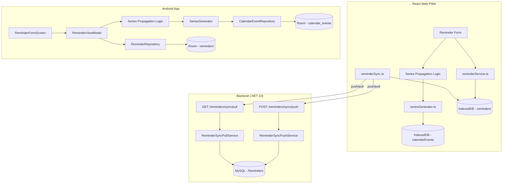

# Design Document — Reminder Series (gh38)

## Overview

This feature adds a `seriesFrequency` field to the Reminder entity and implements automatic calendar event generation based on repetition rules (weekly, monthly, yearly). When a user creates a calendar event from a reminder with a non-`never` frequency, the system generates additional occurrence events through the end of the current year. Frequency changes on reminders trigger a Propagation Modal that allows users to regenerate or keep existing occurrences.

The feature spans all three platforms (React Web PWA, Android App, .NET Backend) and must produce identical series dates given the same inputs. It is purely additive to the existing Reminder and CalendarEvent models.

### Key Design Decisions

1. **No special marker on series occurrences** — all generated events are standard CalendarEvent records. The system does not track parent-child relationships between source events and occurrences. This keeps the data model simple and avoids sync complications.

2. **Generation at event creation time only** — occurrences are generated when a user creates a calendar event or confirms propagation. Pulling a reminder with a frequency does NOT auto-generate events. This respects offline-first principles (each device generates its own events).

3. **Current year boundary** — generation stops at December 31 of the year containing the source event. This prevents unbounded generation and keeps the feature predictable.

4. **Series frequency lives on Reminder, not on CalendarEvent** — the frequency is a template property. Individual events are independent records once generated.

5. **Extended Propagation Modal** — the existing PropagationModal is extended (not replaced) to handle frequency changes separately from display-field changes.

---

## Architecture



### Component Interactions

1. **Reminder Form** adds a frequency selector. On save, updates the reminder record.
2. **Series Generator** is a pure function (no I/O) that computes occurrence dates from a start date, frequency, and year boundary.
3. **Series Propagation Logic** orchestrates: checks if events exist, shows modal, then either regenerates or no-ops.
4. **Calendar Event Service** persists generated occurrences as standard events.
5. **Sync Service** includes `seriesFrequency` in push/pull payloads with null → "never" defaulting.

---

## Components and Interfaces

### 1. Series Generator (Pure Function — Shared Logic)

The core algorithm lives as a pure, deterministic function on both platforms. No I/O, no side effects.

**React Web:** `src/features/reminders/services/seriesGenerator.ts`
**Android:** `com.codenized.planixor.domain.series.SeriesGenerator.kt`

```typescript
// React Web interface
interface SeriesGeneratorInput {
  startDay: string;           // YYYY-MM-DD
  frequency: 'weekly' | 'monthly' | 'yearly';
  yearBoundary: number;       // e.g., 2025
}

type GeneratedDate = string; // YYYY-MM-DD

function generateSeriesDates(input: SeriesGeneratorInput): GeneratedDate[];
```

```kotlin
// Android interface
object SeriesGenerator {
    fun generateDates(
        startDay: String,        // YYYY-MM-DD
        frequency: String,       // "weekly" | "monthly" | "yearly"
        yearBoundary: Int,       // e.g., 2025
    ): List<String>              // List of YYYY-MM-DD strings
}
```

**Algorithm:**
1. Parse `startDay` into year/month/day components
2. Initialize empty result list
3. Loop: compute next date based on frequency
   - **Weekly:** add 7 days to previous date
   - **Monthly:** same day-of-month in next month, clamp to last day if needed
   - **Yearly:** same month+day in next year, clamp Feb 29 → Feb 28 for non-leap
4. If computed date's year > `yearBoundary` → stop
5. If result count reaches 366 → stop (safety cap)
6. Add computed date to results
7. Return results (excludes the source date itself)

### 2. Series Occurrence Builder

Constructs complete CalendarEvent records from a source event and generated dates.

**React Web:** `src/features/reminders/services/seriesOccurrenceBuilder.ts`
**Android:** Part of `ReminderViewModel` / `CalendarEventRepository` extension

```typescript
interface BuildOccurrencesInput {
  sourceEvent: CalendarEvent;
  dates: string[];  // Generated dates from SeriesGenerator
}

function buildOccurrences(input: BuildOccurrencesInput): CalendarEvent[];
```

For each generated date:
- New UUID via `crypto.randomUUID()` / `UUID.randomUUID()`
- Copy: `eventType`, `eventTypeId`, `startTime`, `endTime`, `totalHours`, `notes`, `alertOffsets`
- Compute: `startDay` = generated date, `endDay` = generated date + daySpan of source
- Set: `modifiedAt` = now, `syncedAt` = null, `isDeleted` = false

### 3. Series Propagation Service

Orchestrates the propagation flow when frequency changes.

**React Web:** `src/features/reminders/services/seriesPropagation.ts`
**Android:** `com.codenized.planixor.ui.reminders.ReminderViewModel` (propagation methods)

```typescript
// Check if propagation is needed
async function checkSeriesPropagationNeeded(reminderId: string): Promise<number>;

// Propagate: never → repeating
async function propagateNeverToRepeating(
  reminderId: string,
  newFrequency: 'weekly' | 'monthly' | 'yearly'
): Promise<void>;

// Propagate: repeating → never
async function propagateRepeatingToNever(reminderId: string): Promise<void>;

// Propagate: repeating → different repeating
async function propagateRepeatingToRepeating(
  reminderId: string,
  newFrequency: 'weekly' | 'monthly' | 'yearly'
): Promise<void>;
```

### 4. Extended Propagation Modal

The existing `PropagationModal` component is extended with a new variant for series changes.

**New props (series variant):**
```typescript
interface SeriesPropagationModalProps {
  isOpen: boolean;
  reminderName: string;
  previousFrequency: string;
  newFrequency: string;
  affectedEventCount: number;
  onConfirm: () => void;
  onDecline: () => void;
}
```

### 5. Backend — Reminder Entity Extension

Add `SeriesFrequency` property to the existing Reminder entity:

```csharp
// In Reminder.cs
public string SeriesFrequency { get; private set; } = "never";
```

Update `CreateFromSync` and `ApplySync` to accept `seriesFrequency` parameter.

### 6. Backend — ReminderSyncRecord Extension

```csharp
// Updated ReminderSyncRecord.cs
public record ReminderSyncRecord(
    Guid Id,
    string Name,
    string Icon,
    string BackgroundColor,
    bool IsActive,
    string SeriesFrequency,  // NEW
    DateTime CreatedAt,
    DateTime ModifiedAt,
    bool IsDeleted);
```

---

## Data Models

### Reminder Model Changes

| Platform | Field | Type | Default | Notes |
|---|---|---|---|---|
| React Web (IndexedDB) | `seriesFrequency` | `string` | `'never'` | Added to `Reminder` interface |
| Android (Room) | `seriesFrequency` | `String` | `"never"` | Added to `ReminderEntity`, requires Room migration |
| Backend (MySQL) | `SeriesFrequency` | `varchar(10) NOT NULL` | `'never'` | EF Core migration with default value |

### React Web — Updated Reminder Interface

```typescript
export interface Reminder {
  id: string;
  name: string;
  icon: string;
  backgroundColor: string;
  isActive: boolean;
  seriesFrequency: 'never' | 'weekly' | 'monthly' | 'yearly';  // NEW
  createdAt: Date;
  modifiedAt: Date;
  syncedAt: Date | null;
  isDeleted: boolean;
}
```

### Android — Updated ReminderEntity

```kotlin
@Entity(tableName = "reminders")
data class ReminderEntity(
    @PrimaryKey val id: String,
    val name: String,
    val icon: String,
    val backgroundColor: String,
    val isActive: Boolean,
    val seriesFrequency: String = "never",  // NEW
    val createdAt: Long,
    val modifiedAt: Long,
    val syncedAt: Long?,
    val isDeleted: Boolean,
)
```

### Android — Updated Domain Model

```kotlin
data class Reminder(
    val id: String,
    val name: String,
    val icon: String,
    val backgroundColor: String,
    val isActive: Boolean,
    val seriesFrequency: String = "never",  // NEW
    val createdAt: Long,
    val modifiedAt: Long,
    val syncedAt: Long?,
    val isDeleted: Boolean,
)
```

### Backend — Updated Entity

```csharp
public sealed class Reminder
{
    // ... existing properties ...

    /// <summary>
    /// Gets the series frequency for automatic calendar event generation.
    /// Valid values: "never", "weekly", "monthly", "yearly".
    /// </summary>
    public string SeriesFrequency { get; private set; } = "never";
}
```

### Backend — EF Core Migration

```sql
ALTER TABLE `Reminders`
ADD COLUMN `SeriesFrequency` varchar(10) NOT NULL DEFAULT 'never';
```

### CalendarEvent — No Changes

The CalendarEvent model remains unchanged. Generated occurrences are standard CalendarEvent records with no additional fields.

---

## Series Generation Algorithm (Detailed)

### Weekly Generation

```
Input: startDay = "2025-03-15", frequency = "weekly", yearBoundary = 2025
Output: ["2025-03-22", "2025-03-29", "2025-04-05", ..., "2025-12-27"]

Algorithm:
  current = startDay
  loop:
    current = current + 7 days
    if current.year > yearBoundary → break
    if results.length >= 366 → break
    results.push(current)
```

### Monthly Generation

```
Input: startDay = "2025-01-31", frequency = "monthly", yearBoundary = 2025
Output: ["2025-02-28", "2025-03-31", "2025-04-30", "2025-05-31", ..., "2025-12-31"]

Algorithm:
  sourceDay = startDay.day (31)
  current = startDay
  loop:
    nextMonth = current.month + 1
    nextYear = current.year + (if nextMonth > 12 then 1 else 0)
    nextMonth = nextMonth > 12 ? 1 : nextMonth
    if nextYear > yearBoundary → break
    daysInMonth = getDaysInMonth(nextYear, nextMonth)
    clampedDay = min(sourceDay, daysInMonth)
    current = date(nextYear, nextMonth, clampedDay)
    if results.length >= 366 → break
    results.push(current)
```

### Yearly Generation

```
Input: startDay = "2025-02-28", frequency = "yearly", yearBoundary = 2025
Output: [] (no occurrence within same year)

Input: startDay = "2024-02-29", frequency = "yearly", yearBoundary = 2025
Output: ["2025-02-28"] (clamped from Feb 29 to Feb 28 in non-leap year)

Algorithm:
  sourceMonth = startDay.month
  sourceDay = startDay.day
  currentYear = startDay.year
  loop:
    currentYear = currentYear + 1
    if currentYear > yearBoundary → break
    if sourceMonth == 2 && sourceDay == 29 && !isLeapYear(currentYear):
      clampedDay = 28
    else:
      clampedDay = sourceDay
    current = date(currentYear, sourceMonth, clampedDay)
    if results.length >= 366 → break
    results.push(current)
```

### Day Span Computation

```
daySpan = dateDiff(sourceEvent.endDay, sourceEvent.startDay) // in days

For each occurrence:
  occurrence.startDay = generatedDate
  occurrence.endDay = generatedDate + daySpan days
```

Special case: if source has `endTime <= startTime` (midnight-crossing) and `endDay == startDay`:
- The `computeEndDayForShift` logic already handles this at creation time
- For reminder events: the source event's stored `endDay` already accounts for midnight crossing
- The daySpan from the stored source is always correct

---

## Propagation Logic

### When Propagation Modal Shows

The series-specific Propagation Modal displays when ALL of these are true:
1. The user is editing an existing reminder
2. The `seriesFrequency` field value changed (old ≠ new)
3. There exists at least one non-deleted CalendarEvent referencing this reminder with `startDay` in the current year

### Propagation: Repeating → Never (Confirm)

1. Find the earliest non-deleted event referencing the reminder in the current year → `sourceEvent`
2. Soft-delete all non-deleted events referencing the reminder where `startDay > sourceEvent.startDay` AND `startDay` is in the current year
3. Set each deleted event: `isDeleted = true`, `modifiedAt = now`, `syncedAt = null`

### Propagation: Never → Repeating (Confirm)

1. Find the earliest non-deleted event referencing the reminder in the current year → `sourceEvent`
2. Generate dates using new frequency from `sourceEvent.startDay` through year end
3. Get all existing non-deleted events for this reminder in the current year → `existingDates`
4. Filter generated dates: skip any date that matches an `existingDates.startDay`
5. Build occurrences from `sourceEvent` for remaining dates
6. Persist all new occurrences

### Propagation: Repeating → Different Repeating (Confirm)

1. Find the earliest non-deleted event referencing the reminder in the current year → `sourceEvent`
2. Soft-delete all non-deleted events where `startDay > sourceEvent.startDay` AND in current year
3. Generate new dates using new frequency from `sourceEvent.startDay` through year end
4. Build occurrences from `sourceEvent` for generated dates
5. Persist all new occurrences

### Propagation: Decline

1. Save reminder record changes only (updated `seriesFrequency`)
2. No calendar event modifications

### Combined Changes (Frequency + Display Fields)

When both `seriesFrequency` and display fields (name, icon, backgroundColor) change:
- Show only the series Propagation Modal (not the display-field modal)
- On confirm: generated occurrences use the updated display field values (since they reference the reminder by ID, they'll resolve updated display fields at read time anyway)
- On decline: save reminder only (no event changes)

---

## UI Changes

### Reminder Form — Frequency Selector

Both platforms add a segmented/radio control with 4 options:

| Value | English Label | Spanish Label |
|---|---|---|
| `never` | Never | Nunca |
| `weekly` | Every week | Cada semana |
| `monthly` | Every month | Cada mes |
| `yearly` | Every year | Cada año |

**Position:** After the color picker, before the save button.
**Default:** "Never" pre-selected for new reminders.
**Validation:** Exactly one must be selected (form cannot submit without selection).

### Reminder Card — Frequency Label

Displayed below the reminder name, only when frequency ≠ "never":
- Typography: body small (12px web / `labelSmall` Android)
- Color: `text-secondary` (`#6B7280` light / `#9CA3AF` dark)
- Hidden for `never` or legacy reminders (no space reserved)
- Inherits opacity of card when deactivated

### Series Propagation Modal

A new variant of the existing PropagationModal that shows:
- Title: "Frequency Changed" / "Frecuencia actualizada"
- Description mentioning previous and new frequency values
- Affected event count
- Confirm button: "Update events" / "Actualizar eventos"
- Decline button: "Keep existing" / "Mantener existentes"

---

## Sync Integration

### Push (Client → Backend)

The existing reminder push payload adds `seriesFrequency`:

```json
{
  "records": [
    {
      "id": "uuid",
      "name": "Take Medicine",
      "icon": "💊",
      "backgroundColor": "#10B981",
      "isActive": true,
      "seriesFrequency": "weekly",
      "createdAt": "2025-01-15T10:00:00",
      "modifiedAt": "2025-06-20T14:30:00",
      "isDeleted": false
    }
  ]
}
```

### Pull (Backend → Client)

Response includes `seriesFrequency`. If null/missing, clients default to `"never"`.

### Backend Validation

The push endpoint validates that `seriesFrequency` is one of: `never`, `weekly`, `monthly`, `yearly`. If invalid, the entire push batch is rejected with a validation error.

### Generated Occurrences

Series occurrences are standard CalendarEvent records. They sync via the existing `calendar-events/sync/push` and `calendar-events/sync/pull` endpoints with no special handling.

---

## Correctness Properties

*A property is a characteristic or behavior that should hold true across all valid executions of a system — essentially, a formal statement about what the system should do. Properties serve as the bridge between human-readable specifications and machine-verifiable correctness guarantees.*

### Property 1: Frequency Persistence Round-Trip

*For any* valid reminder with any `seriesFrequency` value (`never`, `weekly`, `monthly`, `yearly`), persisting the reminder to the store and reading it back should return the same `seriesFrequency` value. For any reminder with a null or missing `seriesFrequency`, reading it back should yield `"never"`.

**Validates: Requirements 1.3, 1.5**

### Property 2: Frequency Value Validation

*For any* string value, the system should accept it as a valid `seriesFrequency` if and only if it is one of `"never"`, `"weekly"`, `"monthly"`, `"yearly"`. Any other value should be rejected with a validation error.

**Validates: Requirements 1.4, 6.3**

### Property 3: Sync Serialization Round-Trip

*For any* reminder record, serializing it for sync push should produce a payload containing the `seriesFrequency` field. Deserializing a pull response with null or missing `seriesFrequency` should produce a record with `seriesFrequency` equal to `"never"`.

**Validates: Requirements 1.7, 6.1**

### Property 4: Series Date Generation Correctness

*For any* valid start date (YYYY-MM-DD) and non-`never` frequency, the series generator should produce dates where:
- All dates are strictly after the start date
- All dates are within the year boundary (year ≤ yearBoundary)
- Weekly: each consecutive date is exactly 7 days after the previous
- Monthly: each date has the same day-of-month as the source (or is clamped to the last day of the month when the source day exceeds days in that month)
- Yearly: each date has the same month and day as the source (or Feb 29 is clamped to Feb 28 in non-leap years)
- The function is deterministic (same inputs → same outputs)

**Validates: Requirements 2.1, 2.2, 2.3, 7.2**

### Property 5: Occurrence Field Preservation

*For any* source CalendarEvent and generated series dates, every built occurrence should have: a distinct UUID from the source and all other occurrences, the same `eventType`, `eventTypeId`, `startTime`, `endTime`, `totalHours`, `notes`, and `alertOffsets` as the source, `syncedAt` = null, and `isDeleted` = false.

**Validates: Requirements 2.5**

### Property 6: Day Span Preservation

*For any* source CalendarEvent with a day span of N days (endDay - startDay), every generated occurrence should have `endDay` = `startDay` + N days.

**Validates: Requirements 4.1, 4.2**

### Property 7: Maximum Occurrence Cap

*For any* start date and frequency combination, the series generator should produce at most 366 occurrence records.

**Validates: Requirements 2.8**

### Property 8: Propagation Modal Trigger

*For any* reminder edit that changes `seriesFrequency`, the series Propagation Modal should display if and only if there exists at least one non-deleted CalendarEvent referencing that reminder with `startDay` in the current year.

**Validates: Requirements 3.1, 3.7**

### Property 9: To-Never Propagation Soft-Deletes

*For any* set of non-deleted calendar events referencing a reminder in the current year, after confirming propagation with the new frequency set to `never`, all events with `startDay` strictly after the earliest event's `startDay` should be soft-deleted (isDeleted=true, modifiedAt updated, syncedAt=null), and the earliest event should remain unchanged.

**Validates: Requirements 3.3**

### Property 10: Never-to-Repeating Propagation Generates

*For any* reminder changing from `never` to a repeating frequency, with at least one existing event in the current year, after confirming propagation: new occurrences should be generated using the new frequency from the earliest event through year end, skipping any date that already has a non-deleted event for that reminder.

**Validates: Requirements 3.4**

### Property 11: Repeating-to-Repeating Propagation

*For any* reminder changing from one repeating frequency to another, after confirming propagation: all events after the earliest source should be soft-deleted, and new occurrences should be generated using the new frequency from the earliest source through year end.

**Validates: Requirements 3.5**

### Property 12: Decline Propagation No-Op

*For any* reminder edit where the user declines propagation, the set of calendar events in the store should remain unchanged (no creates, no updates, no deletes).

**Validates: Requirements 3.6**

---

## Error Handling

| Scenario | Handling |
|---|---|
| Invalid frequency value on form submit | Form validation prevents submission; show localized error |
| Invalid frequency in sync push | Backend rejects entire batch; client retries next cycle |
| Null frequency in sync pull | Default to `"never"` before local persistence |
| Generation exceeds 366 cap | Silently stop; no error shown (user still gets up to 366 events) |
| Legacy reminders (no field) | Treat as `"never"` everywhere; no migration prompt needed |
| Propagation with 0 events | Skip modal entirely; save reminder directly |
| Room migration failure (Android) | Standard Room destructive fallback per existing app config |
| IndexedDB schema (React Web) | Dexie is schema-less for non-indexed fields; no migration needed |

---

## Testing Strategy

### Dual Testing Approach

**Unit/Example Tests:**
- Form rendering: verify 4 options displayed, correct default
- Card rendering: frequency label shown/hidden based on value
- Propagation modal: correct information displayed
- Sync adapter: null handling, field inclusion
- Backend validation: rejection of invalid values
- Edge cases: Feb 29 clamping, month-end clamping, midnight-crossing day span

**Property-Based Tests (PBT):**
- **Library:** `fast-check` (React Web), custom property tests via JUnit (Android), NUnit (Backend)
- **Minimum iterations:** 100 per property
- **Tag format:** `Feature: gh38-reminder-series, Property {N}: {title}`

Properties 1–12 above are implemented as property-based tests. The series generator is a pure function ideal for PBT — it has a large input space (any date × any frequency) and universal invariants.

**Integration Tests:**
- End-to-end: create reminder with frequency → create calendar event → verify occurrences generated
- Sync round-trip: push reminder with frequency → pull on another client → verify frequency preserved
- Propagation: change frequency → confirm → verify correct events created/deleted

### Test Organization

| Platform | Location | Framework |
|---|---|---|
| React Web | `src/features/reminders/services/seriesGenerator.property.test.ts` | Vitest + fast-check |
| React Web | `src/features/reminders/services/seriesPropagation.property.test.ts` | Vitest + fast-check |
| Android | `app/src/test/.../domain/series/SeriesGeneratorTest.kt` | JUnit 4 |
| Backend | `UnitTest.Codenized.Planixor/Reminder/` | NUnit |

### Property Test Configuration

- Minimum 100 iterations per property test
- Each test tagged: `Feature: gh38-reminder-series, Property {N}: {title}`
- Generators produce random valid dates (2020–2030 range), random frequencies, random multi-day spans
- Edge case generators specifically target: month boundaries (28/29/30/31), leap years, year boundaries (Dec 31), midnight-crossing events
