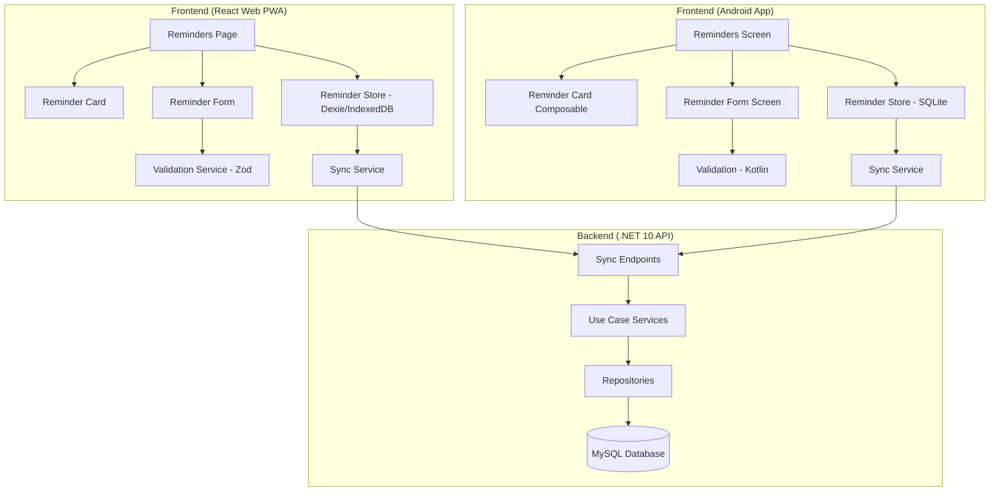

# Design Document: Reminder Management

## Overview

Reminder Management enables users to create, view, edit, deactivate, and delete reminders across both Planixor platforms (React Web PWA and Android App). Reminders are reusable templates that can later be assigned to calendar events of the "reminder" type.

The feature follows Planixor's offline-first architecture — all CRUD operations execute against local storage first (IndexedDB on web, SQLite on Android). For subscribed users, a bidirectional sync service pushes and pulls reminder records to/from the .NET 10 backend API using the established batch-based sync strategy (batches of 100, last-writer-wins conflict resolution).

The design mirrors the existing Shift feature's architecture and patterns, extending the system with a simpler entity (no time fields) while reusing the same sync infrastructure, validation patterns, and UI component conventions.

## Architecture



### Key Architectural Decisions

1. **Mirror Shift patterns**: The Reminder entity follows the same domain model, value object, and sync patterns as Shift to maintain codebase consistency.
2. **Simpler entity**: Unlike Shift, Reminder has no time-related fields (startTime, endTime, hoursWorked) — only name, icon, and backgroundColor.
3. **Shared sync infrastructure**: Reminder sync reuses the existing cross-cutting sync service with no feature-specific sync logic.
4. **Client-side validation**: Real-time field validation uses Zod (web) and Kotlin validation (Android) to provide immediate feedback.
5. **Soft-delete only**: Records are never physically removed on clients — `isDeleted=true` hides them from UI and propagates via sync.

### Sync Infrastructure Integration

The Reminder entity integrates with the existing cross-cutting sync service the same way Shift does — it implements the same sync adapter interface. The sync orchestrator processes all entity types (Shifts, Reminders) in sequence during each sync cycle. No feature-specific sync logic is required; the Reminder module only needs to provide its push/pull data source and conflict resolution delegates conforming to the shared sync contract.

## Components and Interfaces

### Frontend (React Web PWA)

| Component | Type | Responsibility |
|---|---|---|
| `features/reminders/reminders.tsx` | Container | Orchestrates Reminders_Page — loads data, manages state, navigation |
| `features/reminders/components/ReminderCard.tsx` | Presentational | Renders a single Reminder_Card with actions (edit, deactivate, delete) |
| `features/reminders/components/ReminderForm.tsx` | Presentational | Form UI for create/edit with fields: name, icon, backgroundColor |
| `features/reminders/components/ColorPicker.tsx` | Presentational | Predefined_Palette grid with theme-aware shade recommendations |
| `features/reminders/components/EmojiPicker.tsx` | Presentational | Wrapper around `emoji-picker-react` for icon selection |
| `features/reminders/hooks/useReminders.ts` | Hook | CRUD operations against IndexedDB via Dexie |
| `features/reminders/hooks/useReminderValidation.ts` | Hook | Zod-based real-time field validation |
| `features/reminders/services/reminderService.ts` | Service | API calls for reminder sync (push/pull) |
| `features/reminders/models.ts` | Types | Reminder interface and related types |
| `features/reminders/constants.ts` | Constants | Validation limits, palette definition |

### Frontend (Android App)

```
ui/reminders/
├── RemindersScreen.kt                # Main screen composable
├── RemindersViewModel.kt             # State management
├── RemindersUiState.kt               # Immutable UI state
├── ReminderFormScreen.kt             # Create/edit form screen
├── ReminderFormViewModel.kt          # Form state + validation
└── ReminderFormUiState.kt            # Form UI state

data/local/
├── ReminderEntity.kt                 # Room entity
├── ReminderDao.kt                    # Room DAO

domain/model/
└── Reminder.kt                       # Domain model

ui/components/
├── ReminderCard.kt                   # Reusable reminder card
├── ColorPickerDialog.kt              # Predefined_Palette selection dialog
├── EmojiPickerDialog.kt              # Category-based emoji grid dialog
└── ConfirmationDialog.kt             # Reusable confirmation dialog (shared with shifts)
```

| Component | Type | Responsibility |
|---|---|---|
| `RemindersScreen` | Screen Composable | Lists reminders, navigation to form |
| `RemindersViewModel` | ViewModel | State management for reminders screen |
| `RemindersUiState` | Data Class | Immutable UI state for reminders list |
| `ReminderFormScreen` | Screen Composable | Create/edit form |
| `ReminderFormViewModel` | ViewModel | Form state + validation |
| `ReminderFormUiState` | Data Class | Immutable form UI state |
| `ReminderCard` | Composable | Single reminder display with actions |
| `ColorPickerDialog` | Composable | Predefined_Palette selection dialog |
| `EmojiPickerDialog` | Composable | Category-based emoji grid dialog |
| `ReminderRepository` | Repository | SQLite CRUD via Room/DAO |

### Backend (.NET 10 API)

| Component | Layer | Responsibility |
|---|---|---|
| `Reminder` (Entity) | Core (Tier 1) | Rich domain entity with behavior |
| `ReminderName` (Value Object) | Core (Tier 1) | Self-validating name (1–50 chars) |
| `ReminderIcon` (Value Object) | Core (Tier 1) | Self-validating single emoji |
| `ReminderColor` (Value Object) | Core (Tier 1) | Validated color from Predefined_Palette |
| `ReminderSyncPushService` | UseCases (Tier 2) | Handles push sync from clients |
| `ReminderSyncPullService` | UseCases (Tier 2) | Handles pull sync requests |
| `ReminderSyncPushRequest/Response` | Dtos (Tier 2) | Push sync DTOs |
| `ReminderSyncPullRequest/Response` | Dtos (Tier 2) | Pull sync DTOs |
| `ReminderConfiguration` | DataContext (Tier 3) | EF Core entity configuration |
| `ReminderSyncPush/PullEndpoints` | Api (Tier 4) | Minimal API endpoint registration |

### Backend — Sync Endpoints

| Endpoint | Method | Purpose |
|---|---|---|
| `/api/v1/reminders/sync/push` | POST | Accept batch of reminder records from client |
| `/api/v1/reminders/sync/pull` | GET | Return reminders modified after `lastSyncedAt` |

### Interfaces

```csharp
// Backend — Use Case Service interface (auto-registered via NuGet)
public interface IReminderSyncPushCommands
{
    Task UpsertBatch(IReadOnlyCollection<Reminder> reminders);
}

public interface IReminderSyncPullQueries
{
    Task<IReadOnlyCollection<Reminder>> GetModifiedAfter(Guid userId, DateTime since, int pageSize, string? cursor);
}
```

### React Web — Reminder Service Interface

```typescript
interface ReminderService {
  getAll(): Promise<Reminder[]>;
  getById(id: string): Promise<Reminder | undefined>;
  create(reminder: Omit<Reminder, 'id' | 'modifiedAt' | 'syncedAt' | 'isDeleted' | 'isActive' | 'createdAt'>): Promise<Reminder>;
  update(id: string, data: Partial<Pick<Reminder, 'name' | 'icon' | 'backgroundColor'>>): Promise<void>;
  softDelete(id: string): Promise<void>;
  deactivate(id: string): Promise<void>;
  activate(id: string): Promise<void>;
  getUnsynced(): Promise<Reminder[]>;
  applyRemoteRecords(records: Reminder[]): Promise<void>;
}
```

### Android — Reminder DAO Interface

```kotlin
@Dao
interface ReminderDao {
    @Query("SELECT * FROM reminders WHERE isDeleted = 0 ORDER BY createdAt ASC")
    fun getAllActive(): Flow<List<ReminderEntity>>

    @Query("SELECT * FROM reminders WHERE id = :id")
    suspend fun getById(id: String): ReminderEntity?

    @Insert(onConflict = OnConflictStrategy.REPLACE)
    suspend fun upsert(reminder: ReminderEntity)

    @Query("UPDATE reminders SET isDeleted = 1, modifiedAt = :now, syncedAt = NULL WHERE id = :id")
    suspend fun softDelete(id: String, now: Long)

    @Query("UPDATE reminders SET isActive = :isActive, modifiedAt = :now WHERE id = :id")
    suspend fun setActive(id: String, isActive: Boolean, now: Long)
}
```

## Data Models

### Reminder Entity (all platforms)

| Field | Type | Constraints | Description |
|---|---|---|---|
| `id` | UUID (string) | Required, client-generated | Globally unique identifier |
| `name` | string | 1–50 chars after trim, required | User-facing reminder name |
| `icon` | string | Exactly 1 emoji, required | Visual emoji icon |
| `backgroundColor` | string | Hex from Predefined_Palette, required | Card background color |
| `isActive` | boolean | Default: true | Active/deactivated toggle |
| `createdAt` | DateTime (UTC) | Set on creation, immutable | Original creation timestamp |
| `modifiedAt` | DateTime (UTC) | Updated on every local write | Change tracking for sync |
| `syncedAt` | DateTime (UTC) or null | Set on successful sync | Null = never synced |
| `isDeleted` | boolean | Default: false | Soft-delete flag |

### Frontend Model (TypeScript — React Web)

```typescript
export interface Reminder {
  /** Client-generated UUID — globally unique primary identifier */
  id: string;
  /** User-facing reminder name (1–50 characters after trim) */
  name: string;
  /** Single emoji representing the reminder */
  icon: string;
  /** Hex color from the predefined palette */
  backgroundColor: string;
  /** Whether the reminder is currently active or deactivated */
  isActive: boolean;
  /** Original creation timestamp (UTC) */
  createdAt: Date;
  /** Last local modification timestamp (UTC) — updated on every local write */
  modifiedAt: Date;
  /** Timestamp of last successful sync (UTC). null = never synced */
  syncedAt: Date | null;
  /** Soft-delete flag — records are never physically removed until confirmed synced */
  isDeleted: boolean;
}
```

### Backend Entity (C# — .NET 10)

```csharp
public sealed class Reminder
{
    public Guid Id { get; private set; }
    public Guid UserId { get; private set; }
    public ReminderName Name { get; private set; } = null!;
    public ReminderIcon Icon { get; private set; } = null!;
    public ReminderColor BackgroundColor { get; private set; } = null!;
    public bool IsActive { get; private set; }
    public DateTime CreatedAt { get; private set; }
    public DateTime ModifiedAt { get; private set; }
    public DateTime? SyncedAt { get; private set; }
    public bool IsDeleted { get; private set; }
}
```

### IndexedDB Schema (Dexie — Web)

```typescript
// Version 3 upgrade in db.ts
this.version(3).stores({
  calendarEvents: 'id, startAt, endAt, eventType, isDeleted',
  shifts: 'id, createdAt, isDeleted, isActive',
  reminders: 'id, createdAt, isDeleted, isActive',
});
```

### MySQL Table Schema

```sql
CREATE TABLE Reminders (
    Id CHAR(36) NOT NULL PRIMARY KEY,
    UserId CHAR(36) NOT NULL,
    Name VARCHAR(50) NOT NULL,
    Icon VARCHAR(10) NOT NULL,
    BackgroundColor VARCHAR(7) NOT NULL,
    IsActive TINYINT(1) NOT NULL DEFAULT 1,
    CreatedAt DATETIME(6) NOT NULL,
    ModifiedAt DATETIME(6) NOT NULL,
    SyncedAt DATETIME(6) NULL,
    IsDeleted TINYINT(1) NOT NULL DEFAULT 0,
    INDEX IX_Reminders_UserId (UserId),
    INDEX IX_Reminders_UserId_ModifiedAt (UserId, ModifiedAt)
);
```

### Sync DTOs

```csharp
// Push request — batch of reminder records from client
public record ReminderSyncPushRequest(
    IReadOnlyCollection<ReminderSyncRecord> Records);

public record ReminderSyncRecord(
    Guid Id,
    string Name,
    string Icon,
    string BackgroundColor,
    bool IsActive,
    DateTime CreatedAt,
    DateTime ModifiedAt,
    bool IsDeleted);

// Pull request — paginated fetch of modified records
public record ReminderSyncPullRequest(
    DateTime Since,
    int PageSize,
    string? Cursor);

// Pull response
public record ReminderSyncPullResponse(
    IReadOnlyCollection<ReminderSyncRecord> Records,
    string? NextCursor);
```

> **Pagination note:** A `NextCursor` value of `null` in the pull response indicates that no more pages remain. The client sends subsequent pull requests (passing the received cursor) while `NextCursor` is non-null.

### Predefined_Palette (shared constant)

9 families × 5 shades = 45 colors total:

| Family | Shades |
|---|---|
| Red | `#FCA5A5`, `#F87171`, `#EF4444`, `#DC2626`, `#991B1B` |
| Orange | `#FDBA74`, `#FB923C`, `#F97316`, `#EA580C`, `#9A3412` |
| Amber | `#FCD34D`, `#FBBF24`, `#F59E0B`, `#D97706`, `#92400E` |
| Green | `#6EE7B7`, `#34D399`, `#10B981`, `#059669`, `#065F46` |
| Teal | `#67E8F9`, `#22D3EE`, `#0B86D4`, `#0E7490`, `#155E75` |
| Blue | `#93C5FD`, `#60A5FA`, `#2563EB`, `#1D4ED8`, `#1E3A8A` |
| Purple | `#C4B5FD`, `#A78BFA`, `#7C3AED`, `#6D28D9`, `#4C1D95` |
| Pink | `#F9A8D4`, `#F472B6`, `#EC4899`, `#DB2777`, `#9D174D` |
| Gray | `#D1D5DB`, `#9CA3AF`, `#6B7280`, `#4B5563`, `#1F2937` |


## Correctness Properties

*A property is a characteristic or behavior that should hold true across all valid executions of a system — essentially, a formal statement about what the system should do. Properties serve as the bridge between human-readable specifications and machine-verifiable correctness guarantees.*

### Property 1: Creation produces a valid reminder record

*For any* valid reminder input (name with 1–50 trimmed characters, exactly one emoji icon, and a hex color from the Predefined_Palette), creating a reminder SHALL produce a record where: `id` is a valid UUID, `isActive` is true, `modifiedAt` is a recent UTC timestamp, `syncedAt` is null, `isDeleted` is false, and all user-provided field values are preserved exactly as submitted.

**Validates: Requirements 1.1, 4.7**

### Property 2: Form submission requires all fields valid

*For any* combination of field states (name, icon, backgroundColor), the Reminder_Form SHALL allow submission if and only if the name is 1–50 characters after trim, the icon is exactly one emoji, and the backgroundColor is a member of the Predefined_Palette. If any field fails validation, submission SHALL be prevented.

**Validates: Requirements 1.2, 3.4**

### Property 3: Display excludes deleted and orders by creation date

*For any* collection of reminder records with varying `isDeleted` and `createdAt` values, the Reminders_Page SHALL display only records where `isDeleted` is false, and the displayed records SHALL be ordered by `createdAt` ascending (oldest first).

**Validates: Requirements 2.1, 5.4**

### Property 4: Card renders all required data elements

*For any* reminder record, the rendered Reminder_Card SHALL contain the `backgroundColor` as a color indicator, the `icon`, and the `name` from that record.

**Validates: Requirements 2.2**

### Property 5: Edit pre-populates all current field values

*For any* existing reminder record, navigating to the edit Reminder_Form SHALL produce a form where every field (name, icon, backgroundColor) matches the current values of that reminder.

**Validates: Requirements 3.1**

### Property 6: Edit preserves system fields and updates modifiedAt

*For any* existing reminder and any valid set of new field values, submitting an edit SHALL preserve the original `id`, `syncedAt`, and `isDeleted` values unchanged, SHALL update `modifiedAt` to a recent UTC timestamp, and SHALL set user fields (name, icon, backgroundColor) to the new submitted values.

**Validates: Requirements 3.2**

### Property 7: Toggle active state updates isActive and modifiedAt

*For any* reminder record, toggling the active state SHALL flip `isActive` (true→false or false→true) and SHALL update `modifiedAt` to a recent UTC timestamp, while preserving all other fields unchanged.

**Validates: Requirements 4.2, 4.5**

### Property 8: Inactive reminder card displays deactivated visual indicators

*For any* reminder with `isActive` set to false, the rendered Reminder_Card SHALL include a localized "Deactivated" badge and apply reduced opacity styling.

**Validates: Requirements 4.4**

### Property 9: Inactive reminders excluded from calendar event selection

*For any* collection of reminders with varying `isActive` states, the list of selectable reminders for calendar event creation SHALL contain only reminders where `isActive` is true.

**Validates: Requirements 4.6**

### Property 10: Soft-delete sets correct field values

*For any* reminder record (regardless of current `syncedAt` value), performing a soft-delete SHALL set `isDeleted` to true, update `modifiedAt` to a recent UTC timestamp, and set `syncedAt` to null.

**Validates: Requirements 5.2**

### Property 11: Push sync selects correct records and respects batch size

*For any* collection of reminder records with varying `modifiedAt` and `syncedAt` values, the push sync SHALL select exactly those records where `syncedAt` is null or `modifiedAt` is greater than `syncedAt`, SHALL send them in batches of no more than 100 records per request, and SHALL update `syncedAt` to the current UTC timestamp on each successfully pushed record.

**Validates: Requirements 6.1**

### Property 12: Conflict resolution applies last-writer-wins with remote tie-break

*For any* pair of local and remote reminder records with the same `id`, conflict resolution SHALL retain the record with the later `modifiedAt` timestamp. If both `modifiedAt` timestamps are identical, the remote record SHALL be retained.

**Validates: Requirements 6.3**

### Property 13: Pull merge inserts new and overwrites unmodified locals

*For any* set of pulled remote records and a local Reminder_Store: if a pulled record does not exist locally, it SHALL be inserted with `syncedAt` set to the current UTC timestamp; if it exists locally and the local `modifiedAt` is equal to or less than its `syncedAt`, the local record SHALL be overwritten with the remote record's values and `syncedAt` set to the current UTC timestamp.

**Validates: Requirements 6.5**

### Property 14: Name validation accepts trimmed strings of 1–50 characters

*For any* string input, name validation SHALL accept the input if and only if the trimmed value has a length between 1 and 50 characters (inclusive). Empty strings, whitespace-only strings, and strings exceeding 50 characters after trim SHALL be rejected.

**Validates: Requirements 7.1**

### Property 15: Icon validation accepts exactly one emoji

*For any* string input, icon validation SHALL accept the input if and only if it contains exactly one emoji character. Strings with zero emojis, multiple emojis, or non-emoji characters SHALL be rejected.

**Validates: Requirements 7.2**

### Property 16: Color validation accepts only Predefined_Palette members

*For any* string input, color validation SHALL accept the input if and only if it is a member of the 45-color Predefined_Palette set. Any hex string not in the palette SHALL be rejected.

**Validates: Requirements 7.3**

## Error Handling

### Frontend Error Handling

| Scenario | Behavior |
|---|---|
| IndexedDB/SQLite write failure on create | Display localized error, retain form values, remain on form |
| IndexedDB/SQLite read failure on list | Replace loading indicator with localized error message |
| Edit submitted for deleted reminder | Reject silently, navigate back to Reminders_Page |
| Sync push network failure | Retain records in unsynced state, retry on next cycle |
| Sync pull network failure | Preserve lastSyncedAt, retry from same point on next cycle |
| Invalid form field input | Display inline validation error adjacent to field within 1s |

### Backend Error Handling

| Scenario | HTTP Status | Response |
|---|---|---|
| Unauthenticated request | 401 | UnauthorizedException |
| User without active subscription attempts sync | 403 | ForbiddenException |
| Invalid sync push payload (validation failure) | 400 | ValidationException with field failures |
| Batch exceeds 100 records | 400 | BadRequestException — "Batch size exceeds maximum of 100" |
| Record not found on pull | — | Empty collection (not an error) |
| Database write failure | 500 | DatabaseException |
| Malformed request body | 400 | BadRequestException |

### Validation Error Messages (i18n keys)

| Key | English | Spanish |
|---|---|---|
| `reminder.validation.name.required` | Name is required | El nombre es obligatorio |
| `reminder.validation.name.maxLength` | Name must be 50 characters or less | El nombre debe tener 50 caracteres o menos |
| `reminder.validation.icon.required` | Select an icon | Selecciona un ícono |
| `reminder.validation.color.required` | Select a background color | Selecciona un color de fondo |
| `reminder.error.loadFailed` | Could not load reminders | No se pudieron cargar los recordatorios |
| `reminder.error.saveFailed` | Could not save the reminder | No se pudo guardar el recordatorio |
| `reminder.empty` | No reminders available | No hay recordatorios disponibles |
| `reminder.deactivate.confirm` | Deactivate this reminder? | ¿Desactivar este recordatorio? |
| `reminder.delete.confirm` | This action is permanent and cannot be undone. Delete '{name}'? | Esta acción es permanente y no se puede deshacer. ¿Eliminar '{name}'? |
| `reminder.badge.deactivated` | Deactivated | Desactivado |

### Error Recovery Strategy

- **Offline resilience**: All CRUD operations succeed locally regardless of network state. Sync failures are invisible to the user — unsynced records accumulate and push on next successful cycle.
- **Retry semantics**: Sync retries are automatic (every 5 minutes, on app open, on connectivity restore). No exponential backoff for this MVP — simple retry on next trigger.
- **Data integrity**: Soft-delete with `syncedAt=null` on delete ensures deletion always propagates on next sync. No orphaned records possible.

## Testing Strategy

### Dual Testing Approach

This feature uses both **property-based tests** and **example-based unit tests** for comprehensive coverage.

- **Property-based tests** verify universal properties (Properties 1–16) across many generated inputs
- **Unit tests** verify specific examples, edge cases, UI rendering, and integration points
- **Integration tests** verify sync flow end-to-end, theme/language switching

### Property-Based Testing Configuration

- **Library (React Web):** `fast-check` with Vitest
- **Library (Android):** `Kotest` property testing module with JUnit 4
- **Library (Backend):** `FsCheck` with NUnit
- **Minimum iterations:** 100 per property test
- **Tag format:** `Feature: gh5-reminder-management, Property {N}: {title}`

### Test Distribution by Layer

#### Backend (.NET)

| Layer | Test Type | What |
|---|---|---|
| Value Objects | Property (FsCheck) | Properties 14, 15, 16 (validation) |
| Entity | Property (FsCheck) | Properties 1, 6, 7, 10 (create, update, toggle, delete) |
| Sync Service | Property (FsCheck) | Properties 11, 12, 13 (push filter, conflict, pull merge) |
| Request Validators | Unit (NUnit) | Edge cases for sync DTOs |
| Endpoints | Unit (NUnit) | Auth/subscription guards |

#### React Web (TypeScript)

| Layer | Test Type | What |
|---|---|---|
| reminderService.ts | Property (fast-check) | Properties 1, 3, 6, 7, 10 (CRUD against Dexie) |
| validation (Zod) | Property (fast-check) | Properties 2, 14, 15, 16 (validation schema) |
| sync filter | Property (fast-check) | Properties 11, 12, 13 (sync logic) |
| ReminderCard.tsx | Unit (Vitest + RTL) | Rendering, accessibility |
| ReminderForm.tsx | Unit (Vitest + RTL) | Form interactions, error display |
| reminders.tsx (page) | Unit (Vitest + RTL) | Loading/empty/error states |

#### Android (Kotlin)

| Layer | Test Type | What |
|---|---|---|
| ReminderRepository | Property (Kotest) | Properties 1, 3, 6, 7, 10 |
| Validation logic | Property (Kotest) | Properties 2, 14, 15, 16 |
| Sync logic | Property (Kotest) | Properties 11, 12, 13 |
| RemindersViewModel | Unit (JUnit) | State transitions, error handling |
| ReminderFormViewModel | Unit (JUnit) | Form state, validation trigger timing |
| Composables | Unit (Compose Testing) | Rendering, accessibility |

### Example-Based Tests (Key Scenarios)

| Scenario | Platform | Validates |
|---|---|---|
| Create reminder with duplicate name succeeds | All | Req 1.5 |
| Cancel creation discards data | Web, Android | Req 1.3 |
| Empty state shows "No reminders" message | Web, Android | Req 2.3 |
| Loading indicator during data retrieval | Web, Android | Req 2.5 |
| Edit pre-populates form with existing values | Web, Android | Req 3.1 |
| Edit of deleted reminder navigates back | Web, Android | Req 3.5 |
| Deactivation shows confirmation modal | Web, Android | Req 4.1 |
| Cancel deactivation makes no changes | Web, Android | Req 4.3 |
| Deactivated card shows reduced opacity + badge | Web, Android | Req 4.4 |
| Reactivation does NOT show confirmation modal | Web, Android | Req 4.5 |
| Delete shows permanent warning with name | Web, Android | Req 5.1 |
| Dismiss delete modal makes no changes | Web, Android | Req 5.3 |
| Validation error clears on correction | Web, Android | Req 7.5 |

### Integration Tests

- Sync push/pull end-to-end with mocked API (web)
- Sync endpoint authorization checks (backend)
- Full CRUD lifecycle through API endpoints (backend)

### E2E Tests (Playwright — Web)

- Create reminder happy path
- Edit reminder happy path
- Deactivate and reactivate reminder
- Delete reminder with confirmation
- Validation error display and correction
