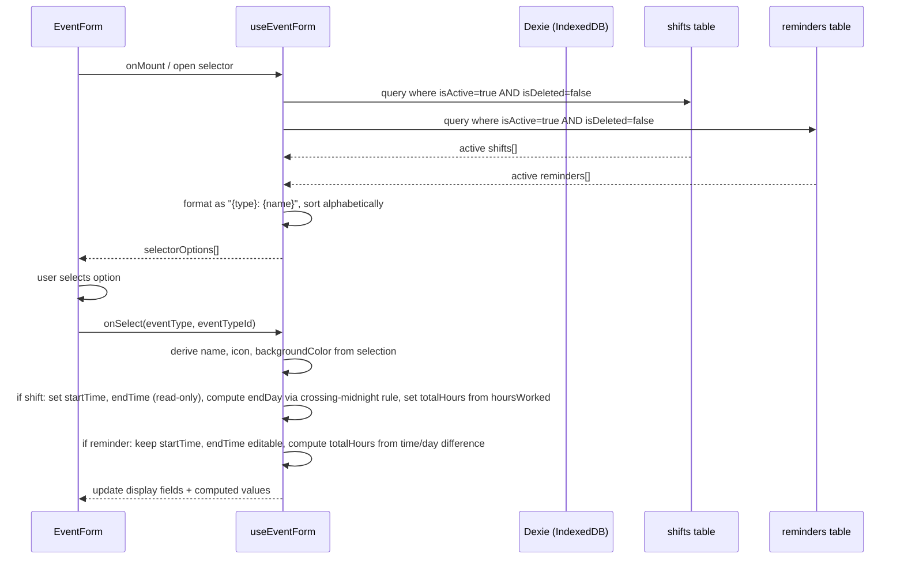

# Design Document: Calendar Event Management

## Overview

Calendar Event Management enables users to create, view, modify, and delete calendar events across the React Web PWA and Android App platforms. Events reference previously created shifts or reminders, span one or more days with a time range, are displayed in four view modes (Day, Week, Month, Year), and follow the offline-first architecture where all CRUD operations happen locally first with optional synchronization for subscribed users.

The system enforces a one-shift-per-day constraint, supports soft deletes with change tracking, computes `totalHours` based on event type rules, and derives display metadata (name, icon, background color) from referenced shift/reminder definitions at read time.

### Key Design Decisions

1. **Offline-first with local-derived display fields**: The `CalendarEvent` record stores only reference IDs (`eventTypeId`). Display fields (name, icon, backgroundColor) are derived at read time by joining with the local Shift/Reminder store. This ensures events always reflect the latest definition state.

2. **Shared validation logic**: Day range validation, time validation (reminders only), crossing-midnight auto-computation (shifts), and the one-shift-per-day constraint are implemented as pure functions shared between form validation and the persistence layer (dual validation), ensuring consistency across create/edit flows and guaranteeing data integrity even if the UI validation is bypassed.

3. **Unified filtering**: A single filtering function handles the `isDeleted` and date-range intersection checks across all four view modes. Events now span `[startDay, endDay]`, so a view for a date range shows events whose `[startDay, endDay]` intersects with the view range.

4. **Sync conflict resolution via LWW**: Last-writer-wins based on `modifiedAt` with remote-preference for ties, consistent with the global sync strategy.

5. **Referential protection**: Shifts and reminders referenced by non-deleted calendar events can only be soft-deleted — physical deletion is prohibited. This guarantees `eventTypeId` always resolves to an existing record under normal operation.

## Architecture

The feature spans all three sub-projects following the established monorepo structure:

```mermaid
graph TD
    subgraph "Frontend - React Web (PWA)"
        RW_Page[CalendarPage]
        RW_Feature[calendar-events feature module]
        RW_Form[EventForm component]
        RW_Views[View components: Day/Week/Month/Year]
        RW_Hooks[useCalendarEvents / useEventForm hooks]
        RW_Service[calendarEventService]
        RW_Store[Dexie IndexedDB - calendarEvents table]
        RW_Sync[SyncService - calendar events module]
    end

    subgraph "Frontend - Android App"
        AN_Page[CalendarScreen]
        AN_Feature[calendar feature module]
        AN_Form[EventFormScreen]
        AN_Views[View composables: Day/Week/Month/Year]
        AN_VM[CalendarViewModel]
        AN_Repo[CalendarEventRepository]
        AN_Store[SQLite - calendar_events table]
        AN_Sync[SyncService - calendar events module]
    end

    subgraph "Backend - .NET 10 API"
        API_Endpoints[CalendarEvent Sync Endpoints]
        API_Service[CalendarEventSyncPush/PullService]
        API_Repo[CalendarEventRepository]
        API_DB[(MySQL - CalendarEvents table)]
    end

    RW_Sync -->|push/pull| API_Endpoints
    AN_Sync -->|push/pull| API_Endpoints
    API_Service --> API_Repo --> API_DB
```



### Architectural Layers

| Layer | React Web | Android | Backend |
|---|---|---|---|
| Presentation | CalendarPage + View components | CalendarScreen + Composables | Minimal API Endpoints |
| Business Logic | Hooks + pure validation functions | ViewModel + validation utils | Use Case Services |
| Data Access | Dexie tables + calendarEventService | Room DAO / SQLite repository | EF Core Repositories |
| Sync | SyncService module (cross-cutting) | SyncService module (WorkManager) | Sync push/pull endpoints |

## Components and Interfaces

### React Web (PWA) — Feature Module Structure

```
frontend/react-web/src/features/calendar-events/
├── calendar-events.tsx                    # Container: orchestrates calendar page
├── components/
│   ├── EventForm.tsx                      # Create/Edit form component
│   ├── EventCard.tsx                      # Event card (shared across views)
│   ├── EventDetailPage.tsx                # Detail/edit page
│   ├── EventTypeSelector.tsx              # Dropdown for shift/reminder selection
│   ├── ConfirmationModal.tsx              # Delete confirmation dialog
│   ├── DayView.tsx                        # Day timeline view
│   ├── WeekView.tsx                       # Week grid view
│   ├── MonthView.tsx                      # Month grid view
│   ├── YearView.tsx                       # Year overview
│   ├── ViewSelector.tsx                   # Day/Week/Month/Year tabs
│   ├── DayNavigator.tsx                   # ← / → day navigation
│   ├── MonthNavigator.tsx                 # ← / → month navigation
│   ├── YearNavigator.tsx                  # ← / → year navigation
│   ├── WeekNavigator.tsx                  # ← / → week navigation
│   └── CurrentTimeIndicator.tsx           # Blue line with circle marker
├── hooks/
│   ├── useCalendarEvents.ts              # CRUD operations + query logic
│   ├── useEventForm.ts                   # Form state (startDay, endDay, startTime, endTime, totalHours), validation, submission
│   ├── useEventFiltering.ts             # Filter events by date range intersection + isDeleted
│   ├── useViewNavigation.ts             # View mode state + navigation logic
│   └── useDayPreSelection.ts            # Pre-select startDay/endDay based on view context
├── services/
│   └── calendarEventService.ts           # Dexie CRUD operations
├── models.ts                             # CalendarEvent interface + types
├── validation.ts                         # Pure validation functions
├── utils.ts                              # Pure utility functions (formatDuration, etc.)
└── constants.ts                          # View modes, time constants
```

**Migration note:** The existing components in `src/components/calendar/` (DayView, WeekView, MonthView, YearView, ViewSelector, DateNavigator) are migrated into `src/features/calendar-events/components/`. These components are used exclusively by the calendar feature and follow the project's Scope Rule. The `src/components/calendar/` directory is removed after migration. `CalendarDashboard.tsx` page is updated to import from the feature module.

### Key Interfaces

```typescript
// models.ts — CalendarEvent (updated from current schema)
interface CalendarEvent {
  id: string;                    // Client-generated UUID
  eventType: 'shift' | 'reminder';
  eventTypeId: string;           // UUID referencing Shift or Reminder
  startDay: string;              // ISO date string (YYYY-MM-DD)
  endDay: string;                // ISO date string (YYYY-MM-DD)
  startTime: number;             // Minutes from midnight (0-1439)
  endTime: number;               // Minutes from midnight (0-1439)
  totalHours: number;            // Total duration in minutes (read-only, computed)
  notes: string | null;          // Optional, max 250 chars
  modifiedAt: Date;              // UTC timestamp
  syncedAt: Date | null;         // null = never synced
  isDeleted: boolean;            // Soft-delete flag
}

// Derived at read time (not persisted)
interface CalendarEventDisplay extends CalendarEvent {
  name: string;                  // From referenced shift/reminder
  icon: string;                  // Emoji from referenced shift/reminder
  backgroundColor: string;       // Hex color from referenced shift/reminder
}
```

```typescript
// validation.ts — Pure validation functions (shared between form and store)
interface ValidationResult {
  isValid: boolean;
  errors: Record<string, string>;
}

function validateDayRange(startDay: string, endDay: string): boolean;
// Returns true if endDay >= startDay

function validateTimeForReminder(startDay: string, endDay: string, startTime: number, endTime: number): boolean;
// Returns true if: endDay > startDay (any times valid) OR (endDay == startDay AND endTime > startTime)
// For shifts: always returns true (no time validation needed)

function computeTotalHours(eventType: 'shift' | 'reminder', startDay: string, endDay: string, startTime: number, endTime: number, shiftHoursWorked?: number): number;
// For shifts: returns shiftHoursWorked
// For reminders: calculates based on day difference + time difference

function computeEndDayForShift(startDay: string, startTime: number, endTime: number): string;
// If endTime < startTime (crossing midnight): returns startDay + 1
// Otherwise: returns startDay

function validateRequiredFields(event: Partial<CalendarEvent>): ValidationResult;
function validateNotes(notes: string | null): boolean;
// Returns true if notes is null or notes.length <= 250
function checkOneShiftPerDay(
  startDay: string,
  eventType: 'shift' | 'reminder',
  existingEvents: CalendarEvent[],
  excludeEventId?: string
): boolean;

// utils.ts — Pure utility functions for display formatting
function formatDuration(startTime: number, endTime: number): string;
// Returns "Xh Ym" format, e.g., formatDuration(480, 570) → "1h 30m"

// services/calendarEventService.ts
interface CalendarEventService {
  create(event: Omit<CalendarEvent, 'id' | 'modifiedAt' | 'syncedAt' | 'isDeleted' | 'totalHours'>): Promise<CalendarEvent>;
  update(id: string, changes: Partial<CalendarEvent>): Promise<CalendarEvent>;
  softDelete(id: string): Promise<void>;
  getByDateRange(startDate: string, endDate: string): Promise<CalendarEventDisplay[]>;
  getByDate(day: string): Promise<CalendarEventDisplay[]>;
  getShiftsForDate(startDay: string, excludeId?: string): Promise<CalendarEvent[]>;
}
```

**Dual validation enforcement:** Both the UI layer (hooks) and the persistence layer (service) validate constraints independently. The `calendarEventService.create()` and `calendarEventService.update()` methods internally call `checkOneShiftPerDay()`, `validateDayRange()`, `validateTimeForReminder()`, and `computeTotalHours()` before persisting. For shift events, `computeEndDayForShift()` is called to auto-set `endDay` when crossing midnight. If validation fails at the service level, the promise rejects with a descriptive error. This guarantees data integrity even if the UI validation is bypassed (e.g., race conditions, direct service calls from sync).

**Calendar navigation state:** The existing `calendarStore.ts` (Zustand) is extended with granular navigation methods (`navigateDay`, `navigateWeek`, `navigateMonth`, `navigateYear`) to support the per-view-mode navigator controls. The existing `navigateForward`/`navigateBackward` methods are deprecated and replaced by the specific methods. The new navigator components in the feature module consume the store directly.

**View state persistence:** The existing `calendarStore.ts` already persists the `activeView` field via Zustand's `persist` middleware (localStorage key: `planixor_calendar`). This behavior is preserved — no additional persistence mechanism is needed for Requirement 12.5. The store continues to restore the last-used View_Mode on subsequent page loads.

**useEventForm hook state model:** The form hook manages the following state fields: `startDay` (date), `endDay` (date), `startTime` (minutes), `endTime` (minutes), `totalHours` (computed, read-only), `eventType`, `eventTypeId`, and `notes` (max 250 chars). When a shift is selected: `startTime` and `endTime` are auto-populated from the shift definition as read-only fields; `totalHours` is set from the shift's `hoursWorked`; `endDay` is auto-computed via `computeEndDayForShift()` if crossing midnight. When a reminder is selected: `startTime` and `endTime` are editable via timepickers; `totalHours` is recalculated on every change via `computeTotalHours()`.

### Android App — Module Structure

```
frontend/android-app/app/src/main/java/com/codenized/planixor/
├── feature/calendar/
│   ├── data/
│   │   ├── CalendarEventEntity.kt         # Room entity
│   │   ├── CalendarEventDao.kt            # Room DAO
│   │   └── CalendarEventRepository.kt     # Repository implementation
│   ├── domain/
│   │   ├── CalendarEvent.kt               # Domain model
│   │   ├── CalendarEventValidation.kt     # Pure validation functions
│   │   └── CalendarEventDisplay.kt        # Display model with derived fields
│   ├── presentation/
│   │   ├── CalendarScreen.kt              # Main calendar composable
│   │   ├── CalendarViewModel.kt           # ViewModel with state management
│   │   ├── EventFormScreen.kt             # Create/Edit form
│   │   ├── EventDetailScreen.kt           # Detail view
│   │   ├── components/
│   │   │   ├── DayView.kt
│   │   │   ├── WeekView.kt
│   │   │   ├── MonthView.kt
│   │   │   ├── YearView.kt
│   │   │   ├── EventCard.kt
│   │   │   ├── EventTypeSelector.kt
│   │   │   └── ViewSelector.kt
│   │   └── navigation/
│   │       └── CalendarNavigation.kt
│   └── sync/
│       └── CalendarEventSyncAdapter.kt    # Sync module adapter
```

### Backend API — Endpoint Structure

```
backend/src/Codenized.Planixor.Api/Endpoints/CalendarEvent/
├── CalendarEventRegisterEndpoints.cs
├── CalendarEventSyncPushEndpoints.cs
└── CalendarEventSyncPullEndpoints.cs

backend/src/Codenized.Planixor.Core/Entities/
└── CalendarEvent.cs

backend/src/Codenized.Planixor.Dtos/CalendarEvent/
├── SyncPush/
│   ├── CalendarEventSyncPushRequest.cs
│   └── CalendarEventSyncPushResponse.cs
└── SyncPull/
    ├── CalendarEventSyncPullRequest.cs
    └── CalendarEventSyncPullResponse.cs

backend/src/Codenized.Planixor.UseCases/CalendarEvent/
├── SyncPush/
│   └── CalendarEventSyncPushService.cs
└── SyncPull/
    └── CalendarEventSyncPullService.cs
```

## Data Models

### CalendarEvent — Local Store (IndexedDB / SQLite)

| Field | Type | Required | Description |
|---|---|---|---|
| `id` | UUID (string) | Yes | Client-generated, primary key |
| `eventType` | string (`"shift"` \| `"reminder"`) | Yes | Type discriminator |
| `eventTypeId` | UUID (string) | Yes | References Shift.id or Reminder.id |
| `startDay` | string (ISO date `YYYY-MM-DD`) | Yes | Start calendar date of the event |
| `endDay` | string (ISO date `YYYY-MM-DD`) | Yes | End calendar date of the event (>= startDay) |
| `startTime` | number (0–1439) | Yes | Minutes from midnight |
| `endTime` | number (0–1439) | Yes | Minutes from midnight |
| `totalHours` | number | Yes | Total duration in minutes (read-only, computed) |
| `notes` | string \| null | No | Optional, max 250 characters |
| `modifiedAt` | DateTime (UTC) | Yes | Updated on every local write |
| `syncedAt` | DateTime (UTC) \| null | No | Last successful sync timestamp |
| `isDeleted` | boolean | Yes | Soft-delete flag, defaults to false |

**Time validation rules:**
- For reminder events where `endDay == startDay`: `endTime` must be strictly greater than `startTime`
- For reminder events where `endDay > startDay`: any combination of `startTime` and `endTime` (0–1439) is valid
- For shift events: no time validation is applied (times are read-only from the shift definition)

**Indexes (IndexedDB via Dexie):**
- Primary: `id`
- Compound: `[startDay+eventType+isDeleted]` (for one-shift-per-day queries)
- Single: `isDeleted`, `eventType`, `startDay`, `endDay`

**Derived Display Fields (not persisted, resolved at read time):**

| Field | Source | Description |
|---|---|---|
| `name` | `Shift.name` or `Reminder.name` | Display name (max 50 chars) |
| `icon` | `Shift.icon` or `Reminder.icon` | Single emoji |
| `backgroundColor` | `Shift.backgroundColor` or `Reminder.backgroundColor` | Hex color from palette |

**Referential protection rule:** A shift or reminder referenced by any non-deleted calendar event (`isDeleted = false`) can only be soft-deleted — physical deletion is prohibited. This ensures `eventTypeId` always resolves to an existing record in the local store under normal operation.

**Orphaned reference fallback (corruption safety net):** If the referenced shift or reminder does not exist in the local store due to data corruption, the derived display fields default to: `name` = localized "Unknown" string, `icon` = "❓", `backgroundColor` = `"transparent"`. The event remains visible and editable — the user can reassign it to a valid type via the Event_Type_Selector.

### CalendarEvent — Backend (MySQL)

| Column | Type | Constraints |
|---|---|---|
| `Id` | `CHAR(36)` | PK |
| `UserId` | `CHAR(36)` | FK → Users, NOT NULL, indexed |
| `EventType` | `VARCHAR(10)` | NOT NULL, CHECK ('shift', 'reminder') |
| `EventTypeId` | `CHAR(36)` | NOT NULL |
| `StartDay` | `DATE` | NOT NULL, indexed |
| `EndDay` | `DATE` | NOT NULL |
| `StartTime` | `INT` | NOT NULL, CHECK (0–1439) |
| `EndTime` | `INT` | NOT NULL, CHECK (0–1439) |
| `TotalHours` | `INT` | NOT NULL |
| `Notes` | `VARCHAR(250)` | NULL |
| `ModifiedAt` | `DATETIME(6)` | NOT NULL |
| `SyncedAt` | `DATETIME(6)` | NULL |
| `IsDeleted` | `TINYINT(1)` | NOT NULL, DEFAULT 0 |

**Note:** The backend includes `UserId` for ownership enforcement. Clients do not store or send this field — it is derived from the authenticated session on the API side. The `EndDay >= StartDay` constraint and time validation for reminders are enforced at the application level (not as DB CHECK constraints) for consistency with client-side rules.

### Dexie Schema Migration

The existing `db.ts` will be updated to version 5:

```typescript
this.version(5).stores({
  calendarEvents: 'id, startDay, endDay, [startDay+eventType+isDeleted], eventType, isDeleted, modifiedAt',
  shifts: 'id, createdAt, isDeleted, isActive',
  reminders: 'id, createdAt, isDeleted, isActive',
}).upgrade(tx => {
  // v4 calendarEvents schema used `day` field (single day). v5 introduces `startDay`, `endDay`, `totalHours`.
  // No user data exists in any deployed environment. Clear and start fresh.
  return tx.table('calendarEvents').clear();
});
```

**Migration strategy:** The v4 `calendarEvents` schema used a single `day` field. Version 5 replaces it with `startDay` and `endDay` to support multi-day events, adds `totalHours` as a computed field, and removes the `EndTime > StartTime` constraint (now only applies to reminders where `endDay == startDay`). No user-created calendar events exist in any deployed environment. Version 5 clears the `calendarEvents` table via `upgrade()` and applies the new schema. No data transformation is required.

### Sync Data Transfer Objects

```typescript
// Push request body (client → API)
interface CalendarEventSyncPushRequest {
  records: CalendarEventSyncRecord[];
}

interface CalendarEventSyncRecord {
  id: string;
  eventType: 'shift' | 'reminder';
  eventTypeId: string;
  startDay: string;           // ISO date (YYYY-MM-DD)
  endDay: string;             // ISO date (YYYY-MM-DD)
  startTime: number;
  endTime: number;
  totalHours: number;         // Total duration in minutes
  notes: string | null;
  modifiedAt: string;         // ISO DateTime UTC
  isDeleted: boolean;
}

// Push response (API → client)
interface CalendarEventSyncPushResponse {
  acknowledgedIds: string[];
  rejectedIds: { id: string; reason: string }[];
}

// Pull request query params (client → API)
// GET /api/v1/calendar-events/pull?lastSyncedAt={ISO}&cursor={string}

// Pull response (API → client)
interface CalendarEventSyncPullResponse {
  records: CalendarEventSyncRecord[];
  cursor: string | null;     // null = no more pages
}
```

**Note on `syncedAt`:** This field is never transmitted in sync DTOs. It is a client-local timestamp set when the client successfully processes a sync operation: on push acknowledgment (per record) and on pull insertion/overwrite. Each device manages its own `syncedAt` values independently.

### Event Type Selector Data Flow



## Correctness Properties

*A property is a characteristic or behavior that should hold true across all valid executions of a system — essentially, a formal statement about what the system should do. Properties serve as the bridge between human-readable specifications and machine-verifiable correctness guarantees.*

### Property 1: Write operations update change tracking fields

*For any* calendar event and any local write operation (create, update, or soft-delete), the resulting record SHALL have `modifiedAt` set to the current UTC timestamp and `syncedAt` set to null, regardless of previous field values.

**Validates: Requirements 1.1, 7.2, 8.2, 11.4**

### Property 2: Time validation for reminders rejects invalid intervals on same day

*For any* reminder event where `endDay` equals `startDay`, if `endTime` is less than or equal to `startTime`, the validation function SHALL return invalid and the event SHALL NOT be persisted. Conversely, for any reminder where `endDay` equals `startDay` and `endTime` is strictly greater than `startTime`, the time validation SHALL pass. For any reminder where `endDay` is greater than `startDay`, any combination of `startTime` and `endTime` values (0–1439) SHALL be valid. For shift events, no time validation SHALL be applied regardless of `startDay`/`endDay`/`startTime`/`endTime` values.

**Validates: Requirements 1.10, 11.6**

### Property 3: One-shift-per-day constraint enforcement

*For any* set of existing non-deleted calendar events and any new or modified event with `eventType` "shift", the store SHALL allow persistence only if no other non-deleted event with `eventType` "shift" exists with the same `startDay` (excluding the event being modified, if applicable). Events with `eventType` "reminder" SHALL always be allowed regardless of existing events.

**Validates: Requirements 2.1, 2.3, 2.4, 2.5**

### Property 4: Event type selector filters to active non-deleted items

*For any* collection of shifts and reminders with arbitrary `isActive` and `isDeleted` states, the Event_Type_Selector SHALL display only those items where `isActive` is true AND `isDeleted` is false, formatted as `"{type}: {name}"` and ordered alphabetically by display name.

**Validates: Requirements 1.5, 13.4**

### Property 5: Display fields derived from referenced entity at read time

*For any* calendar event referencing a shift or reminder by `eventTypeId`, the derived display fields (name, icon, backgroundColor) SHALL equal the corresponding fields of the currently stored shift or reminder definition, reflecting any updates made to the definition after event creation.

**Validates: Requirements 1.4, 11.2**

### Property 6: View filtering excludes deleted events and out-of-range dates

*For any* view mode (Day, Week, Month, Year) and any set of calendar events with mixed `isDeleted` values, `startDay` values, and `endDay` values, the Calendar_Page SHALL display only events where `isDeleted` is false AND the event's date range `[startDay, endDay]` intersects with the currently displayed date range. A day view for date D shows events where `startDay <= D <= endDay`. A week view shows events where their `[startDay, endDay]` range intersects with the Mon-Sun week range.

**Validates: Requirements 3.4, 4.4, 5.4, 6.4, 8.4**

### Property 7: Event card rendering contains all required display data

*For any* calendar event with derived display fields, the rendered Event_Card SHALL contain the event's name, icon, backgroundColor, startTime, endTime, and computed duration. For Day view, it SHALL additionally show notes when present.

**Validates: Requirements 3.2, 4.2**

### Property 8: Month view container rendering rules

*For any* day with a set of calendar events, the Month view container SHALL: use the shift's backgroundColor as the container background if a shift event exists (transparent otherwise); display emojis of all events ordered shifts-first then reminders; and cap at 5 emojis with an overflow count indicator when more than 5 events exist.

**Validates: Requirements 5.2**

### Property 9: Year view day indicators follow event type rules

*For any* day in the year view, the day SHALL display: no indicators if no events exist; a colored circle using the shift's backgroundColor if a shift exists; the first reminder's icon emoji if only reminders exist; both circle and emoji if both shift and reminders exist.

**Validates: Requirements 6.2**

### Property 10: Sync push batches records correctly

*For any* number of pending records (where `syncedAt` is null or `modifiedAt` > `syncedAt`), the Sync_Service SHALL partition them into sequential batches of at most 100 records each, sending all batches until no pending records remain.

**Validates: Requirements 10.1**

### Property 11: Sync conflict resolution uses last-writer-wins with remote preference on ties

*For any* pair of a local record and a remote record with the same `id`, if both have local modifications (`modifiedAt` > `syncedAt`), the record with the later `modifiedAt` SHALL be retained. If both `modifiedAt` values are identical, the remote record SHALL be preferred.

**Validates: Requirements 10.3, 10.6**

### Property 12: Sync pull inserts new remote records

*For any* pulled remote record whose `id` does not exist in the local Event_Store, the Sync_Service SHALL insert the record into the local store with `syncedAt` set to the current UTC timestamp.

**Validates: Requirements 10.5, 10.8**

### Property 13: Sync pull overwrites unmodified local records

*For any* pulled remote record whose `id` exists locally and the local record has `modifiedAt` less than or equal to `syncedAt` (no local modifications since last sync), the Sync_Service SHALL overwrite the local record with the remote record and set `syncedAt` to the current UTC timestamp.

**Validates: Requirements 10.7**

### Property 14: Required fields validation rejects incomplete events

*For any* combination of event fields where at least one required field (eventType, eventTypeId, startDay, endDay, startTime, endTime) is missing or empty, the validation function SHALL return invalid and prevent persistence.

**Validates: Requirements 1.2, 1.12**

### Property 15: Referential protection prevents physical deletion of referenced entities

*For any* shift or reminder that is referenced by at least one non-deleted calendar event (`isDeleted = false`), any attempt to physically delete that shift or reminder SHALL be rejected. Soft-deletion (`isDeleted = true`) SHALL be permitted regardless of references.

**Validates: Requirements 11.2**

### Property 16: Day range validation rejects invalid intervals

*For any* pair of `startDay` and `endDay` values where `endDay` is earlier than `startDay`, the validation function SHALL return invalid and the event SHALL NOT be persisted. Conversely, for any pair where `endDay` is greater than or equal to `startDay`, the day range validation SHALL pass.

**Validates: Requirements 1.11, 11.5**

### Property 17: Crossing midnight shift auto-sets endDay

*For any* calendar event with `eventType` "shift" where the referenced shift definition has `endTime` less than `startTime` (crossing midnight), the system SHALL automatically set `endDay` to `startDay + 1` day. For shift events where `endTime` is greater than or equal to `startTime`, `endDay` SHALL remain equal to `startDay`.

**Validates: Requirements 1.6, 11.7**

## Error Handling

### Client-Side (React Web & Android)

| Scenario | Handling Strategy |
|---|---|
| Form validation failure (required fields, time range, day range, one-shift-per-day) | Prevent submission, display inline error messages per field, clear errors on correction |
| Local storage write failure (IndexedDB/SQLite) | Display toast/snackbar error message, preserve form state, allow retry |
| Deletion storage failure | Dismiss modal, display error message, guarantee event record unchanged |
| Referenced shift/reminder deleted/deactivated | Allow viewing/editing the event, show current reference in selector, permit type change |
| Sync push failure (network error) | Silently retry on next sync cycle; no user-facing error for background sync |
| Sync pull conflict | Apply LWW resolution automatically; no user prompt |
| Sync push rejection (foreign record) | Discard rejected record, continue processing remaining records |
| Navigation failure (Year view → Detail) | Display error message, allow manual retry |

### Backend API

| Scenario | HTTP Status | Response |
|---|---|---|
| Missing required fields in push payload | 400 Bad Request | Validation error with field-level details |
| Unauthenticated request | 401 Unauthorized | Standard auth error |
| No active subscription | 403 Forbidden | Subscription required message |
| Push record not owned by user | 403 Forbidden | Authorization error (no data exposed) |
| Pull request for other user's data | 403 Forbidden | Authorization error |
| Internal server error | 500 Internal Server Error | Generic error (no stack traces) |

### Validation Error Display Rules

1. Errors appear inline below the affected field (not as a toast/alert)
2. Errors clear immediately when the user corrects the field value
3. All validation errors display simultaneously (not one at a time)
4. The one-shift-per-day error displays as a form-level message (not field-level)
5. Error messages are localized (ES/EN) using the i18n system

## Testing Strategy

### Dual Testing Approach

This feature uses both unit/example-based tests and property-based tests for comprehensive coverage.

**Property-Based Testing (PBT):**
- Library: `fast-check` (already installed in react-web)
- Minimum 100 iterations per property test
- Each property test references its design document property
- Tag format: `Feature: gh8-calendar-event-management, Property {N}: {title}`
- Focus: validation logic, filtering logic, sync resolution logic, rendering rules

**Unit / Example-Based Testing:**
- Library: Vitest + React Testing Library (react-web), NUnit + NSubstitute (backend)
- Focus: UI interactions, navigation flows, specific edge cases, integration points
- Coverage: specific scenarios not suited for PBT (cancel flows, navigation, modal behavior)

### Test Scope by Layer

| Layer | Test Type | What to Test |
|---|---|---|
| `validation.ts` (pure functions) | Property tests | Day range, time for reminders, required fields, one-shift-per-day, notes length, crossing midnight, totalHours computation |
| `calendarEventService.ts` | Property tests + Unit tests | CRUD operations with change tracking, filtering, constraint enforcement |
| `useEventForm.ts` hook | Unit tests | Form state management, submission flow, error clearing |
| `EventForm.tsx` component | Integration tests (RTL) | User interaction flows, validation display |
| `DayView/WeekView/MonthView/YearView` | Property tests + Unit tests | Rendering rules, card content, filtering |
| `SyncService` (calendar module) | Property tests | Batching, conflict resolution, insert/overwrite logic |
| Backend `CalendarEventSyncPushService` | Unit tests (NUnit) | Push validation, ownership check, upsert logic |
| Backend `CalendarEventSyncPullService` | Unit tests (NUnit) | Pull filtering, pagination, ownership enforcement |

### Property Test Configuration

```typescript
// Example property test structure
import { fc } from 'fast-check';

describe('Calendar Event Validation Properties', () => {
  it('Property 2: Time validation for reminders rejects invalid intervals on same day', () => {
    // Feature: gh8-calendar-event-management, Property 2: Time validation for reminders
    fc.assert(
      fc.property(
        fc.constantFrom('shift', 'reminder') as fc.Arbitrary<'shift' | 'reminder'>,
        fc.date(), // startDay
        fc.date(), // endDay
        fc.integer({ min: 0, max: 1439 }), // startTime
        fc.integer({ min: 0, max: 1439 }), // endTime
        (eventType, startDayDate, endDayDate, startTime, endTime) => {
          const startDay = startDayDate.toISOString().slice(0, 10);
          const endDay = endDayDate.toISOString().slice(0, 10);
          if (eventType === 'shift') {
            // Shifts always pass time validation
            return validateTimeForReminder(startDay, endDay, startTime, endTime) === true || eventType === 'shift';
          }
          // Reminders: only validate when endDay == startDay
          const result = validateTimeForReminder(startDay, endDay, startTime, endTime);
          if (endDay > startDay) return result === true;
          if (endDay === startDay) return result === (endTime > startTime);
          return true; // endDay < startDay handled by validateDayRange
        }
      ),
      { numRuns: 100 }
    );
  });

  it('Property 16: Day range validation rejects invalid intervals', () => {
    // Feature: gh8-calendar-event-management, Property 16: Day range validation
    fc.assert(
      fc.property(
        fc.date(), // startDay
        fc.date(), // endDay
        (startDayDate, endDayDate) => {
          const startDay = startDayDate.toISOString().slice(0, 10);
          const endDay = endDayDate.toISOString().slice(0, 10);
          const result = validateDayRange(startDay, endDay);
          return result === (endDay >= startDay);
        }
      ),
      { numRuns: 100 }
    );
  });
});
```

### Coverage Targets

| Metric | Target |
|---|---|
| Pure validation functions | 100% (property tests) |
| Service layer (CRUD) | ≥ 90% |
| UI components | ≥ 80% (integration tests) |
| Sync logic | ≥ 90% (property tests) |
| Backend services | ≥ 80% (unit tests) |

### Test Naming Convention

- Property tests: `Property {N}: {property title}`
- Unit tests: `should {expected behavior} when {condition}`
- Integration tests: `should {user-facing behavior} when {user action}`

