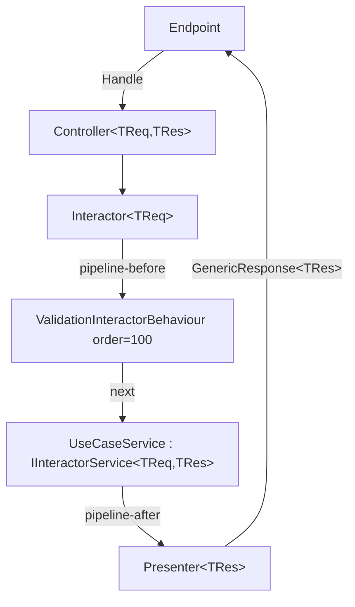

# API — Architecture & Pipeline

## Clean Architecture — 5 tiers

Dependencies always point **inward**. Nothing in an inner ring can know anything from an outer ring.

```
Tier 1 — Enterprise Business Rules (Core)
  Entities, Enums, ValueObjects, Settings, Service abstractions

Tier 2 — Application Business Rules (Dtos, Events, UseCases)
  Use case services, Request/Response DTOs, Validators, Domain events

Tier 3 — Interface Adapters (Services, DataContext, Repositories, Persistence IoC)
  Concrete service implementations, EF Core contexts, Repository implementations

Tier 4 — Frameworks and Drivers (IoC, Api)
  Minimal API endpoints, DI wiring, Docker

Tier 5 — Tests (UnitTest)
  NUnit + NSubstitute unit tests
```

## Execution pipeline (canonical — TIER 0)

**Never create per-use-case Controller, Interactor, or Presenter classes.** These are generic and come from the NuGet.

```
Endpoint
  ↓
Controller<TRequest, TResponse>          ← generic, from NuGet
  ↓
Interactor<TRequest>                     ← generic, from NuGet (ONE type param)
  ↓ pipeline-before (order < 100)
[ custom behaviours, order < 100 ]
  ↓
ValidationInteractorBehaviour            ← order 100, innermost, from NuGet
  ↓ next()
{Entity}{Action}Service                  ← DEVELOPER CODE — implements IInteractorService<TReq,TRes>
  ↓ pipeline-after
Presenter<TResponse>                     ← generic, from NuGet
  ↓
GenericResponse<TResponse>
  ↓
Endpoint → Client
```



## TIER 0 — Non-negotiable rules

1. **Dependency Rule**: source code dependencies always point inward. Outer rings cannot be known by inner rings.
2. **No per-use-case Controller/Interactor/Presenter** — `Controller<TReq,TRes>`, `Interactor<TReq>`, `Presenter<TRes>` are generic and come from NuGet.
3. **No manual `RunValidator()`** — `ValidationInteractorBehaviour` (order 100) resolves `IValidator<TRequest>` from DI and throws `ValidationException(code, title, detail, failures)` — **4 params** — before `Service.Run()`.
4. **No `Common` project** — `IInteractorBehaviour<,>`, `InteractorBehaviourOrderAttribute`, predefined behaviours come from `{Organization}.CleanArchitecture.Abstractions`.
5. **Behaviour order inverted**: lower N = outermost. `ValidationInteractorBehaviour` is order 100 (innermost). Custom behaviours use N < 100.
6. **DI markers**: implement own interface first, marker last: `public sealed class Svc : ISvc, IAppServiceScoped`.
7. **`AddCleanArchitecture(friendlyName)`** scans assemblies by name prefix and auto-registers everything — no manual use case wiring.
8. **Event emission**: inject `IAsyncDomainEventHub<TEvent>` and call `await this.eventHub.RiseEventAsync(event)`. Never inject `IDomainEventHandler<TEvent>` directly from a service.
9. **`ValidationException` always has 4 params**: `(code, title, detail, failures)` — `detail` is mandatory.
10. **`Interactor<TReq>` has ONE type param** — `TResponse` is resolved dynamically. Legacy `Interactor<TReq,TRes>` with two params is obsolete.

## Use case service contract

```csharp
public sealed class {Entity}{Action}Service : IInteractorService<{Entity}{Action}Request, {Entity}{Action}Response>
{
    // Constructor injection: repositories, event hubs, other services
    // DO NOT inject IValidator<> — handled automatically by the pipeline
    // DO NOT call RunValidator() — handled automatically by the pipeline

    public async Task<{Entity}{Action}Response> Run({Entity}{Action}Request request)
    {
        // request is already validated — write pure business logic here
    }
}
```

## Endpoint registration pattern

```csharp
group.MapEndpoint<GenericResponse<{Entity}{Action}Response>>(
    HttpMethods.Post,
    "/",
    async ({Entity}{Action}Request request, IController<{Entity}{Action}Request, {Entity}{Action}Response> controller) =>
    {
        var result = await controller.Handle(request);
        return Results.Ok(result);
    },
    "{Action}{Entity}",
    "{Action} {entity-lowercase} endpoint",
    "This endpoint is for {action-lowercase} a {entity-lowercase}.");
```

## HTTP method / action mapping

| Action | HTTP method | URL pattern |
|---|---|---|
| Add / Create | POST | `/` |
| Update / Edit | PUT | `/{id}` |
| Delete / Remove | DELETE | `/{id}` |
| Get / Retrieve | GET | `/{id}` |
| GetList / Search | GET | `/` + query params |

## Exception types

All from `{Organization}.CleanArchitecture.Abstractions.Exceptions`:

- `ValidationException(code, title, detail, failures)` — 400
- `BadRequestException` — 400
- `NotFoundException` — 404
- `ConflictException` — 409
- `UnauthorizedException` — 401
- `ForbiddenException` — 403
- `DatabaseException` — 500
- `GeneralException` — 500
- `ServiceException` — 500
- `MethodNotAllowedException` — 405
