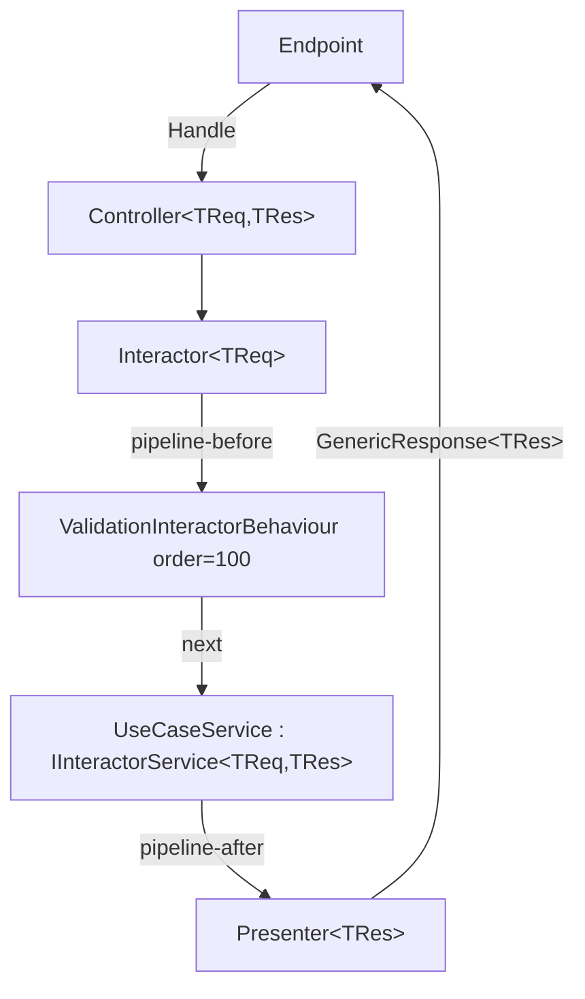

# API — Architecture & Pipeline

## Clean Architecture — 5 tiers

Dependencies always point **inward**. Nothing in an inner ring can know anything from an outer ring.

```
Tier 1 — Enterprise Business Rules (Core) — DDD Tactical Patterns
  Rich Entities (behavior + state), Value Objects (self-validating records),
  Enums, Domain Events, Domain Exceptions, Settings

Tier 2 — Application Business Rules (Dtos, Events, UseCases)
  Use case services, Request/Response DTOs, Request Validators (input validation),
  Domain event handlers

Tier 3 — Interface Adapters (Services, DataContext, Repositories, Persistence IoC)
  Concrete service implementations, EF Core contexts, Repository implementations,
  Value Object EF Core configurations (Owned Types)

Tier 4 — Frameworks and Drivers (IoC, Api)
  Minimal API endpoints, DI wiring, Docker

Tier 5 — Tests (UnitTest)
  NUnit + NSubstitute unit tests — TDD mandatory for domain and application logic
```

## Execution pipeline (canonical — TIER 0)

**Never create per-use-case Controller, Interactor, or Presenter classes.** These are generic and come from the NuGet.

```
Endpoint
  ↓
Controller<TRequest, TResponse>          ← generic, from NuGet
  ↓
Interactor<TRequest>                     ← generic, from NuGet (ONE type param)
  ↓ pipeline-before (order < 100)
[ custom behaviours, order < 100 ]
  ↓
ValidationInteractorBehaviour            ← order 100, innermost, from NuGet
  ↓ next()
{Entity}{Action}Service                  ← DEVELOPER CODE — implements IInteractorService<TReq,TRes>
  ↓ pipeline-after
Presenter<TResponse>                     ← generic, from NuGet
  ↓
GenericResponse<TResponse>
  ↓
Endpoint → Client
```



## TIER 0 — Non-negotiable rules

1. **Dependency Rule**: source code dependencies always point inward. Outer rings cannot be known by inner rings.
2. **No per-use-case Controller/Interactor/Presenter** — `Controller<TReq,TRes>`, `Interactor<TReq>`, `Presenter<TRes>` are generic and come from NuGet.
3. **No manual `RunValidator()`** — `ValidationInteractorBehaviour` (order 100) resolves `IValidator<TRequest>` from DI and throws `ValidationException(code, title, detail, failures)` — **4 params** — before `Service.Run()`.
4. **No `Common` project** — `IInteractorBehaviour<,>`, `InteractorBehaviourOrderAttribute`, predefined behaviours come from `{Organization}.CleanArchitecture.Abstractions`.
5. **Behaviour order inverted**: lower N = outermost. `ValidationInteractorBehaviour` is order 100 (innermost). Custom behaviours use N < 100.
6. **DI markers**: implement own interface first, marker last: `public sealed class Svc : ISvc, IAppServiceScoped`.
7. **`AddCleanArchitecture(friendlyName)`** scans assemblies by name prefix and auto-registers everything — no manual use case wiring.
8. **Event emission from entities**: entities raise domain events via `this.AddDomainEvent(event)`. The Use Case Service dispatches pending events after persistence.
9. **`ValidationException` always has 4 params**: `(code, title, detail, failures)` — `detail` is mandatory.
10. **`Interactor<TReq>` has ONE type param** — `TResponse` is resolved dynamically. Legacy `Interactor<TReq,TRes>` with two params is obsolete.
11. **Rich Domain Model**: entities contain business logic as pure methods. No anemic entities (data-only classes with logic in services).
12. **Value Objects are `record` types**: immutable, self-validating, with private constructors and static `Create()` factory methods.
13. **TDD mandatory**: all domain logic (entities, value objects) and application logic (services) must be developed following Red-Green-Refactor.
14. **Dual validation**: Request Validators (Tier 2) validate input format/presence; Value Objects (Tier 1) enforce domain invariants. Both levels coexist.

## Use case service contract

```csharp
public sealed class {Entity}{Action}Service : IInteractorService<{Entity}{Action}Request, {Entity}{Action}Response>
{
    // Constructor injection: repositories, event hubs, other services
    // DO NOT inject IValidator<> — handled automatically by the pipeline
    // DO NOT call RunValidator() — handled automatically by the pipeline

    public async Task<{Entity}{Action}Response> Run({Entity}{Action}Request request)
    {
        // request is already validated — write pure business logic here
    }
}
```

## Endpoint registration pattern

```csharp
group.MapEndpoint<GenericResponse<{Entity}{Action}Response>>(
    HttpMethods.Post,
    "/",
    async ({Entity}{Action}Request request, IController<{Entity}{Action}Request, {Entity}{Action}Response> controller) =>
    {
        var result = await controller.Handle(request);
        return Results.Ok(result);
    },
    "{Action}{Entity}",
    "{Action} {entity-lowercase} endpoint",
    "This endpoint is for {action-lowercase} a {entity-lowercase}.");
```

## HTTP method / action mapping

| Action | HTTP method | URL pattern |
|---|---|---|
| Add / Create | POST | `/` |
| Update / Edit | PUT | `/{id}` |
| Delete / Remove | DELETE | `/{id}` |
| Get / Retrieve | GET | `/{id}` |
| GetList / Search | GET | `/` + query params |

## Exception types

All from `{Organization}.CleanArchitecture.Abstractions.Exceptions`:

- `ValidationException(code, title, detail, failures)` — 400
- `BadRequestException` — 400
- `NotFoundException` — 404
- `ConflictException` — 409
- `UnauthorizedException` — 401
- `ForbiddenException` — 403
- `DatabaseException` — 500
- `GeneralException` — 500
- `ServiceException` — 500
- `MethodNotAllowedException` — 405

---

## Domain-Driven Design — Tactical Patterns (Tier 1)

### Value Objects

Immutable `record` types that encapsulate a concept with self-validation. Equality is by value (structural).

```csharp
/// <summary>
/// Represents a validated email address.
/// </summary>
public record Email
{
    /// <summary>
    /// Gets the email address value.
    /// </summary>
    public string Value { get; }

    private Email(string value)
    {
        this.Value = value;
    }

    /// <summary>
    /// Creates a validated email address.
    /// </summary>
    /// <param name="value">The email address string.</param>
    /// <returns>A validated <see cref="Email"/> instance.</returns>
    public static Email Create(string value)
    {
        if (string.IsNullOrWhiteSpace(value))
        {
            throw new DomainException("Email cannot be empty.");
        }

        if (!value.Contains('@') || !value.Contains('.'))
        {
            throw new DomainException("Email format is invalid.");
        }

        return new Email(value.Trim().ToLowerInvariant());
    }
}
```

**Value Object rules:**
- Always a `record` (value equality for free)
- Private constructor — only creatable via static `Create()` factory method
- `Create()` validates domain invariants and throws `DomainException` on violation
- Immutable — no setters, no mutation methods
- No dependencies — pure logic only
- Can contain behavior (formatting, comparison, arithmetic) as pure methods
- One Value Object per file in `Core/ValueObjects/`

### Rich Entities

Entities have identity, state (using Value Objects for properties), and behavior (pure domain methods).

```csharp
/// <summary>
/// Represents a work shift in the scheduling system.
/// </summary>
public class Shift
{
    private readonly List<IDomainEvent> domainEvents = new();

    /// <summary>
    /// Gets the shift identifier.
    /// </summary>
    public Guid Id { get; private set; }

    /// <summary>
    /// Gets the employee email.
    /// </summary>
    public Email EmployeeEmail { get; private set; }

    /// <summary>
    /// Gets the shift duration.
    /// </summary>
    public ShiftDuration Duration { get; private set; }

    /// <summary>
    /// Gets the shift status.
    /// </summary>
    public ShiftStatus Status { get; private set; }

    /// <summary>
    /// Gets the domain events pending dispatch.
    /// </summary>
    public IReadOnlyCollection<IDomainEvent> DomainEvents => this.domainEvents.AsReadOnly();

    private Shift()
    {
    }

    /// <summary>
    /// Creates a new shift.
    /// </summary>
    /// <param name="employeeEmail">The employee email.</param>
    /// <param name="duration">The shift duration.</param>
    /// <returns>A new <see cref="Shift"/> instance.</returns>
    public static Shift Create(
        Email employeeEmail,
        ShiftDuration duration)
    {
        var shift = new Shift
        {
            Id = Guid.NewGuid(),
            EmployeeEmail = employeeEmail,
            Duration = duration,
            Status = ShiftStatus.Pending,
        };

        shift.AddDomainEvent(new ShiftCreatedDomainEvent(shift.Id));
        return shift;
    }

    /// <summary>
    /// Cancels the shift with a reason.
    /// </summary>
    /// <param name="reason">The cancellation reason.</param>
    public void Cancel(string reason)
    {
        if (this.Status == ShiftStatus.Cancelled)
        {
            throw new DomainException("Shift is already cancelled.");
        }

        this.Status = ShiftStatus.Cancelled;
        this.AddDomainEvent(new ShiftCancelledDomainEvent(this.Id, reason));
    }

    /// <summary>
    /// Clears all pending domain events.
    /// </summary>
    public void ClearDomainEvents()
    {
        this.domainEvents.Clear();
    }

    private void AddDomainEvent(IDomainEvent domainEvent)
    {
        this.domainEvents.Add(domainEvent);
    }
}
```

**Entity rules:**
- Private parameterless constructor (for EF Core)
- Static `Create()` factory method — the only way to instantiate a new entity
- Properties use Value Objects where domain meaning exists (not raw primitives)
- All property setters are `private set` — state changes only through domain methods
- Domain methods are pure business logic — validate preconditions, mutate state, raise events
- Domain methods throw `DomainException` for invariant violations
- Entities raise Domain Events via `AddDomainEvent()` — events are dispatched by the Use Case Service after persistence
- No infrastructure dependencies (no repositories, no services injected)

### Domain Events

Events raised by entities to signal something meaningful happened in the domain.

```csharp
/// <summary>
/// Event raised when a shift is cancelled.
/// </summary>
public record ShiftCancelledDomainEvent(Guid ShiftId, string Reason) : IDomainEvent;
```

**Domain Event rules:**
- `record` type implementing `IDomainEvent`
- Named in past tense: `{Entity}{Action}edDomainEvent`
- Contain only the data needed by handlers (IDs, relevant values)
- Raised from entity methods via `AddDomainEvent()`
- Dispatched by the Use Case Service after successful persistence
- Handlers live in `Events/On{Entity}{Action}ed/`

### Domain Event dispatch in Use Case Service

```csharp
public async Task<ShiftCancelResponse> Run(ShiftCancelRequest request)
{
    Shift shift = await this.queries.GetById(request.ShiftId)
        ?? throw new NotFoundException("Shift not found.");

    // Domain logic — entity raises events internally
    shift.Cancel(request.Reason);

    // Persist
    await this.commands.Update(shift);

    // Dispatch domain events after successful persistence
    foreach (IDomainEvent domainEvent in shift.DomainEvents)
    {
        await this.eventHub.RiseEventAsync(domainEvent);
    }

    shift.ClearDomainEvents();

    return new ShiftCancelResponse(shift.Id);
}
```

### Dual Validation Strategy

| Level | Location | Responsibility | Throws |
|---|---|---|---|
| Input validation | `{Entity}{Action}RequestValidator` (Tier 2) | Format, presence, max length, basic format | `ValidationException` (via pipeline) |
| Domain validation | Value Object `Create()` / Entity methods (Tier 1) | Business invariants, domain rules | `DomainException` |

- Request Validators catch malformed input early (fail fast, HTTP-friendly messages)
- Value Objects and Entities protect domain invariants regardless of entry point
- Both levels coexist — they are complementary, not redundant

### EF Core configuration for Value Objects (Owned Types)

```csharp
public class ShiftConfiguration : IEntityTypeConfiguration<Shift>
{
    public void Configure(EntityTypeBuilder<Shift> builder)
    {
        builder.ToTable("Shifts");
        builder.HasKey(s => s.Id);

        builder.OwnsOne(s => s.EmployeeEmail, email =>
        {
            email.Property(e => e.Value)
                .HasColumnName("EmployeeEmail")
                .HasMaxLength(255)
                .IsRequired();
        });

        builder.OwnsOne(s => s.Duration, duration =>
        {
            duration.Property(d => d.Start)
                .HasColumnName("StartTime")
                .IsRequired();
            duration.Property(d => d.End)
                .HasColumnName("EndTime")
                .IsRequired();
        });

        builder.Ignore(s => s.DomainEvents);
    }
}
```

**EF Core rules for Value Objects:**
- Use `OwnsOne()` for all Value Objects — maps properties as columns in the entity's table
- Always specify `HasColumnName()` for clarity
- Always `Ignore()` the `DomainEvents` collection
- Private parameterless constructor on entities allows EF Core materialization

---

## TDD — Test-Driven Development (mandatory)

### Scope

TDD (Red-Green-Refactor) is **mandatory** for:
- Value Objects (domain invariant validation)
- Entities (domain behavior methods)
- Use Case Services (application logic)
- Application Services (infrastructure-facing logic)

TDD is **not required** for purely declarative code:
- EF Core configurations
- Endpoint registrations
- DI registrations
- DTOs (no logic)

### Red-Green-Refactor cycle

```
1. RED    — Write a failing test that describes the expected behavior
2. GREEN  — Write the MINIMUM code to make the test pass
3. REFACTOR — Clean up while keeping tests green
```

### Execution order

When implementing a new feature:

1. **Value Objects first** — write tests for `Create()` validation, then implement
2. **Entity next** — write tests for factory method and domain methods, then implement
3. **Use Case Service last** — write tests for orchestration logic, then implement

### Test structure (Arrange-Act-Assert)

```csharp
[Test]
public void Create_WithValidEmail_ReturnsEmailInstance()
{
    // Arrange
    string validEmail = "user@example.com";

    // Act
    Email result = Email.Create(validEmail);

    // Assert
    Assert.That(result.Value, Is.EqualTo("user@example.com"));
}

[Test]
public void Create_WithEmptyString_ThrowsDomainException()
{
    // Arrange
    string emptyEmail = "";

    // Act & Assert
    Assert.Throws<DomainException>(() => Email.Create(emptyEmail));
}
```

### Test naming convention

Format: `MethodName_StateUnderTest_ExpectedBehavior`

```
Create_WithValidEmail_ReturnsEmailInstance
Create_WithEmptyString_ThrowsDomainException
Cancel_WhenAlreadyCancelled_ThrowsDomainException
Cancel_WhenPending_SetsStatusToCancelled
Cancel_WhenPending_RaisesShiftCancelledDomainEvent
Run_WithValidRequest_ReturnsResponse
Run_WithNonExistentShift_ThrowsNotFoundException
```

### What to test per layer

| Layer | What to test | Mocks needed |
|---|---|---|
| Value Objects | `Create()` with valid/invalid inputs, behavior methods | None (pure logic) |
| Entities | Factory method, domain methods, event raising, invariant violations | None (pure logic) |
| Use Case Services | Orchestration, repository interactions, event dispatch | Repositories, EventHub |
| Request Validators | Validation rules for each field | None |

### Quality gate

```bash
dotnet test ProjectPath
```

All tests must pass before committing. No skipped tests without a ticket reference.
