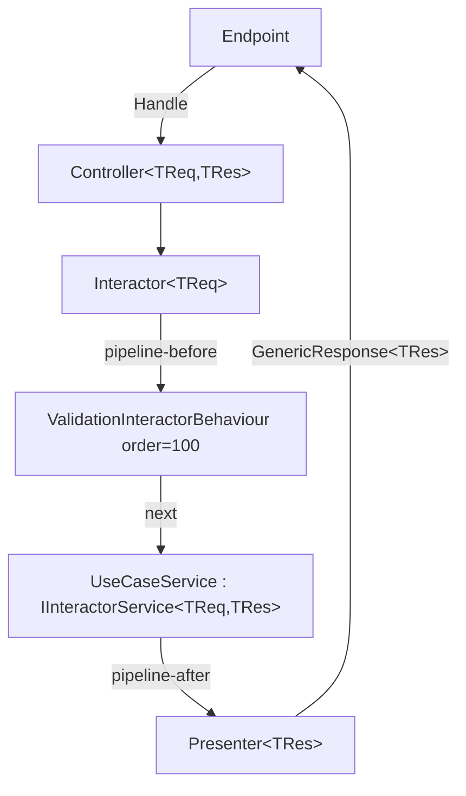

# API — Architecture & Pipeline

## Clean Architecture — 5 tiers

Dependencies always point **inward**. Nothing in an inner ring can know anything from an outer ring.

```
Tier 1 — Enterprise Business Rules (Core) — DDD Tactical Patterns
  Rich Entities (behavior + state), Value Objects (self-validating records),
  Enums, Domain Events, Domain Exceptions, Settings, Service Interfaces

Tier 2 — Application Business Rules (Dtos, Events, UseCases)
  Use case services, Request/Response DTOs, Request Validators (input validation),
  Domain event handlers

Tier 3 — Interface Adapters (Services, DataContext, Repositories, Persistence IoC)
  Concrete service implementations, EF Core contexts, Repository implementations,
  Value Object EF Core configurations (Owned Types)

Tier 4 — Frameworks and Drivers (IoC, Api)
  Minimal API endpoints, DI wiring, Docker

Tier 5 — Tests (UnitTest)
  NUnit + NSubstitute unit tests — TDD mandatory for domain and application logic
```

## Execution pipeline (canonical — TIER 0)

**Never create per-use-case Controller, Interactor, or Presenter classes.** These are generic and come from the NuGet.

```
Endpoint
  ↓
Controller<TRequest, TResponse>          ← generic, from NuGet
  ↓
Interactor<TRequest>                     ← generic, from NuGet (ONE type param)
  ↓ pipeline-before (order < 100)
[ custom behaviours, order < 100 ]
  ↓
ValidationInteractorBehaviour            ← order 100, innermost, from NuGet
  ↓ next()
{Entity}{Action}Service                  ← DEVELOPER CODE — implements IInteractorService<TReq,TRes>
  ↓ pipeline-after
Presenter<TResponse>                     ← generic, from NuGet
  ↓
GenericResponse<TResponse>
  ↓
Endpoint → Client
```



### The pipeline is not reentrant

`Presenter<TResponse>` is registered **per scope and is stateful by design**: `Handle` stores the response in
`Content`, and the controller reads it back afterwards. That is what the output port pattern prescribes, and it has one
consequence that has to be respected.

**Within a single request scope, do not run the pipeline twice for the same `TResponse`.** The second run overwrites
`Content` before the first controller has read it, and the caller silently receives the wrong payload — no exception,
no log, just the other request's data. The shapes that trip over this:

```csharp
// WRONG — same TResponse twice in one scope; the second Handle clobbers the first.
var a = await controller.Handle(requestA, cancellationToken);
var b = await controller.Handle(requestB, cancellationToken);

// WRONG — concurrent, same scope. Both share one Presenter and one DbContext.
await Task.WhenAll(ids.Select(id => controller.Handle(new GetRequest(id), cancellationToken)));

// WRONG — a use case service resolving IController to call another use case.
```

Different `TResponse` types are independent: `Presenter<ShiftGetResponse>` and `Presenter<ReminderGetResponse>` are
different registrations and do not interfere.

**What to do instead:** one endpoint, one pipeline run. When a use case needs the work of another, extract that work
into a service both use cases inject — not a nested `IController` call. For a genuine batch, model it as one request
carrying the whole collection and one response carrying the whole result, which is what the sync push routes do. If a
background job must run the pipeline repeatedly, create a **new scope per iteration** with
`IServiceScopeFactory.CreateScope()` and resolve the controller from that scope.

## TIER 0 — Non-negotiable rules

1. **Dependency Rule**: source code dependencies always point inward. Outer rings cannot be known by inner rings.
2. **No per-use-case Controller/Interactor/Presenter** — `Controller<TReq,TRes>`, `Interactor<TReq>`, `Presenter<TRes>` are generic and come from NuGet.
3. **No manual `RunValidator()`** — `ValidationInteractorBehaviour` (order 100) resolves `IValidator<TRequest>` from DI and throws `ValidationException(code, title, detail, failures)` — **4 params** — before `Service.Run()`.
4. **No `Common` project** — `IInteractorBehaviour<,>`, `InteractorBehaviourOrderAttribute`, predefined behaviours come from `{Organization}.CleanArchitecture.Abstractions`.
5. **Behaviour order inverted**: lower N = outermost. `ValidationInteractorBehaviour` is order 100 (innermost). Custom behaviours use N < 100.
6. **DI markers**: add the marker alongside the service's own contracts: `public sealed class Svc : ISvc, IAppServiceScoped`. It is registered under every non-marker interface it implements, all sharing one instance; declaration order is irrelevant.
7. **`AddCleanArchitecture(friendlyName)`** scans assemblies by name prefix and auto-registers everything — no manual use case wiring. `friendlyName` is the **product** prefix here, unlike `AddGlobalExceptionStrategy(friendlyName)`, which takes the organization root.
8. **Event emission from the Use Case Service**: the service raises domain events through `IAsyncDomainEventHub<TEventType>` after successful persistence. Entities never raise or accumulate events — the hub is contravariant over the concrete event type, so a heterogeneous collection cannot be dispatched through it.
9. **`ValidationException` always has 4 params**: `(code, title, detail, failures)` — `detail` is mandatory.
10. **`Interactor<TReq>` has ONE type param** — `TResponse` is resolved dynamically. Legacy `Interactor<TReq,TRes>` with two params is obsolete.
11. **Rich Domain Model**: entities contain business logic as pure methods. No anemic entities (data-only classes with logic in services).
12. **Value Objects are `record` types**: immutable, self-validating, with private constructors and static `Create()` factory methods.
13. **TDD mandatory**: all domain logic (entities, value objects) and application logic (services) must be developed following Red-Green-Refactor.
14. **Dual validation**: Request Validators (Tier 2) validate input format/presence; Value Objects (Tier 1) enforce domain invariants. Both levels coexist.
15. **Service interfaces in Core**: When a service must be accessible from Tier 2 (Use Cases), its interface lives in `Core/Services/{ServiceName}/I{ServiceName}.cs`. The implementation lives in Tier 3 (Services). This preserves the dependency rule.

## Use case service contract

```csharp
public sealed class {Entity}{Action}Service : IInteractorService<{Entity}{Action}Request, {Entity}{Action}Response>
{
    // Constructor injection: repositories, event hubs, other services
    // DO NOT inject IValidator<> — handled automatically by the pipeline
    // DO NOT call RunValidator() — handled automatically by the pipeline

    public async Task<{Entity}{Action}Response> Run({Entity}{Action}Request request, CancellationToken cancellationToken)
    {
        // request is already validated — write pure business logic here
    }
}
```

## Custom pipeline behaviours

A behaviour is the framework's cross-cutting hook: it wraps the use case service the way ASP.NET Core middleware wraps
the next delegate. `ValidationInteractorBehaviour` is one, and it is the reason no service ever calls a validator.

```csharp
public interface IInteractorBehaviour<TRequest, TResponse>
    where TRequest : class
    where TResponse : class
{
    Task<TResponse> Handle(TRequest request, Func<Task<TResponse>> next, CancellationToken cancellationToken);
}
```

**Reach for one when the concern is orthogonal to every use case** — timing, auditing, an idempotency guard — and it
would otherwise be copy-pasted into each service. A rule that is about *this* entity is domain logic and belongs in the
entity or the service, not here.

### A worked example: slow use cases get logged

Open generic, so it applies to every use case at once:

```csharp
// <copyright file="TimingInteractorBehaviour.cs" company="{Organization}">
// Copyright (c) {Organization}. All rights reserved.
// </copyright>

namespace {Organization}.{Product}.UseCases.Behaviours;

using System.Diagnostics;
using Microsoft.Extensions.Logging;
using {Organization}.CleanArchitecture.Abstractions.Interactors;

/// <summary>Logs use cases that take longer than the configured threshold.</summary>
/// <typeparam name="TRequest">The request type.</typeparam>
/// <typeparam name="TResponse">The response type.</typeparam>
[InteractorBehaviourOrder(10)]
public sealed class TimingInteractorBehaviour<TRequest, TResponse> : IInteractorBehaviour<TRequest, TResponse>
    where TRequest : class
    where TResponse : class
{
    private static readonly TimeSpan Threshold = TimeSpan.FromMilliseconds(500);
    private readonly ILogger<TimingInteractorBehaviour<TRequest, TResponse>> logger;

    /// <summary>
    /// Initializes a new instance of the <see cref="TimingInteractorBehaviour{TRequest, TResponse}"/> class.
    /// </summary>
    /// <param name="logger">Logger service.</param>
    public TimingInteractorBehaviour(ILogger<TimingInteractorBehaviour<TRequest, TResponse>> logger)
    {
        this.logger = logger;
    }

    /// <summary>Times the rest of the pipeline.</summary>
    /// <param name="request">The request being processed.</param>
    /// <param name="next">The rest of the pipeline.</param>
    /// <param name="cancellationToken">Cancellation token.</param>
    /// <returns>The response produced by the pipeline.</returns>
    public async Task<TResponse> Handle(TRequest request, Func<Task<TResponse>> next, CancellationToken cancellationToken)
    {
        long start = Stopwatch.GetTimestamp();

        // Nothing is caught here: an exception belongs to the global handler, which turns it into ProblemDetails.
        // Swallowing it would turn a 500 into a success with a null response.
        TResponse response = await next();

        TimeSpan elapsed = Stopwatch.GetElapsedTime(start);
        if (elapsed > Threshold)
        {
            this.logger.LogWarning(
                "Slow use case {UseCase}: {ElapsedMilliseconds} ms.",
                typeof(TRequest).Name,
                elapsed.TotalMilliseconds);
        }

        return response;
    }
}
```

Nothing else is needed: the assembly scan registers it. See `#backend-tech` → DI auto-registration for the constraint
open generics must satisfy.

### The four rules

1. **`await next()` exactly once, on every path.** Not calling it skips the use case and returns a response the service
   never produced. Calling it twice runs the use case twice — and, since the same scope means the same `DbContext`,
   that is a double write, not a retry.
2. **Order is middleware order: lower runs outermost.** `[InteractorBehaviourOrder(N)]` with **N < 100**;
   `ValidationInteractorBehaviour` sits at 100, innermost, so anything above it sees the request *before* it is known
   to be valid. A behaviour without the attribute is placed innermost of all.
3. **Pass the `cancellationToken` through**, and do not catch exceptions to turn them into responses — the global
   exception strategy owns that translation.
4. **Do not read the response envelope from here.** `GenericResponse<T>` is built by the presenter, downstream. A
   behaviour sees `TResponse`, which is the payload.

## Endpoint registration pattern

```csharp
group.MapEndpoint<GenericResponse<{Entity}{Action}Response>>(
    HttpMethods.Post,
    "/",
    async ({Entity}{Action}Request request, IController<{Entity}{Action}Request, {Entity}{Action}Response> controller, CancellationToken cancellationToken) =>
    {
        var result = await controller.Handle(request, cancellationToken);
        return Results.Ok(result);
    },
    "{Action}{Entity}",
    "{Action} {entity-lowercase} endpoint",
    "This endpoint is for {action-lowercase} a {entity-lowercase}.");
```

### What `MapEndpoint` does for you

Beyond mapping the route it attaches the name, summary and description, and declares the **full response contract** in
OpenAPI: `TProduces` for 200, and `ProblemDetails` for 400, 401, 403, 404, 405, 500 and 503. That is why the type
argument is `GenericResponse<T>` and not `T` — the envelope is what the client actually receives. Never re-declare
those `.Produces<ProblemDetails>(...)` calls by hand; they are already there.

### It returns a builder — chain per-endpoint conventions onto it

`MapEndpoint` returns the `RouteHandlerBuilder`, so anything that applies to *one* endpoint rather than the whole
group is chained onto the call:

```csharp
group.MapEndpoint<GenericResponse<ShiftExportResponse>>(
        HttpMethods.Get,
        "/export",
        async (IController<ShiftExportRequest, ShiftExportResponse> controller, CancellationToken cancellationToken) =>
            Results.Ok(await controller.Handle(new ShiftExportRequest(), cancellationToken)),
        "ExportShifts",
        "Export shifts endpoint",
        "This endpoint exports the caller's shifts.")
    .RequireAuthorization("ExportPolicy")
    .CacheOutput(policy => policy.Expire(TimeSpan.FromMinutes(5)));
```

Conventions shared by every endpoint of the entity go on the **group**, not repeated per endpoint.

> **Do not chain `.RequireRateLimiting("name")` onto an endpoint** unless you have registered a policy under that
> name yourself. `Codenized.Security.RateLimit` installs a **global** limiter, which already covers every endpoint
> and needs no per-endpoint opt-in; naming a policy that was never added throws when the endpoint is built, at
> start-up. If one route genuinely needs a tighter allowance than the rest, add the named policy in the same
> `AddRateLimiter` call first.

### The other verbs, and the eighth parameter

- **HEAD and OPTIONS** are supported alongside the five verbs of the table below. `HttpMethods.Head` is the one worth
  knowing: it lets a client check existence or freshness without paying for the body.
- **`deprecated: true`** is the optional eighth argument. It stamps the endpoint as obsolete in the generated OpenAPI
  document, which is how a client finds out before the route disappears. Deprecate first, delete a release later —
  never delete a published route in the same change that stops using it.

```csharp
group.MapEndpoint<GenericResponse<ShiftGetResponse>>(
    HttpMethods.Get,
    "/legacy/{id}",
    /* ... */,
    "GetShiftLegacy",
    "Get shift endpoint (legacy)",
    "Superseded by GetShift. Kept for clients still on the old route.",
    deprecated: true);
```

An unsupported verb throws `NotSupportedException` **at startup**, not per request.

## HTTP method / action mapping

| Action | HTTP method | URL pattern |
|---|---|---|
| Add / Create | POST | `/` |
| Update / Edit | PUT | `/{id}` |
| Delete / Remove | DELETE | `/{id}` |
| Get / Retrieve | GET | `/{id}` |
| GetList / Search | GET | `/` + query params |

## Exception types

The catalogue lives in `{Organization}.CleanArchitecture.Exceptions.Abstractions.{Area}` — one namespace per exception, matching its folder. Every one takes `(code, title, detail)` unless stated otherwise:

- `BadRequestException` — 400
- `DomainException` — 400
- `DatabaseException(code, title, detail, entries)` — 400
- `UnauthorizedException` — 401
- `ForbiddenException` — 403
- `NotFoundException` — 404
- `MethodNotAllowedException` — 405
- `ConflictException` — 409
- `GeneralException` — 500
- `ServiceException` — 503

`ValidationException(code, title, detail, failures)` — 400 — is the exception to the rule: it lives in `{Organization}.CleanArchitecture.Abstractions.Validations.Exceptions`, next to the validation infrastructure that raises it.

`ValidationException` and `DatabaseException` are the two that add an `invalid-params` member to the `ProblemDetails` — field errors in the first case, affected entity names in the second. Extension members are serialized at the root of the document, not nested.

---

## Domain-Driven Design — Tactical Patterns (Tier 1)

### Value Objects

Immutable `record` types that encapsulate a concept with self-validation. Equality is by value (structural).

```csharp
/// <summary>
/// Represents a validated email address.
/// </summary>
public record Email
{
    /// <summary>
    /// Gets the email address value.
    /// </summary>
    public string Value { get; }

    private Email(string value)
    {
        this.Value = value;
    }

    /// <summary>
    /// Creates a validated email address.
    /// </summary>
    /// <param name="value">The email address string.</param>
    /// <returns>A validated <see cref="Email"/> instance.</returns>
    public static Email Create(string value)
    {
        if (string.IsNullOrWhiteSpace(value))
        {
            throw new DomainException("EMAIL_REQUIRED", "Invalid email", "Email cannot be empty.");
        }

        if (!value.Contains('@') || !value.Contains('.'))
        {
            throw new DomainException("EMAIL_INVALID", "Invalid email", "Email format is invalid.");
        }

        return new Email(value.Trim().ToLowerInvariant());
    }
}
```

**Value Object rules:**
- Always a `record` (value equality for free)
- Private constructor — only creatable via static `Create()` factory method
- `Create()` validates domain invariants and throws `DomainException` on violation
- Immutable — no setters, no mutation methods
- No dependencies — pure logic only
- Can contain behavior (formatting, comparison, arithmetic) as pure methods
- One Value Object per file in `Core/ValueObjects/`

### Rich Entities

Entities have identity, state (using Value Objects for properties), and behavior (pure domain methods).

```csharp
/// <summary>
/// Represents a work shift in the scheduling system.
/// </summary>
public class Shift
{
    /// <summary>
    /// Gets the shift identifier.
    /// </summary>
    public Guid Id { get; private set; }

    /// <summary>
    /// Gets the employee email.
    /// </summary>
    public Email EmployeeEmail { get; private set; }

    /// <summary>
    /// Gets the shift duration.
    /// </summary>
    public ShiftDuration Duration { get; private set; }

    /// <summary>
    /// Gets the shift status.
    /// </summary>
    public ShiftStatus Status { get; private set; }

    private Shift()
    {
    }

    /// <summary>
    /// Creates a new shift.
    /// </summary>
    /// <param name="employeeEmail">The employee email.</param>
    /// <param name="duration">The shift duration.</param>
    /// <returns>A new <see cref="Shift"/> instance.</returns>
    public static Shift Create(
        Email employeeEmail,
        ShiftDuration duration)
    {
        return new Shift
        {
            Id = Guid.NewGuid(),
            EmployeeEmail = employeeEmail,
            Duration = duration,
            Status = ShiftStatus.Pending,
        };
    }

    /// <summary>
    /// Cancels the shift with a reason.
    /// </summary>
    /// <param name="reason">The cancellation reason.</param>
    public void Cancel(string reason)
    {
        if (this.Status == ShiftStatus.Cancelled)
        {
            throw new DomainException("SHIFT_ALREADY_CANCELLED", "Shift already cancelled", "A shift that is already cancelled cannot be cancelled again.");
        }

        this.Status = ShiftStatus.Cancelled;
    }
}
```

**Entity rules:**
- Private parameterless constructor (for EF Core)
- Static `Create()` factory method — the only way to instantiate a new entity
- Properties use Value Objects where domain meaning exists (not raw primitives)
- All property setters are `private set` — state changes only through domain methods
- Domain methods are pure business logic — validate preconditions and mutate state
- Domain methods throw `DomainException` for invariant violations
- Entities do not raise or accumulate events — that is the Use Case Service's job (see below)
- No infrastructure dependencies (no repositories, no services injected)

### Domain Events

Events that signal something meaningful happened in the domain. They live in the `Events` project, one folder per event.

```csharp
/// <summary>
/// Event raised when a shift is cancelled.
/// </summary>
public record OnShiftCancelledEvent(Guid ShiftId, string Reason) : IDomainEvent;
```

**Domain Event rules:**
- `record` type implementing `IDomainEvent`
- Named in past tense with the `On` prefix and `Event` suffix: `On{Entity}{Action}edEvent`
- Contain only the data needed by handlers (IDs, relevant values)
- Raised by the Use Case Service after successful persistence, never from the entity
- Event and handler live together in `Events/On{Entity}{Action}ed/`

> The entity does not collect events. `IAsyncDomainEventHub<TEventType>` is contravariant over the concrete event type, so there is no way to dispatch a heterogeneous `IDomainEvent` collection through it: the hub is resolved per event type. The service raising each event explicitly is what the framework supports, and it keeps the ordering with respect to persistence obvious.

### Domain Event dispatch in Use Case Service

The service injects one `IAsyncDomainEventHub<TEventType>` per event type it raises.

```csharp
public async Task<ShiftCancelResponse> Run(ShiftCancelRequest request, CancellationToken cancellationToken)
{
    Shift shift = await this.queries.GetById(request.ShiftId, cancellationToken)
        ?? throw new NotFoundException("SHIFT_NOT_FOUND", "Shift not found", $"No shift exists with id {request.ShiftId}.");

    // Domain logic — the entity validates its own invariants
    shift.Cancel(request.Reason);

    // Persist first: an event must never announce something that was not committed
    await this.commands.Update(shift, cancellationToken);
    await this.commands.SaveChanges(cancellationToken);

    await this.eventHub.RaiseEventAsync(new OnShiftCancelledEvent(shift.Id, request.Reason), cancellationToken);

    return new ShiftCancelResponse(shift.Id);
}
```

### Dual Validation Strategy

| Level | Location | Responsibility | Throws |
|---|---|---|---|
| Input validation | `{Entity}{Action}RequestValidator` (Tier 2) | Format, presence, max length, basic format | `ValidationException` (via pipeline) |
| Domain validation | Value Object `Create()` / Entity methods (Tier 1) | Business invariants, domain rules | `DomainException` |

- Request Validators catch malformed input early (fail fast, HTTP-friendly messages)
- Value Objects and Entities protect domain invariants regardless of entry point
- Both levels coexist — they are complementary, not redundant

### EF Core configuration for Value Objects (Owned Types)

```csharp
public class ShiftConfiguration : IEntityTypeConfiguration<Shift>
{
    public void Configure(EntityTypeBuilder<Shift> builder)
    {
        builder.ToTable("Shifts");
        builder.HasKey(s => s.Id);

        builder.OwnsOne(s => s.EmployeeEmail, email =>
        {
            email.Property(e => e.Value)
                .HasColumnName("EmployeeEmail")
                .HasMaxLength(255)
                .IsRequired();
        });

        builder.OwnsOne(s => s.Duration, duration =>
        {
            duration.Property(d => d.Start)
                .HasColumnName("StartTime")
                .IsRequired();
            duration.Property(d => d.End)
                .HasColumnName("EndTime")
                .IsRequired();
        });

    }
}
```

**EF Core rules for Value Objects:**
- Use `OwnsOne()` for all Value Objects — maps properties as columns in the entity's table
- Always specify `HasColumnName()` for clarity
- Private parameterless constructor on entities allows EF Core materialization

---

## TDD — Test-Driven Development (mandatory)

### Scope

TDD (Red-Green-Refactor) is **mandatory** for:
- Value Objects (domain invariant validation)
- Entities (domain behavior methods)
- Use Case Services (application logic)
- Application Services (infrastructure-facing logic)

TDD is **not required** for purely declarative code:
- EF Core configurations
- Endpoint registrations
- DI registrations
- DTOs (no logic)

### Red-Green-Refactor cycle

```
1. RED    — Write a failing test that describes the expected behavior
2. GREEN  — Write the MINIMUM code to make the test pass
3. REFACTOR — Clean up while keeping tests green
```

### Execution order

When implementing a new feature:

1. **Value Objects first** — write tests for `Create()` validation, then implement
2. **Entity next** — write tests for factory method and domain methods, then implement
3. **Use Case Service last** — write tests for orchestration logic, then implement

### Test structure (Arrange-Act-Assert)

```csharp
[Test]
public void Create_WithValidEmail_ReturnsEmailInstance()
{
    // Arrange
    string validEmail = "user@example.com";

    // Act
    Email result = Email.Create(validEmail);

    // Assert
    Assert.That(result.Value, Is.EqualTo("user@example.com"));
}

[Test]
public void Create_WithEmptyString_ThrowsDomainException()
{
    // Arrange
    string emptyEmail = "";

    // Act & Assert
    Assert.Throws<DomainException>(() => Email.Create(emptyEmail));
}
```

### Test naming convention

Format: `MethodName_StateUnderTest_ExpectedBehavior`

```
Create_WithValidEmail_ReturnsEmailInstance
Create_WithEmptyString_ThrowsDomainException
Cancel_WhenAlreadyCancelled_ThrowsDomainException
Cancel_WhenPending_SetsStatusToCancelled
Run_WhenShiftIsCancelled_RaisesOnShiftCancelledEvent
Run_WithValidRequest_ReturnsResponse
Run_WithNonExistentShift_ThrowsNotFoundException
```

### What to test per layer

| Layer | What to test | Mocks needed |
|---|---|---|
| Value Objects | `Create()` with valid/invalid inputs, behavior methods | None (pure logic) |
| Entities | Factory method, domain methods, event raising, invariant violations | None (pure logic) |
| Use Case Services | Orchestration, repository interactions, event dispatch | Repositories, EventHub |
| Request Validators | Validation rules for each field | None |

### Quality gate

```bash
dotnet test ProjectPath
```

All tests must pass before committing. No skipped tests without a ticket reference.
